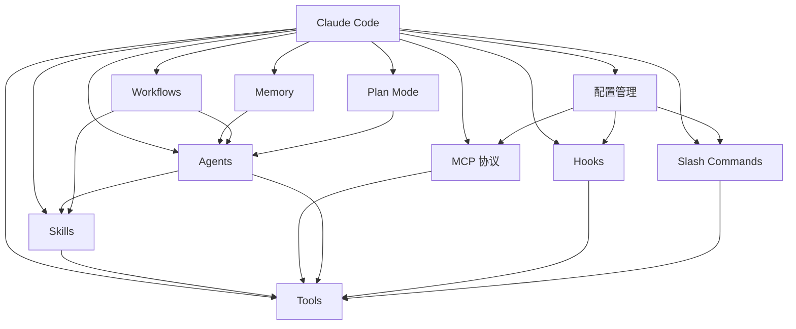

# AI 学习知识库

欢迎来到 AI 学习知识库！这是一个关于 AI 工具、平台与实践的系统化学习笔记库。

## 专题目录

| 专题 | 描述 | 进度 |
|------|------|------|
| [[Claude Code/00-Claude Code 入门概览\|Claude Code 基本使用]] | Claude Code CLI 的完整使用方法 | ✅ 11 篇文章 |

## 专题目录树

```
Claude Code/                         ← Claude Code 学习方法论专题
├── 00-Claude Code 入门概览.md       ←     总览与架构
├── 01-Skills 技能系统.md            ← ─┐
├── 02-MCP 模型上下文协议.md         ←  ├─ 扩展能力层
├── 03-Tools 工具系统.md            ← ─┘
├── 04-Agents 代理系统.md           ← ─┐
├── 08-Workflows 工作流编排.md      ←  ├─ 协作执行层
├── 09-Slash Commands 斜杠命令.md   ← ─┘
├── 10-Plan Mode 规划模式.md        ←    规划设计层
├── 05-Memory 记忆系统.md           ← ─┐
├── 06-Hooks 钩子系统.md            ←  ├─ 持久化与自动化层
└── 07-配置与项目管理.md            ← ─┘
```

| # | 文章 | 核心内容 | 层 |
|:--|------|---------|---|
| 00 | [[Claude Code/00-Claude Code 入门概览\|入门概览]] | 架构总览、核心概念地图 | 总览 |
| 01 | [[Claude Code/01-Skills 技能系统\|Skills 技能系统]] | 可安装的能力扩展单元 | 扩展能力 |
| 02 | [[Claude Code/02-MCP 模型上下文协议\|MCP 协议]] | AI 的 USB-C 接口——连接外部服务 | 扩展能力 |
| 03 | [[Claude Code/03-Tools 工具系统\|Tools 工具系统]] | AI 的手和眼睛——执行单元 + 扩展机制 | 扩展能力 |
| 04 | [[Claude Code/04-Agents 代理系统\|Agents 代理系统]] | 多代理并行协作架构 | 协作执行 |
| 08 | [[Claude Code/08-Workflows 工作流编排\|Workflows 工作流编排]] | 多 Agent 的确定性脚本编排 | 协作执行 |
| 09 | [[Claude Code/09-Slash Commands 斜杠命令\|Slash Commands 斜杠命令]] | 快捷指令系统 | 协作执行 |
| 10 | [[Claude Code/10-Plan Mode 规划模式\|Plan Mode 规划模式]] | 结构化规划——先设计再动手 | 规划设计 |
| 05 | [[Claude Code/05-Memory 记忆系统\|Memory 记忆系统]] | 跨会话持久化知识系统 | 持久化 |
| 06 | [[Claude Code/06-Hooks 钩子系统\|Hooks 钩子系统]] | 事件驱动自动化机制 | 自动化 |
| 07 | [[Claude Code/07-配置与项目管理\|配置与项目管理]] | 分层配置 + 完整目录树 | 配置 |

## 如何使用本库

1. **顺序阅读**：按 00 → 01 → 02 → ... → 10 顺序阅读，前文是后文的基础
2. **按需跳转**：文章之间通过 `[[双向链接]]` 关联，可自由跳转探索
3. **分层学习**：先读"扩展能力层"（01-03）建立基础，再读"协作执行层"（04/08/09），最后读"持久化与自动化层"（05-07）
4. **实战优先**：每篇文章包含 3+ 个软件开发和项目规划的真实示例
5. **模板复用**：新建专题时可使用 [[模板/专题文章模板]] 保持一致性

## 核心概念关系图



## 概念与目录树对应关系

| 概念 | 文章 | 目录入口 |
|------|------|---------|
| Skills | [[01-Skills 技能系统]] | `.claude/skills/`、`~/.claude/skills/` |
| MCP | [[02-MCP 模型上下文协议]] | `.claude/settings.json → mcpServers` |
| Tools | [[03-Tools 工具系统]] | 内置 + MCP 扩展 + Hook 增强 |
| Agents | [[04-Agents 代理系统]] | `.claude/agents/`、`~/.claude/agents/` |
| Memory | [[05-Memory 记忆系统]] | `~/.claude/projects/<hash>/memory/` |
| Hooks | [[06-Hooks 钩子系统]] | `.claude/hooks/`、`~/.claude/settings.json → hooks` |
| Config | [[07-配置与项目管理]] | `.claude/settings.json`、`CLAUDE.md` |
| Workflows | [[08-Workflows 工作流编排]] | `~/.claude/workflows/`、`Workflow()` 工具 |
| Commands | [[09-Slash Commands 斜杠命令]] | `.claude/commands/`、`~/.claude/commands/` |
| Plan Mode | [[10-Plan Mode 规划模式]] | `.claude/plans/`、`EnterPlanMode/ExitPlanMode` 工具 |

## 学习路径建议

1. 先读 [[Claude Code/00-Claude Code 入门概览|入门概览]]，建立全局认知
2. 通读"扩展能力层"（01-03）：理解 Skills → MCP → Tools 的扩展体系
3. 学习"协作执行层"（04/08/09/10）：从单 Agent 到多 Agent 编排
4. 深入"持久化与自动化层"（05-07）：Memory + Hooks + 配置管理
5. 每个概念学习后，尝试在自己的项目中实践
6. 回到总览，用 Obsidian 图谱视图（Graph View）发现概念之间的关联网络

---

> 💡 **提示**：在 Obsidian 中按 `Cmd/Ctrl + E` 切换编辑/预览模式，按 `Cmd/Ctrl + K` 插入内链。
> 🗺️ **目录树**：每篇文章的"📂 目录树位置"章节展示了该概念在文件系统中的实际位置——所有概念最终都映射到 `.claude/` 和 `~/.claude/` 目录下。

