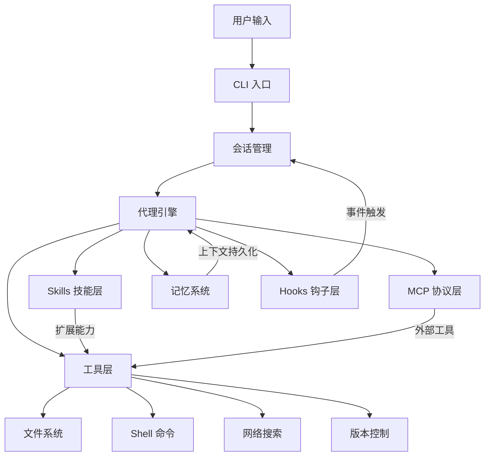

# Claude Code 入门概览

## 📖 概念

> Claude Code 是 Anthropic 推出的**命令行 AI 编程助手**，它在终端内运行，能直接读写文件、执行命令、搜索代码库，并支持复杂的多步骤开发工作流。本质上，它是一个**终端原生的 AI 代理（Agent）**，而非传统 IDE 插件。

Claude Code 不是简单的"代码补全"工具。它拥有完整的**工具调用能力**（读写文件、执行 Bash 命令、搜索代码），通过**代理架构**可以自主规划和执行多步骤任务，通过 **Skills/MCP/Hooks** 等机制可以无限扩展其能力边界。

### 核心设计理念

| 理念 | 说明 |
|------|------|
| **终端原生** | 运行在终端中，与 shell、git、npm 等工具无缝协作 |
| **代理模式** | 自主规划任务步骤，使用工具执行，检查结果，迭代修正 |
| **可扩展架构** | Skills、MCP、Hooks、Agents 构成四层扩展体系 |
| **权限可控** | 分级权限系统，用户可精确控制 AI 能做什么 |

## 🔧 工作原理

> Claude Code 的核心是一个**工具调用循环（Tool-Use Loop）**：接收用户指令 → 规划步骤 → 调用工具 → 观察结果 → 调整计划 → 继续执行直到完成。

### 架构总览



### 执行流程

1. **会话启动**：加载项目配置（`CLAUDE.md`、`settings.json`），初始化工具集
2. **意图解析**：理解用户自然语言指令，分解为可执行步骤
3. **工具调度**：根据当前步骤选择合适的工具（读文件、执行命令、搜索等）
4. **结果观察**：读取工具返回结果，评估是否达成目标
5. **迭代调整**：如果结果不符合预期，调整计划重新执行
6. **持久化记忆**：将关键发现和用户偏好写入 Memory 系统

## 📂 目录树位置

> 在 Claude Code 的配置体系中，以下文件和目录共同构成"项目理解"的基石。

```
项目根目录/
├── CLAUDE.md                    ← 项目指令（AI 每次会话自动读取）
├── AGENTS.md                    ← 子代理专用指令
└── .claude/                     ← 项目级 Claude Code 配置目录
    ├── settings.json            ← 项目权限、MCP、Hooks 配置
    ├── settings.local.json      ← 本地覆盖配置（不提交 Git）
    ├── agents/                  ← 项目自定义子代理
    │   └── <name>.md
    ├── skills/                  ← 项目自定义技能
    │   └── <name>/
    │       └── SKILL.md
    ├── commands/                ← 项目自定义斜杠命令
    │   └── <name>.md
    └── hooks/                   ← 项目 Hook 脚本
        └── *.sh / *.js / *.py

用户全局目录 (~/.claude/)：
~/.claude/
├── settings.json                ← 全局默认配置（所有项目共享）
├── agents/                      ← 全局自定义代理
├── skills/                      ← 全局自定义技能
├── commands/                    ← 全局自定义命令
├── hooks/                       ← 全局 Hooks
├── keybindings.json             ← 快捷键绑定
└── projects/<hash>/memory/      ← 按项目隔离的 Memory 存储
```

| 文件/目录 | 作用 | 加载时机 | 是否提交 Git |
|----------|------|---------|:--:|
| `CLAUDE.md` | 项目架构、规范、约定 | 每次会话启动 | ✅ 是 |
| `AGENTS.md` | 子代理行为指令 | 子代理启动时 | ✅ 是 |
| `.claude/settings.json` | 项目权限/MCP/Hooks | 每次会话启动 | ✅ 是 |
| `.claude/settings.local.json` | 个人本地覆盖 | 每次会话启动（覆盖项目配置） | ❌ 否 |
| `~/.claude/settings.json` | 全局默认配置 | 每次会话启动（被项目配置覆盖） | N/A |

## 💡 为什么重要

- **效率革命**：从"写代码"转变为"描述目标"，Agent 自主完成实现、测试、调试
- **降低认知负荷**：不需要记住所有 CLI 参数、配置格式、API 细节
- **知识积累**：Memory 系统让每次协作都比上一次更智能
- **团队标准化**：通过 `CLAUDE.md` 和 `settings.json` 统一团队工作流

## 🎯 实战示例

### 示例 1：新项目快速启动

**场景**：你需要从零开始创建一个 TypeScript REST API 项目。

**操作步骤**：

```bash
# 在终端中进入空目录，然后对 Claude Code 说：
"帮我初始化一个 TypeScript Node.js 项目，使用 Express 框架，
配置 ESLint + Prettier，添加 Jest 测试框架，创建基础的
健康检查端点 /health，并写好 Dockerfile"
```

**结果**：Claude Code 会自动执行以下步骤：
1. `npm init -y` 初始化项目
2. 安装 `typescript`, `express`, `jest`, `eslint`, `prettier` 等依赖
3. 创建 `tsconfig.json`、`.eslintrc.js`、`.prettierrc`
4. 编写 `src/index.ts` 含 `/health` 端点
5. 编写 `Dockerfile`
6. 配置 `package.json` 的 scripts

**原理分析**：Claude Code 的 Agent 引擎将任务分解为多个子步骤，每个步骤调用对应的工具（Bash 执行命令、Write 创建文件），并在每步完成后检查结果。这体现了**自主规划 + 工具调用**的核心模式。

### 示例 2：代码库迁移与重构

**场景**：将一个 50+ 文件的 JavaScript 项目迁移到 TypeScript，需要逐个文件转换、修复类型错误。

**操作步骤**：

```bash
# 在项目根目录下：
"将这个项目从 JavaScript 迁移到 TypeScript。步骤：
1. 先分析项目结构，列出所有 .js 文件
2. 按依赖顺序逐个转换（先工具函数，再组件，最后入口）
3. 为每个模块创建对应的 .d.ts 类型声明
4. 更新 package.json 和构建配置
5. 确保所有测试通过"
```

**结果**：Claude Code 会：
1. 用 Glob 扫描项目文件，用 Read 逐文件分析
2. 按依赖图排序，先转换底层模块
3. 每个文件：读取 → 分析类型 → 编写 `.ts` 版本 → 验证
4. 更新 `package.json` 添加 TypeScript 依赖
5. 运行 `npm test` 验证迁移正确性

**原理分析**：这里体现了 Agent 的**上下文管理**能力——它能理解 50+ 文件的依赖关系，按正确顺序处理，并在过程中保持对项目整体结构的认知。Skills 系统可以在这里创建"迁移技能"以复用此工作流。

### 示例 3：多服务项目的 CI/CD 流水线搭建

**场景**：你有一个 monorepo，包含 3 个微服务（api、worker、frontend），需要为每个服务配置 GitHub Actions CI。

**操作步骤**：

```bash
"为这个 monorepo 搭建 GitHub Actions CI：
1. 分析每个服务的 package.json，了解各自的 test/build/lint 命令
2. 创建一个基础 workflow 模板
3. 为每个服务生成独立的 workflow 文件，只在该服务的文件变更时触发
4. 添加 PR 评论自动展示测试覆盖率
5. 配置分支保护规则的建议文档"
```

**结果**：Claude Code 会：
1. 读取所有 `package.json`，了解每个服务的命令
2. 创建 `.github/workflows/api-ci.yml`、`worker-ci.yml`、`frontend-ci.yml`
3. 使用 `paths` 过滤器实现按需触发
4. 集成覆盖率报告到 PR 评论
5. 生成 `docs/BRANCH_PROTECTION.md` 说明配置步骤

**原理分析**：这展示了 Claude Code 的**项目规划能力**——不是只写代码，而是理解工程实践（monorepo CI 最佳实践、按路径触发、覆盖率报告），并生成完整的解决方案。Memory 系统会记住项目的 monorepo 结构，后续协作更高效。

## ✅ 最佳实践

1. **DO**：在项目根目录维护 `CLAUDE.md`，描述项目架构、约定和偏好
2. **DO**：从简单任务开始，逐步建立对 Agent 的信任
3. **DO**：利用 Memory 系统记录重要决策和偏好，让协作越来越智能
4. **DON'T**：一次性给过于庞大模糊的指令——分解为清晰的步骤
5. **DON'T**：完全信任 Agent 的输出而不做 Code Review
6. **TIP**：使用 `/memory` 主动记录重要信息，加速后续协作

## ⚠️ 常见陷阱

| 陷阱 | 表现 | 解决方案 |
|------|------|---------|
| 指令过于模糊 | Agent 反复确认需求 | 提供具体的文件路径、期望输出格式、约束条件 |
| 上下文过长 | 会话变慢，回答质量下降 | 使用 `/compact` 压缩上下文，或将任务分解为多个会话 |
| 权限过度开放 | Agent 执行了意外的命令 | 使用分级权限，对危险操作设置 `ask` 模式 |
| 忽略 CLAUDE.md | Agent 不了解项目约定 | 在 `CLAUDE.md` 中写清楚架构、命名规范、禁止事项 |

## 🔗 关联概念

- [[Claude Code/01-Skills 技能系统\|Skills 技能系统]] — 如何通过 Skills 扩展能力
- [[Claude Code/02-MCP 模型上下文协议\|MCP 协议]] — 接入外部工具和数据源
- [[Claude Code/03-Tools 工具系统\|Tools 工具系统]] — 深入理解工具调用机制
- [[Claude Code/04-Agents 代理系统\|Agents 代理系统]] — 多代理并行协作
- [[Claude Code/05-Memory 记忆系统\|Memory 记忆系统]] — 让 AI 记住你的项目
- [[Claude Code/06-Hooks 钩子系统\|Hooks 钩子系统]] — 事件驱动的自动化
- [[Claude Code/07-配置与项目管理\|配置与项目管理]] — 团队级配置管理
- [[Claude Code/08-Workflows 工作流编排\|Workflows 工作流编排]] — 多 Agent 确定性编排
- [[Claude Code/09-Slash Commands 斜杠命令\|Slash Commands 斜杠命令]] — 快捷指令系统
- [[Claude Code/10-Plan Mode 规划模式\|Plan Mode 规划模式]] — 结构化规划机制

## 📚 扩展阅读

- 官方文档：[Claude Code Overview](https://docs.anthropic.com/en/docs/claude-code)
- CLI 参考：`claude --help`

---

> **下一步**：阅读 [[Claude Code/01-Skills 技能系统\|Skills 技能系统]] 了解如何通过技能扩展 Claude Code 的能力。
