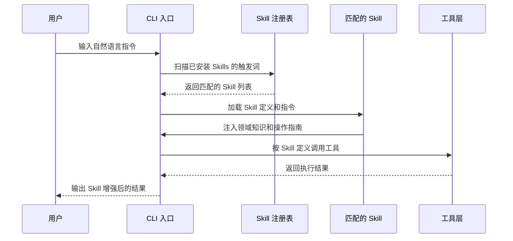

# Skills 技能系统

## 📖 概念

> Skills 是 Claude Code 的**可安装能力扩展单元**。每个 Skill 是一个包含特定领域知识、工作流程和指令的独立模块。当用户提出匹配的需求时，Skill 会被自动发现并加载，为 Claude Code 注入该领域的专业能力——如同给 AI 安装了一个"专业应用"。

Skill 不是简单的"提示词模板"。它是一套完整的**能力契约**：定义了触发条件、工作流程、工具使用模式和输出规范。Skills 让 Claude Code 从"通用助手"变成"领域专家"。

### Skills 的层级结构

| 层级 | 说明 | 示例 |
|------|------|------|
| **内置 Skills** | Claude Code 自带的官方技能 | `code-review`, `security-review`, `verify` |
| **社区 Skills** | 通过 `findskill` 发现和安装 | `flutter-ui-ux`, `deep-research` |
| **项目 Skills** | 项目 `.claude/skills/` 目录下的自定义技能 | 项目专属的部署流程、代码生成模板 |
| **用户 Skills** | 全局 `~/.claude/skills/` 下的个人技能 | 个人偏好的工作流 |

## 🔧 工作原理

> Skills 系统通过**触发词匹配 + 能力注入 + 工具编排**三层机制工作。

### Skills 的完整生命周期



### 关键机制

1. **触发词匹配**：每个 Skill 在 `description` 中声明触发词（中英文均可），Claude Code 在收到用户输入时扫描匹配
2. **上下文注入**：匹配成功后，Skill 的完整指令被注入当前会话的系统提示词
3. **工具编排**：Skill 的指令中包含工具使用策略，指导 Agent 何时调用哪个工具
4. **优先级策略**：项目 Skills > 用户全局 Skills > 社区 Skills > 内置 Skills

### Skill 的文件结构

```
.claude/skills/my-skill/
├── SKILL.md          # 核心定义：触发词、描述、指令
├── scripts/          # 可选：辅助脚本
│   └── helper.sh
├── templates/        # 可选：代码模板
│   └── component.tsx
└── references/       # 可选：参考文档
    └── api-docs.md
```

## 📂 目录树位置

> Skills 按作用范围存储在两级目录中，项目级优先于全局级。

```
项目根目录/
└── .claude/
    └── skills/                          ← 项目 Skills（仅当前项目可用）
        └── <skill-name>/
            └── SKILL.md                 ← 核心定义文件（触发词 + 指令）

用户全局目录 (~/.claude/)：
~/.claude/
└── skills/                              ← 全局 Skills（所有项目可用）
    └── <skill-name>/
        └── SKILL.md
```

| 位置 | 作用范围 | 优先级 | 适用场景 |
|------|---------|:-----:|---------|
| `.claude/skills/<name>/SKILL.md` | 当前项目 | 🔴 最高 | 团队共享的 API 生成规范、部署流程 |
| `~/.claude/skills/<name>/SKILL.md` | 所有项目 | 🟡 次之 | 个人偏好的代码风格、通用工作流 |

**优先级规则**：项目 Skills > 用户全局 Skills > 社区 Skills > 内置 Skills。同名 Skill 按此顺序覆盖。

**Skills 发现的其它来源**：
- 内置 Skills：编译在 Claude Code CLI 内部（如 `code-review`、`security-review`）
- 社区 Skills：通过 `findskill` 搜索并安装（实际安装到 `~/.claude/skills/`）

## 💡 为什么重要

- **专业化**：将通用 AI 转化为特定领域的专家，如 Flutter 开发、安全审查、UX 设计
- **可复用**：一次创建，团队共享，跨项目使用
- **标准化**：将团队的最佳实践编码为 Skill，新人也能产出高质量工作
- **生态扩展**：通过社区 Skills 获取他人的专业能力

## 🎯 实战示例

### 示例 1：创建项目专属的 API 生成 Skill

**场景**：你的团队使用固定的 API 设计规范（RESTful、特定命名约定、统一错误格式）。每次创建新端点都要重复相同的样板代码。

**操作步骤**：

创建 `.claude/skills/api-generator/SKILL.md`：

```markdown
# API Generator Skill

## Description
Generate REST API endpoints following our team's conventions.
Triggers: "create API", "新接口", "REST endpoint", "API endpoint"

## Instructions
When generating API endpoints, follow these rules:

1. **Route Convention**: All routes use `/api/v1/{resource}` prefix
2. **File Structure**: 
   - Route handler: `src/routes/{resource}.ts`
   - Validation: `src/validators/{resource}.ts` (using Zod)
   - Service: `src/services/{resource}.ts`
   - Types: `src/types/{resource}.ts`
3. **Error Format**:
   ```typescript
   { error: { code: string, message: string, details?: any } }
   ```
4. **Response Format**: 
   ```typescript
   { data: T, meta: { page?: number, total?: number } }
   ```
5. Always include: input validation, error handling, TypeScript types, unit tests
```

**使用**：

```bash
"create API endpoint for user registration with email/password"
```

**结果**：Claude Code 自动按团队规范生成 4 个文件，包含完整的验证、错误处理、类型定义和测试。

**原理分析**：项目 Skill 的优先级最高，Claude Code 将其指令注入后，所有代码生成都遵循团队规范。这是**标准化**能力的核心体现——将隐性知识（团队偏好）转化为显性规则（Skill 定义）。

### 示例 2：组合使用社区 Skills 进行代码审查

**场景**：你正在开发一个 Flutter 应用，完成了登录页面。想在合并前进行全面的代码审查：安全检查、UI/UX 评估、代码简化。

**操作步骤**：

```bash
# 首先安装需要的 Skills（一次性）
"find a skill for Flutter UI development"
# → 安装 flutter-ui-ux

"find a skill for security review"  
# → 安装 security-review

"find a skill for code simplification"
# → 安装 simplify

# 然后在开发中使用：
"review the login page using security-review and simplify skills"
```

**结果**：三个 Skill 各自从不同维度审查代码：
1. `security-review`：检查 token 存储安全、输入验证、SQL 注入防护
2. `flutter-ui-ux`：检查响应式布局、动画性能、无障碍支持
3. `simplify`：识别冗余代码、可复用的 widget、过度嵌套

**原理分析**：多个 Skills 可以叠加使用，每个 Skill 注入不同领域的专业知识。这体现了 Skills 系统的**可组合性**——不同 Skill 之间不冲突，Agent 会综合多个视角给出全面反馈。

### 示例 3：用 Skills 搭建项目规划工作流

**场景**：你作为 Tech Lead，需要为一个新功能做完整的技术规划：需求分析 → 架构设计 → 任务分解 → 风险评估。

**操作步骤**：

```bash
# 第一步：需求分析
"use the planning-with-files skill to help me break down 
a user story: 'As an admin, I want to bulk import users from CSV'"

# 第二步：架构设计
"使用 ux-design:lean-ux skill，为这个功能设计假设和实验方案"

# 第三步：实现计划
"create a detailed implementation plan with file-level tasks,
use the planning skill to track everything"
```

**结果**：
1. `planning-with-files`：创建 `task_plan.md`、`findings.md`、`progress.md`，将需求分解为可追踪的任务
2. `lean-ux`：产出假设陈述、MVP 范围、实验设计方案
3. Agent 综合两个 Skill 的输出，生成文件级的实现计划

**原理分析**：这个示例展示了 Skills 在**项目规划**中的价值。每个 Skill 提供一种结构化的思维框架（任务拆解、精益实验、实现规划），Agent 将这些框架组合为完整的项目规划文档。这不是"写代码"，而是"设计解决方案"。

## ✅ 最佳实践

1. **DO**：为团队重复性工作创建项目 Skill（API 生成、组件脚手架、部署流程）
2. **DO**：在 Skill 的 description 中同时包含中英文触发词，覆盖多语言团队
3. **DO**：Skill 指令应具体、可执行，包含代码示例和反例
4. **DON'T**：过度创建 Skill——如果只用一次，直接用自然语言描述即可
5. **DON'T**：在 Skill 中写"尽可能好"这类模糊指令——给出具体标准
6. **TIP**：使用 `skill-creator` Skill 来创建和优化你的自定义 Skills

## ⚠️ 常见陷阱

| 陷阱 | 表现 | 解决方案 |
|------|------|---------|
| 触发词过于宽泛 | Skill 在不相关的场景被激活 | 使用具体、独特的触发词组合 |
| 指令过长 | Skill 占用过多上下文，影响其他任务 | 保持 Skill 指令精简，引用外部文档 |
| 权限未配置 | Skill 需要的工具因权限不足无法使用 | 在 `settings.json` 中为 Skill 所需工具配置 `allow` |
| 未及时更新 | Skill 规范与团队实践脱节 | 定期 Review 和更新项目 Skills |

## 🔗 关联概念

- [[Claude Code/00-Claude Code 入门概览\|Claude Code 入门概览]] — Skills 在整个架构中的位置
- [[Claude Code/02-MCP 模型上下文协议\|MCP 协议]] — Skills vs MCP：两种不同的扩展方式
- [[Claude Code/03-Tools 工具系统\|Tools 工具系统]] — Skills 是 Tools 的编排层
- [[Claude Code/04-Agents 代理系统\|Agents 代理系统]] — Skills 如何与 Agent 系统协作
- [[Claude Code/05-Memory 记忆系统\|Memory 记忆系统]] — Skills + Memory：持久化的专业能力
- [[Claude Code/08-Workflows 工作流编排\|Workflows 工作流编排]] — Workflows + Skills：给 Agent 装备专业技能

## 📚 扩展阅读

- 官方文档：[Claude Code Skills](https://docs.anthropic.com/en/docs/claude-code/skills)
- `skill-creator` Skill：直接在 Claude Code 中说 "create a new skill"

---

> **下一步**：阅读 [[Claude Code/02-MCP 模型上下文协议\|MCP 协议]] 了解如何接入外部工具和数据源。
