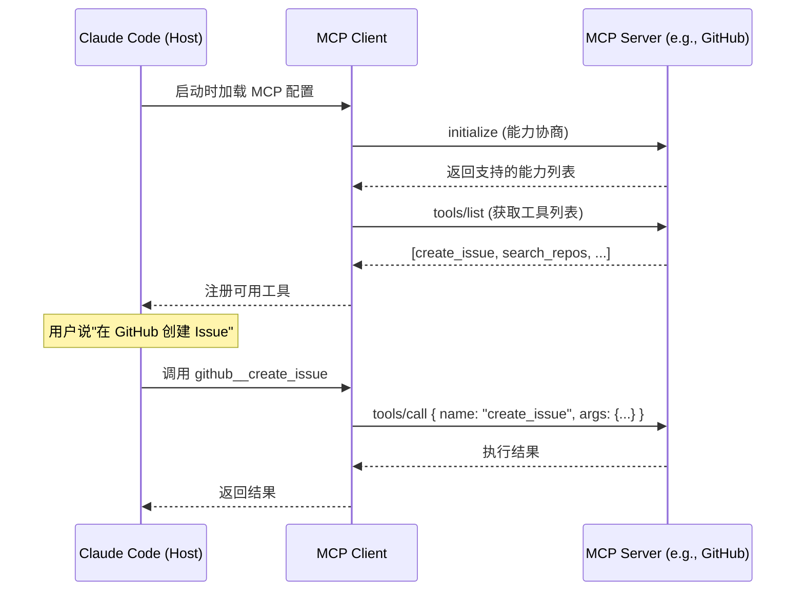

# MCP 模型上下文协议

## 📖 概念

> MCP（Model Context Protocol）是 Anthropic 提出的**开放协议标准**，定义了 AI 应用如何安全地连接到外部数据源和工具。它本质上是一个 **"AI 的 USB-C 接口"**——只要遵循 MCP 协议，任何外部服务都能被 Claude Code 发现和调用。

MCP 解决了 AI 工具的**碎片化问题**：过去每个 AI 应用都要单独实现与 GitHub、Jira、数据库等外部服务的集成。MCP 提供统一协议后，一次编写 MCP Server，所有兼容的 AI 应用都能使用。

### MCP 架构三要素

| 组件 | 角色 | 说明 |
|------|------|------|
| **MCP Host** | 消费者 | Claude Code、Claude Desktop 等 AI 应用 |
| **MCP Client** | 连接器 | Host 内部的协议客户端，管理连接和权限 |
| **MCP Server** | 提供者 | 实现 MCP 协议的外部服务，暴露 Tools/Resources/Prompts |

## 🔧 工作原理

> MCP 采用 **Client-Server 架构**，使用 JSON-RPC 2.0 通信，支持 `stdio`（本地进程）和 `SSE/Streamable HTTP`（远程服务）两种传输方式。

### 协议通信流程



### MCP 提供的三种能力

```
MCP Server
├── Tools（工具）
│   └── 可被 AI 调用的函数，如 create_issue、run_query
├── Resources（资源）
│   └── 暴露给 AI 的数据，如 schema.sql、api-docs.md
└── Prompts（提示模板）
    └── 预定义的用户交互模板
```

### MCP 配置结构

在 Claude Code 中，MCP Server 配置在 `settings.json` 中：

```json
{
  "mcpServers": {
    "github": {
      "type": "stdio",
      "command": "npx",
      "args": ["-y", "@anthropic/mcp-server-github"],
      "env": {
        "GITHUB_TOKEN": "${GITHUB_TOKEN}"
      }
    },
    "remote-api": {
      "type": "sse",
      "url": "https://mcp.example.com/sse"
    }
  }
}
```

### 工具命名规则

MCP 工具按照 `mcp__<serverName>__<toolName>` 的格式暴露给 Claude Code。例如 GitHub MCP Server 的 `create_issue` 工具会被注册为 `mcp__github__create_issue`。

## 💡 为什么重要

## 📂 目录树位置

> MCP Server 并非以独立文件存在，而是通过 `settings.json` 中的 `mcpServers` 字段配置。Server 进程本身可以位于任意位置。

```
项目根目录/
├── .claude/
│   ├── settings.json              ← mcpServers 字段在此配置
│   │   { "mcpServers": { ... } }
│   └── settings.local.json        ← 含凭证的 MCP 配置建议放此（不提交）
└── mcp-servers/                   ← 建议：自定义 MCP Server 放项目仓库
    └── <name>/
        ├── package.json
        └── src/index.ts

用户全局目录 (~/.claude/)：
~/.claude/
└── settings.json                  ← 全局 MCP Server 配置（所有项目共享）
    { "mcpServers": { ... } }
```

| 配置位置 | 字段 | 作用范围 | 是否提交 Git |
|---------|------|---------|:--:|
| `.claude/settings.json` | `mcpServers` | 当前项目 | ✅ 是（不含凭证） |
| `.claude/settings.local.json` | `mcpServers` | 当前项目（仅本机） | ❌ 否（含凭证） |
| `~/.claude/settings.json` | `mcpServers` | 所有项目 | N/A |

**MCP Server 进程位置**：
- **npx 管理**：`"command": "npx", "args": ["-y", "@anthropic/mcp-server-github"]` —— 由 npm 管理，不在文件系统中持久化
- **项目本地**：`"command": "node", "args": ["./mcp-servers/custom/dist/index.js"]` —— 放在项目仓库中，团队共享
- **全局安装**：`"command": "node", "args": ["~/.mcp-servers/custom/index.js"]` —— 个人工具，全局可用

- **打破数据孤岛**：Claude Code 可直接操作 GitHub、Jira、数据库、内部 API 等
- **生态互通**：一个 MCP Server 可被 Claude Code、Claude Desktop、Codex 等所有支持 MCP 的应用使用
- **安全边界**：通过 stdio 进程隔离和权限控制，外部访问安全可控
- **标准化扩展**：不需要为每个外部服务学习不同的接入方式

## 🎯 实战示例

### 示例 1：GitHub 工作流集成

**场景**：你正在开发一个功能，需要根据当前分支的变更自动创建规范的 Pull Request。

**操作步骤**：

配置 MCP：

```json
// .claude/settings.json
{
  "mcpServers": {
    "github": {
      "type": "stdio",
      "command": "npx",
      "args": ["-y", "@anthropic/mcp-server-github"],
      "env": { "GITHUB_TOKEN": "${GITHUB_TOKEN}" }
    }
  }
}
```

使用：

```bash
"用 GitHub MCP 帮我：
1. 查看当前分支和 main 的 diff 总结
2. 根据变更生成规范的 PR 标题和描述
3. 创建 PR 并关联相关的 Issue
4. 请求团队成员 review"
```

**结果**：Claude Code 通过 MCP 自动：
1. 调用 `mcp__github__get_diff` 获取变更摘要
2. 分析 diff 生成 PR 标题（遵循 conventional commits 格式）
3. 调用 `mcp__github__create_pull_request` 创建 PR
4. 调用 `mcp__github__request_reviewers` 添加 Reviewer

**原理分析**：这个示例展示了 MCP 的核心价值——**外部 API 变为本地工具**。GitHub 的 REST API 封装为 MCP Tools 后，AI 可以像调用内置工具一样操作 GitHub，不需要记住 API 端点、认证方式等细节。整个 PR 工作流在对话中一气呵成。

### 示例 2：数据库访问与数据分析

**场景**：你需要分析生产数据库中的用户行为数据，但不能直接执行 SQL——需要安全的只读访问。

**操作步骤**：

配置一个只读的 PostgreSQL MCP Server：

```json
{
  "mcpServers": {
    "analytics-db": {
      "type": "stdio",
      "command": "npx",
      "args": ["-y", "@anthropic/mcp-server-postgres", "--readonly"],
      "env": {
        "DATABASE_URL": "${ANALYTICS_DB_URL}"
      }
    }
  }
}
```

使用：

```bash
"分析最近一周的用户注册转化率：
1. 查看 users 和 signups 表结构
2. 写查询计算每天的注册量、激活量、转化率
3. 找出转化率低于 20% 的渠道
4. 输出 Markdown 报告"
```

**结果**：Claude Code 通过 MCP 安全地：
1. 读取表结构（Resources 能力）
2. 执行 SELECT 查询（Tools 能力）
3. 分析结果，生成图表和数据洞察
4. 输出 `docs/analytics/weekly-report.md`

**原理分析**：这里的关键是**安全边界**——MCP Server 配置为 `--readonly`，AI 只能执行 SELECT，无法修改数据。这体现了 MCP 的权限控制能力：通过 Server 端的约束确保安全，而非依赖 AI 的"自觉"。

### 示例 3：企业内部工具集成

**场景**：公司内部有一套项目管理工具（API 地址 `https://pm.internal.company.com/api`），你希望 Claude Code 能直接创建任务、查询进度。

**操作步骤**：

创建自定义 MCP Server（TypeScript）：

```typescript
// pm-mcp-server/src/index.ts
import { Server } from "@anthropic/mcp-sdk";

const server = new Server({
  name: "internal-pm",
  version: "1.0.0"
});

// 注册工具：创建任务
server.registerTool({
  name: "create_task",
  description: "Create a task in the internal project management system",
  parameters: {
    type: "object",
    properties: {
      title: { type: "string", description: "Task title" },
      assignee: { type: "string", description: "Assignee email" },
      priority: { type: "string", enum: ["P0", "P1", "P2", "P3"] },
      sprint: { type: "string", description: "Sprint name" }
    },
    required: ["title", "priority"]
  },
  handler: async ({ title, assignee, priority, sprint }) => {
    const res = await fetch("https://pm.internal.company.com/api/tasks", {
      method: "POST",
      headers: { "Authorization": `Bearer ${process.env.PM_TOKEN}` },
      body: JSON.stringify({ title, assignee, priority, sprint })
    });
    return res.json();
  }
});

// 注册资源：获取当前 Sprint 信息
server.registerResource({
  name: "current-sprint",
  description: "Current sprint details and progress",
  handler: async () => {
    const res = await fetch("https://pm.internal.company.com/api/sprints/current", {
      headers: { "Authorization": `Bearer ${process.env.PM_TOKEN}` }
    });
    return res.json();
  }
});

server.start();
```

配置和使用：

```json
// settings.json
{
  "mcpServers": {
    "internal-pm": {
      "type": "stdio",
      "command": "node",
      "args": ["./mcp-servers/pm-mcp-server/dist/index.js"],
      "env": { "PM_TOKEN": "${PM_TOKEN}" }
    }
  }
}
```

```bash
"查看当前 Sprint 的进度，把剩余的 P0 任务分配给有空闲的工程师"
```

**结果**：Claude Code：
1. 通过 Resource 读取当前 Sprint 状态
2. 识别未分配的 P0 任务
3. 结合团队信息，调用 `mcp__internal-pm__create_task` 分配任务
4. 在对话中展示分配结果

**原理分析**：这个示例展示了 MCP 的**可扩展性**——任何有 API 的内部系统都能封装为 MCP Server。对于企业场景，这意味着可以将所有内部工具（PM、CI/CD、监控、文档）统一接入 Claude Code，实现"一个对话界面操作所有系统"。

## ✅ 最佳实践

1. **DO**：将凭证放在环境变量中（`${TOKEN}` 格式），不要硬编码
2. **DO**：对生产数据库的 MCP Server 强制只读访问
3. **DO**：为每个 MCP Server 设置最小权限原则
4. **DON'T**：在一个 MCP Server 中暴露过多无关工具——保持内聚
5. **DON'T**：将 MCP Server 的敏感操作设为 `allow` 自动执行
6. **TIP**：先用 `list_tools` 了解 MCP Server 提供的能力，再尝试调用

## ⚠️ 常见陷阱

| 陷阱 | 表现 | 解决方案 |
|------|------|---------|
| 环境变量未设置 | MCP Server 启动失败 | 确保 `env` 中引用的变量都已配置，检查 shell profile |
| 工具权限过高 | AI 执行了意外的数据修改 | 在 MCP Server 层限制权限（如 `--readonly`），在 Host 层设 `ask` |
| 超时配置不当 | 长时间查询被中断 | 调整 MCP Server 的超时配置和 Host 的 `mcpServerTimeout` |
| 版本不兼容 | 升级 Claude Code 后 MCP 连接失败 | 检查 MCP Server SDK 版本兼容性，及时更新 |

## 🔗 关联概念

- [[Claude Code/01-Skills 技能系统\|Skills 技能系统]] — Skills vs MCP：内部指令 vs 外部工具
- [[Claude Code/03-Tools 工具系统\|Tools 工具系统]] — MCP 工具如何融入 Tools 体系
- [[Claude Code/07-配置与项目管理\|配置与项目管理]] — MCP Server 的配置管理

## 📚 扩展阅读

- MCP 官方文档：[Model Context Protocol](https://modelcontextprotocol.io)
- MCP Server 列表：[MCP Servers Directory](https://github.com/modelcontextprotocol/servers)

---

> **下一步**：阅读 [[Claude Code/03-Tools 工具系统\|Tools 工具系统]] 深入理解工具调用机制。
