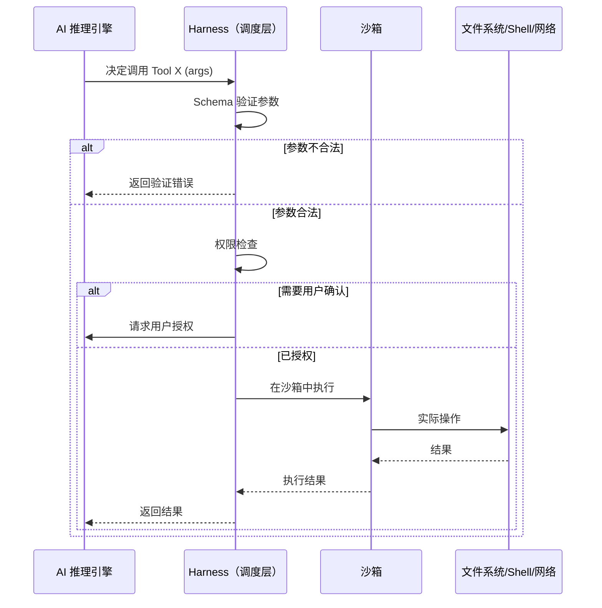
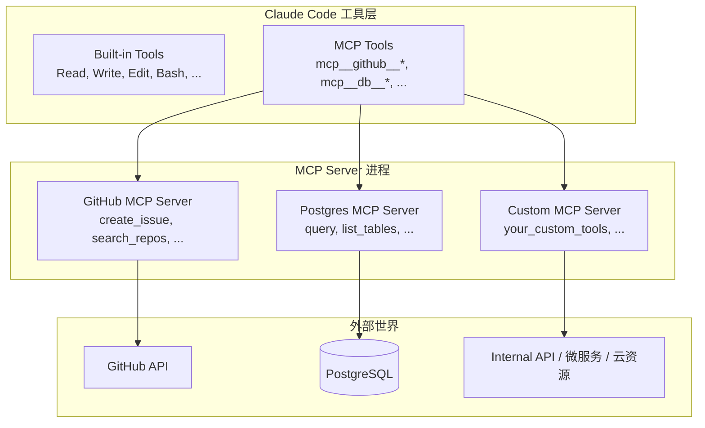

# Tools 工具系统

## 📖 概念

> Tools 是 Claude Code 与外界交互的**执行单元**。它们是 AI 的"手和眼睛"——读写文件、执行命令、搜索代码、访问网络。每一个 Tool 是一个定义明确的函数，有严格的输入 Schema 和输出格式。Claude Code 通过调用工具来获取信息、修改文件、执行操作，从而完成用户的任务。

Tools 是 Claude Code 能力的基础层。Skills 通过编排 Tools 实现复杂工作流，MCP 通过协议暴露外部 Tools，Agents 通过组合 Tools 来执行任务。理解 Tools 是理解整个 Claude Code 架构的关键。

### 工具的类别

| 类别 | 工具 | 说明 |
|------|------|------|
| **文件操作** | `Read`, `Write`, `Edit`, `Glob`, `Grep` | 读写和搜索文件 |
| **命令执行** | `Bash` | 执行 Shell 命令 |
| **网络访问** | `WebSearch`, `WebFetch` | 搜索和抓取网络内容 |
| **代理管理** | `Agent`, `TaskCreate`, `TaskUpdate` | 管理子代理和任务 |
| **交互控制** | `AskUserQuestion`, `EnterPlanMode` | 与用户交互和规划 |
| **记忆持久化** | `Write`（写入 memory 目录） | 持久化记忆 |
| **MCP 工具** | `mcp__<server>__<tool>` | 通过 MCP 协议接入的外部工具 |

## 🔧 工作原理

> 工具调用的核心是一个**安全的执行沙箱**：每个工具调用都经过 Schema 验证、权限检查、超时控制、结果回传四个阶段的严格管理。

### 工具调用生命周期



### 核心机制

1. **Schema 验证**：每个工具的输入参数都有 JSON Schema 定义，调用前必须通过验证。不合法参数会被立即拒绝，不会进入执行阶段。

2. **权限分级**：
   - `allow`：自动执行，不询问用户
   - `ask`：每次执行前询问用户确认
   - `deny`：禁止执行
   - 权限可按工具、命令模式、路径等粒度配置

3. **沙箱隔离**：命令执行在受控的沙箱环境中运行，有超时限制（默认 120 秒），防止无限循环或资源耗尽。

4. **结果回传**：工具执行结果以结构化方式返回给 AI，AI 评估结果后决定下一步行动（继续调用工具、询问用户、完成任务）。

### 工具调用的决策逻辑

AI 不会盲目调用工具。它根据以下优先级决策：

1. **信息获取优先**：先用 `Read`、`Glob`、`Grep` 理解现状，再决定修改
2. **最小权限原则**：选择能满足需求的最安全工具
3. **原子操作偏好**：优先使用专用工具（`Edit` 而非 `Bash sed`）
4. **幂等性意识**：对可能重复的操作（如 `Write`）保持谨慎

## 📂 目录树位置

> 工具系统没有独立的目录。内置工具编译在 CLI 中，MCP 工具通过 `settings.json` 注册，Hook 脚本可增强工具行为。

```
项目根目录/
├── .claude/
│   ├── settings.json              ← 工具权限配置 (permissions.allow/ask/deny)
│   │   { "permissions": { "allow": [...], "ask": [...], "deny": [...] } }
│   ├── settings.local.json        ← 本地工具权限覆盖
│   └── hooks/                     ← 通过 Hook 增强工具行为
│       └── *.sh / *.js / *.py     ← PreToolUse / PostToolUse 脚本
└── mcp-servers/                   ← 自定义 MCP Server（扩展工具集）
    └── <name>/index.ts

用户全局目录 (~/.claude/)：
~/.claude/
├── settings.json                  ← 全局默认工具权限
└── projects/<hash>/memory/        ← 通过 Write 工具写入 Memory
```

| 相关文件 | 与工具的关系 | 配置内容 |
|---------|------------|---------|
| `.claude/settings.json` → `permissions` | 控制工具的**调用权限** | allow/ask/deny 规则（按工具、命令模式、路径） |
| `.claude/settings.json` → `mcpServers` | 注册**扩展工具** | MCP Server 连接配置，暴露 `mcp__*` 工具 |
| `.claude/settings.json` → `hooks` | 增强工具**执行行为** | PreToolUse / PostToolUse 脚本 |
| `.claude/hooks/*.sh` | Hook 脚本**物理存储** | 安全检查、自动格式化等自定义逻辑 |
| `mcp-servers/` | 自定义 MCP Server **源码** | 将内部 API 封装为 AI 可调用的工具 |

**工具的分类存储**：
- **内置工具**（Read, Write, Edit, Bash, Grep, Glob, WebSearch, WebFetch, Agent, TaskCreate 等）：编译在 Claude Code CLI 二进制/包中，无独立文件
- **MCP 工具**（mcp__*）：通过 `settings.json` → `mcpServers` 注册，实际逻辑在外部进程中
- **Hook 增强**：通过 `settings.json` → `hooks` 注册，脚本存储在 `.claude/hooks/` 或 `~/.claude/hooks/`

## 💡 为什么重要

- **从"对话"到"行动"**：Tools 让 AI 从"给建议"升级为"执行任务"
- **安全可控的执行边界**：通过权限分级和沙箱机制，用户精确控制 AI 能做什么
- **工具组合的涌现能力**：单个工具简单，但组合使用能完成复杂工作流
- **可扩展的工具生态**：MCP 允许无限扩展工具集

## 🔌 工具的扩展机制

> Claude Code 的工具集**不是封闭的**。它通过三种核心机制支持工具扩展：**MCP 协议**添加全新工具类型、**Hooks** 增强现有工具行为、**Skills** 将工具编排模式固化为可复用的复合工具。

### 扩展方式总览

| 扩展方式 | 机制 | 扩展能力 | 典型场景 |
|---------|------|---------|---------|
| **MCP Server** | 外部进程暴露 Tools | ✅ 添加全新工具类型 | 接入 GitHub API、数据库、Jira、内部系统 |
| **Hooks** | 事件拦截/增强 | ✅ 修改工具行为 | 自动格式化、安全检查、变更日志 |
| **Skills** | 编排现有工具 | ✅ 定义复合工具模式 | 代码审查流程、部署工作流、项目脚手架 |

三种机制互补而非互斥——一个完整的扩展方案通常组合使用：MCP 添加外部能力，Skills 编排工具调用，Hooks 在关键节点做自动化增强。

### 方式一：MCP Server — 添加全新工具（主要扩展方式）

MCP 是工具扩展的**最主要方式**。任何有 API 的外部服务都可以封装为一个 MCP Server，其暴露的 Tools 自动被 Claude Code 发现并注册为 `mcp__<server>__<tool>` 工具。



**扩展流程**：

1. **配置**：在 `settings.json` 中添加 MCP Server 条目（本地进程或远程 URL）
2. **协商**：Claude Code 启动时自动连接 Server，交换协议版本和能力列表
3. **注册**：Server 暴露的 Tools 以 `mcp__<serverName>__<toolName>` 格式注册到工具表
4. **调用**：AI 在需要时像调用内置工具一样调用 MCP 工具，Harness 层通过 JSON-RPC 转发请求
5. **返回**：MCP Server 执行实际操作（调用 API、查询数据库等），结果原路返回给 AI

**快速接入示例**——将 Jira 变为 Claude Code 的工具：

```json
// .claude/settings.json
{
  "mcpServers": {
    "jira": {
      "type": "stdio",
      "command": "npx",
      "args": ["-y", "@anthropic/mcp-server-jira"],
      "env": {
        "JIRA_URL": "https://your-company.atlassian.net",
        "JIRA_TOKEN": "${JIRA_TOKEN}"
      }
    }
  }
}
```

配置后，Claude Code 自动获得 10+ 个 Jira 工具：

```
mcp__jira__search_issues    — 按 JQL 搜索 Issue
mcp__jira__create_issue     — 创建 Issue（含描述、指派人、优先级）
mcp__jira__get_sprint       — 查看 Sprint 进度和燃尽图数据
mcp__jira__transition_issue — 变更 Issue 状态（如 To Do → In Progress）
mcp__jira__add_comment      — 在 Issue 下添加评论
... 及其他
```

### 方式二：Hooks — 增强现有工具行为

Hooks 不添加新工具，但能**修改工具的执行逻辑**：

| Hook 事件 | 时机 | 增强能力 |
|-----------|------|---------|
| `PreToolUse` | 工具执行**前** | 验证参数、阻止危险操作、修改参数 |
| `PostToolUse` | 工具执行**后** | 自动格式化、记录变更日志、触发通知 |

```json
{
  "hooks": {
    "PreToolUse": [
      {
        "matcher": "Bash",
        "command": "python3 .claude/hooks/validate-command.py",
        "description": "Shell 执行前自动安全检查：阻止 rm -rf / 等危险命令"
      }
    ],
    "PostToolUse": [
      {
        "matcher": "Write|Edit",
        "command": "bash .claude/hooks/add-change-log.sh",
        "description": "文件修改后自动写入 CHANGELOG 条目"
      }
    ]
  }
}
```

本质上，Hooks 让你可以在不修改 Claude Code 源码的情况下，在工具调用链中插入自定义逻辑。

### 方式三：Skills — 将工具编排固化为复合工具

Skills 不创建底层工具，但它们将**工具编排模式**固化为可复用的"高级工具"。一个 Skill 本质上是一组指令，告诉 AI 在面对特定任务时应该如何组合调用现有工具。

```
Skill "代码审查" 内部编排逻辑：
  Step 1: Bash("git diff origin/main")     → 获取变更列表
  Step 2: Grep("TODO|FIXME|HACK")           → 检查技术债务标记
  Step 3: Read(<changed files>)             → 逐文件审查
  Step 4: Bash("npx eslint <changed>")       → 运行 Linter
  Step 5: Bash("npm test -- --related")      → 运行相关测试
  Step 6: Write(review-report.md)            → 生成审查报告
```

用户只需说"审查代码"，以上 6 步工具编排自动执行。Skills 让**工具编排知识**可被命名、存储、共享和复用。

### 扩展能力对比

| 维度 | MCP | Hooks | Skills |
|------|:---:|:-----:|:------:|
| 添加全新工具 | ✅ 是 | ❌ 不添加 | ❌ 不添加 |
| 修改工具行为 | ❌ 不修改 | ✅ 拦截/增强 | ❌ 不修改 |
| 编排工具模式 | ❌ 不编排 | ❌ 不编排 | ✅ 定义工作流 |
| 开发方式 | 任意语言（独立进程） | 任意语言（脚本） | Markdown |
| 生效范围 | 所有 MCP 兼容应用 | 当前项目/全局 | 项目/全局 |
| 实现难度 | ⭐⭐⭐⭐ | ⭐⭐ | ⭐ |
| 复用性 | 跨应用 | 项目级 | 项目级/全局 |

### 自定义 MCP Server 开发速览

除了使用社区 MCP Server，你也可以用 TypeScript 或 Python 创建自己的 MCP Server。核心步骤：

```typescript
// custom-mcp-server/src/index.ts
import { Server } from "@modelcontextprotocol/sdk/server/index.js";
import { StdioServerTransport } from "@modelcontextprotocol/sdk/server/stdio.js";

const server = new Server({
  name: "my-custom-tools",
  version: "1.0.0"
});

// 注册工具：自动化部署
server.setRequestHandler("tools/list", async () => ({
  tools: [{
    name: "deploy_to_staging",
    description: "将指定分支部署到 Staging 环境",
    inputSchema: {
      type: "object",
      properties: {
        branch: { type: "string", description: "要部署的分支名" },
        services: { 
          type: "array", 
          items: { type: "string", enum: ["api", "worker", "frontend"] }
        }
      },
      required: ["branch"]
    }
  }, {
    name: "get_deploy_status",
    description: "查询最近的部署状态",
    inputSchema: {
      type: "object",
      properties: {
        environment: { type: "string", enum: ["staging", "production"] }
      },
      required: ["environment"]
    }
  }]
}));

// 注册工具处理函数
server.setRequestHandler("tools/call", async (request) => {
  const { name, arguments: args } = request.params;
  
  switch (name) {
    case "deploy_to_staging":
      // 调用内部 CI/CD API
      return { result: `部署 ${args.branch} 到 Staging 已触发` };
    case "get_deploy_status":
      // 查询部署状态 API
      return { result: { status: "success", deployedAt: new Date().toISOString() } };
  }
});

// 启动服务
const transport = new StdioServerTransport();
await server.connect(transport);
```

配置后即可使用：

```bash
"把 feature/payment 分支的 api 和 worker 部署到 Staging"
# → AI 调用 mcp__my-custom-tools__deploy_to_staging({branch: "feature/payment", services: ["api", "worker"]})
```

## 🎯 实战示例

### 示例 1：自动化代码迁移

**场景**：你需要将一个使用 `moment.js` 的项目迁移到 `date-fns`。这涉及修改 30+ 个文件中的导入语句和 API 调用。

**操作步骤**：

```bash
"将项目从 moment.js 迁移到 date-fns：
1. 扫描所有使用 moment 的文件
2. 分析每个文件中 moment 的具体用法
3. 逐个文件替换导入语句和 API 调用
4. 安装 date-fns 并移除 moment
5. 运行测试验证"
```

**工具调用链**：

```
Grep("moment")                    → 发现 34 个文件
  ├── Read(src/utils/date.ts)     → 分析 moment 用法
  ├── Edit(src/utils/date.ts)     → 替换为 date-fns
  ├── Read(src/components/...)    → 逐个分析
  ├── Edit(src/components/...)    → 逐个替换
  ├── ...
  └── Bash("npm test")            → 验证迁移结果
Bash("npm uninstall moment")      
Bash("npm install date-fns")      
```

**结果**：Claude Code 系统化地：
1. 用 Grep 定位所有引用（不遗漏）
2. 用 Read 逐个分析（理解上下文）
3. 用 Edit 精确替换（不引入错误）
4. 用 Bash 运行测试（验证正确性）

**原理分析**：这个示例展示了**工具组合的力量**。单一工具（如批量 sed）可能会错误替换（如注释中的 moment），但 Claude Code 通过 Read → 理解 → Edit 的循环，确保每次替换都是上下文感知的。工具的"理解-执行-验证"循环产生了远超单个工具简单叠加的效果。

### 示例 2：跨项目的依赖审计与更新

**场景**：你管理一个 monorepo，有 5 个子项目。需要检查所有项目的依赖安全性，识别过时的包，生成更新计划。

**操作步骤**：

```bash
"审计所有子项目的依赖：
1. 列出所有 package.json 文件
2. 分析每个项目的主要依赖和版本
3. 用 npm audit 检查安全漏洞
4. 检查哪些包有主版本更新
5. 生成一份依赖健康报告，按紧急程度排序"
```

**工具调用链**：

```
Glob("**/package.json")                    → 发现 5 个 package.json
  ├── Read(packages/api/package.json)      → 分析依赖
  ├── Bash("cd packages/api && npm audit --json")
  ├── Bash("cd packages/api && npm outdated --json")
  ├── Read(packages/worker/package.json)
  ├── Bash("cd packages/worker && npm audit --json")
  ├── ...
  └── Write(docs/dependency-audit.md)      → 生成报告
```

**生成的报告**：

```markdown
# 依赖健康报告 - 2026-06-19

## 🔴 紧急（安全漏洞）
| 包 | 当前版本 | 漏洞 | 修复版本 | 影响项目 |
|----|---------|------|---------|---------|
| lodash | 4.17.20 | CVE-2026-XXXX | 4.17.22 | api, worker |
| axios | 1.6.0 | CVE-2026-YYYY | 1.7.0 | frontend |

## 🟡 建议更新（主版本过时）
| 包 | 当前 | 最新 | 影响项目 |
|----|------|------|---------|
| typescript | 5.0 | 5.8 | 全部 |

## 🟢 健康
14 个包无需操作
```

**原理分析**：这个示例展示了 Tools 在**项目规划**中的价值。通过 Glob 发现所有相关文件、Bash 执行审计命令、Read 理解依赖关系、Write 生成可操作的报告——工具组合将"手动查半天"变成了"一句话完成"。

### 示例 3：渐进式重构——数据库 Schema 变更

**场景**：你需要为 user 表添加 `avatar_url` 和 `bio` 字段。这涉及：数据库 migration、后端 Model 更新、API Schema 更新、前端类型更新、测试数据更新。

**操作步骤**：

```bash
"为 user 表添加 avatar_url (TEXT) 和 bio (TEXT) 字段：
1. 读取当前的 schema、Model、API 类型定义
2. 生成数据库 migration 文件
3. 更新所有相关的 TypeScript 类型
4. 更新 API 验证 Schema
5. 更新测试 fixtures
6. 确保所有引用处都更新了"
```

**工具调用链**：

```
Read(prisma/schema.prisma)                 → 理解当前 Schema
  ├── Edit(prisma/schema.prisma)           → 添加字段定义
  ├── Bash("npx prisma migrate dev --name add_user_profile")
  ├── Read(src/types/user.ts)              → 分析类型定义
  ├── Edit(src/types/user.ts)              → 添加 avatar_url, bio
  ├── Grep("IUser|UserType|userSchema")    → 找到所有引用
  ├── Read(src/validators/user.ts)         
  ├── Edit(src/validators/user.ts)         → 更新验证 Schema
  ├── Read(tests/fixtures/users.ts)
  ├── Edit(tests/fixtures/users.ts)        → 更新测试数据
  └── Bash("npm test -- --testPathPattern=user")
```

**结果**：Claude Code 确保：
1. Migration 文件正确（数据库层）
2. TypeScript 类型更新（类型层）
3. API 验证更新（接口层）
4. 测试数据更新（测试层）
5. 所有层之间保持一致

**原理分析**：这展示了 **"全栈变更"** 的能力——Tools 让 AI 能同时操作数据库（Bash → prisma migrate）、后端代码（Edit）、类型系统（Edit）、测试（Edit + Bash）。关键是 AI 理解各层之间的关系，确保变更的一致性。如果手动做，最容易出错的就是"改了数据库但忘记更新类型"，但 AI 通过全文搜索（Grep）和系统化编辑避免了这种遗漏。

### 示例 4：用自定义 MCP Server 扩展工具集 — 内部系统集成

**场景**：你所在的公司有一套内部 CI/CD 系统（API 地址 `https://cicd.internal.company.com/api`）和一套内部文档平台。你希望 Claude Code 能直接触发部署、查询构建状态、搜索内部文档——就像操作内置工具一样。

**操作步骤**：

**第一步：创建 TypeScript MCP Server**

```typescript
// mcp-servers/internal-tools/src/index.ts
import { Server } from "@modelcontextprotocol/sdk/server/index.js";
import { StdioServerTransport } from "@modelcontextprotocol/sdk/server/stdio.js";

const server = new Server({
  name: "internal-tools",
  version: "1.0.0"
});

const INTERNAL_API = "https://cicd.internal.company.com/api";
const DOCS_API = "https://docs.internal.company.com/api";
const TOKEN = process.env.INTERNAL_API_TOKEN;

// ─── 工具 1：触发部署 ───
server.setRequestHandler("tools/list", async () => ({
  tools: [{
    name: "trigger_deploy",
    description: "触发指定服务部署到指定环境",
    inputSchema: {
      type: "object",
      properties: {
        service: { type: "string", enum: ["api", "worker", "frontend", "admin"] },
        environment: { type: "string", enum: ["dev", "staging", "production"] },
        branch: { type: "string", description: "Git 分支名" },
        dryRun: { type: "boolean", description: "仅预览，不实际部署" }
      },
      required: ["service", "environment", "branch"]
    }
  }, {
    name: "get_deploy_history",
    description: "查询服务的最近部署记录",
    inputSchema: {
      type: "object",
      properties: {
        service: { type: "string" },
        limit: { type: "number", default: 10 }
      },
      required: ["service"]
    }
  }, {
    name: "rollback_service",
    description: "回滚服务到上一个版本",
    inputSchema: {
      type: "object",
      properties: {
        service: { type: "string" },
        environment: { type: "string" },
        reason: { type: "string", description: "回滚原因（记录到审计日志）" }
      },
      required: ["service", "environment", "reason"]
    }
  }, {
    name: "search_internal_docs",
    description: "搜索内部技术文档和 Runbook",
    inputSchema: {
      type: "object",
      properties: {
        query: { type: "string" },
        docType: { type: "string", enum: ["runbook", "architecture", "api-guide", "all"] }
      },
      required: ["query"]
    }
  }]
}));

// ─── 处理函数 ───
server.setRequestHandler("tools/call", async (request) => {
  const { name, arguments: args } = request.params;
  const headers = { Authorization: `Bearer ${TOKEN}`, "Content-Type": "application/json" };

  switch (name) {
    case "trigger_deploy": {
      if (args.environment === "production" && !args.dryRun) {
        return { result: { blocked: true, reason: "生产部署需要额外的审批流程。请通过内部 Dashboard 操作或设置 dryRun 为 true 预览。" } };
      }
      const res = await fetch(`${INTERNAL_API}/deployments`, {
        method: "POST", headers,
        body: JSON.stringify({ service: args.service, env: args.environment, branch: args.branch, dryRun: args.dryRun })
      });
      return { result: await res.json() };
    }
    case "get_deploy_history": {
      const res = await fetch(`${INTERNAL_API}/deployments?service=${args.service}&limit=${args.limit}`, { headers });
      return { result: await res.json() };
    }
    case "rollback_service": {
      const res = await fetch(`${INTERNAL_API}/rollbacks`, {
        method: "POST", headers,
        body: JSON.stringify({ service: args.service, env: args.environment, reason: args.reason })
      });
      return { result: await res.json() };
    }
    case "search_internal_docs": {
      const res = await fetch(`${DOCS_API}/search?q=${encodeURIComponent(args.query)}&type=${args.docType || "all"}&limit=5`, { headers });
      return { result: await res.json() };
    }
  }
});

// 启动
await server.connect(new StdioServerTransport());
```

**第二步：配置到项目**

```json
// .claude/settings.json
{
  "mcpServers": {
    "internal-tools": {
      "type": "stdio",
      "command": "node",
      "args": ["./mcp-servers/internal-tools/dist/index.js"],
      "env": { "INTERNAL_API_TOKEN": "${INTERNAL_API_TOKEN}" }
    }
  }
}
```

**第三步：使用**

```bash
"把 feature/payment-refactor 分支的 api 和 worker 部署到 staging，
先 dry run 预览变更，确认没问题后真实部署"
```

```bash
"api 服务在 staging 报错，查一下最近 5 次部署记录，
然后搜索内部 runbook 看有没有对应的故障排查文档"
```

**结果**：Claude Code 通过扩展工具自动：

1. 第一次调用：`mcp__internal-tools__trigger_deploy({service: "api", environment: "staging", branch: "feature/payment-refactor", dryRun: true})` → 预览部署计划
2. 用户确认后，第二次调用：`dryRun: false` → 真实触发部署
3. 故障时：`mcp__internal-tools__get_deploy_history({service: "api", limit: 5})` + `mcp__internal-tools__search_internal_docs({query: "api staging error"})` → 同时获取部署历史和故障排查文档

**原理分析**：这个示例展示了 Tools 扩展的**完整流程**——从编写 MCP Server 到配置到使用。核心洞察：

1. **安全边界在 Server 层实现**：生产部署被 Server 代码拦截（非 AI 自觉），这比权限配置更可靠
2. **工具是 API 的薄封装**：MCP Server 本质上是将 HTTP API 转换为 AI 可调用的函数签名——Schema 定义了参数类型和枚举值，AI 天然理解如何正确调用
3. **一处编写，全团队复用**：这个 MCP Server 提交到 Git 后，所有团队成员配置即可获得相同的内部工具集
4. **工具组合效应**：`get_deploy_history` + `search_internal_docs` 可以组合使用（查部署历史 + 查 Runbook），AI 能根据上下文灵活组合

## ✅ 最佳实践

1. **DO**：优先使用社区 MCP Server（GitHub、Jira、Postgres 等），它们已处理了认证、分页、错误重试等边缘情况
2. **DO**：自定义 MCP Server 时，在 Server 层实现安全边界（如生产环境保护），而非仅依赖 AI 的权限配置
3. **DO**：为 MCP 工具提供清晰的 `description` 和 `enum` 约束——这直接决定 AI 调用工具的准确性
4. **DON'T**：在一个 MCP Server 中暴露过多不相关的工具——保持内聚，如 `internal-cicd` 和 `internal-docs` 分开
5. **DON'T**：过度使用 `Bash` 做文件操作——`Write`/`Edit` 更精确、可回滚
6. **TIP**：用 `description` 参数让工具调用的意图更清晰，方便审计

## ⚠️ 常见陷阱

| 陷阱 | 表现 | 解决方案 |
|------|------|---------|
| 命令注入风险 | 用户输入被拼接到 Shell 命令 | 使用 `Edit`/`Write` 代替 `Bash` 做文件操作 |
| 超时导致失败 | 长时间构建或测试被中断 | 使用 `run_in_background` + `timeout` 延长 |
| 部分修改不一致 | 改了 Schema 但没更新所有引用 | 在指令中明确要求"找到所有引用并更新" |
| 不可逆的批量编辑 | `replace_all` 替换了不该替换的内容 | 先用 `Grep` 预览匹配项，确认后再用 `replace_all` |
| MCP 工具未注册 | MCP Server 启动失败，工具不出现 | 检查环境变量是否设置、进程是否能启动；用 `claude mcp list` 诊断 |
| MCP 工具 Schema 不精确 | AI 调用参数错误率高 | 在 MCP Server 中使用 `enum` 约束、清晰的 `description`、完整的 `required` 字段 |
| 自定义 MCP Server 不可复用 | 仅在当前机器可用，团队成员无法使用 | 将 MCP Server 放在项目仓库中（如 `mcp-servers/`），通过相对路径配置 |

## 🔗 关联概念

- [[Claude Code/00-Claude Code 入门概览\|Claude Code 入门概览]] — Tools 在整体架构中的位置
- [[Claude Code/01-Skills 技能系统\|Skills 技能系统]] — Skills 是 Tools 的编排层，可将工具组合固化为可复用模式
- [[Claude Code/02-MCP 模型上下文协议\|MCP 协议]] — **MCP 是 Tools 扩展的主要机制**，通过 MCP Server 无限扩充工具集
- [[Claude Code/04-Agents 代理系统\|Agents 代理系统]] — Agent 通过组合 Tools 执行任务
- [[Claude Code/06-Hooks 钩子系统\|Hooks 钩子系统]] — Hooks 增强现有工具行为（PreToolUse/PostToolUse）

## 📚 扩展阅读

- 官方文档：[Claude Code Tool Use](https://docs.anthropic.com/en/docs/claude-code/tools)

---

> **下一步**：阅读 [[Claude Code/04-Agents 代理系统\|Agents 代理系统]] 了解多代理协作机制。
