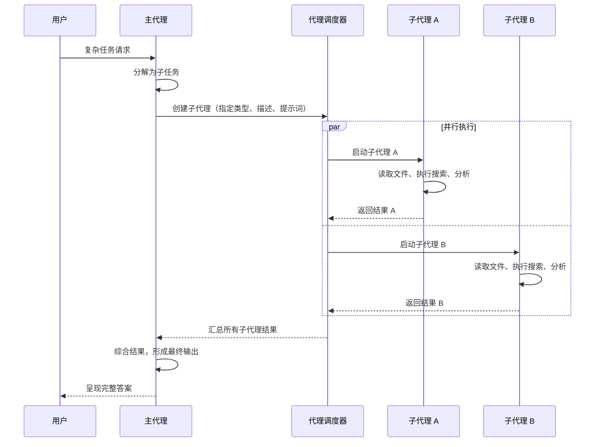

# Agents 代理系统

## 📖 概念

> Agents 是 Claude Code 的**多代理协作架构**。它允许主会话（Main Agent）动态创建和管理多个子代理（Sub-Agent），每个子代理独立执行特定子任务。这就像"一个人（主代理）带领一支团队（子代理），每个成员负责自己擅长的领域，最终汇总成果"。

Agents 系统解决了单代理的**上下文窗口瓶颈**：一个子代理可以专注于一个子问题，处理大量文件但不污染主会话的上下文。同时，多个子代理可以**并行执行**，显著提升效率。

### 代理的层级关系

```
Main Agent（主代理 - 你在对话中交互的对象）
  ├── Sub-Agent A（子代理 - 独立执行代码审查）
  ├── Sub-Agent B（子代理 - 独立运行测试）
  ├── Sub-Agent C（子代理 - 独立研究文档）
  └── Sub-Agent D（子代理 - 独立修复 Bug）
```

### 内置子代理类型

| 类型 | 用途 | 典型场景 |
|------|------|---------|
| `general-purpose` | 通用任务执行 | 多步骤搜索、代码分析 |
| `Explore` | 只读代码库探索 | 理解项目结构、搜索模式 |
| `Plan` | 架构设计与规划 | 实现策略设计、技术方案评审 |
| `claude-code-guide` | Claude Code 知识问答 | 功能查询、配置指导 |
| `statusline-setup` | 状态栏配置 | 终端状态栏定制 |

## 🔧 工作原理

> Agents 系统的核心是一个**工作树（Worktree）隔离 + 上下文管理 + 结果合并**的框架。

### 代理的生命周期



### 关键机制

1. **上下文隔离**：每个子代理拥有独立的上下文窗口，不污染主会话
2. **工作树隔离**（可选）：`isolation: "worktree"` 为子代理创建独立的 git 工作树，避免文件冲突
3. **后台执行**：`run_in_background: true` 让子代理异步运行，主会话继续处理其他任务
4. **模型选择**：可为不同子代理指定不同模型（`sonnet`/`opus`/`haiku`），性价比最优
5. **权限继承**：子代理继承主会话的权限模式（`auto`/`acceptEdits`/`bypassPermissions` 等）

### 并行 vs 串行策略

```
串行执行（依赖关系）：
  分析结构 → 设计方案 → 实现代码 → 运行测试
  
并行执行（无依赖关系）：  
  ├── 审查前端代码
  ├── 审查后端代码  ← 三者同时进行
  └── 审查数据库 Schema
```

## 📂 目录树位置

> 子代理分为**内置类型**和**自定义代理**。内置类型编译在 CLI 中；自定义代理以 Markdown 文件定义。

```
项目根目录/
├── AGENTS.md                      ← 所有子代理的默认指令（项目级）
└── .claude/
    ├── agents/                    ← 项目自定义代理定义
    │   └── <agent-name>.md        ← 单文件即一个代理类型
    └── worktrees/                 ← 代理工作树隔离目录（自动创建/清理）
        └── <agent-id>/

用户全局目录 (~/.claude/)：
~/.claude/
├── agents/                        ← 全局自定义代理（所有项目可用）
│   └── <agent-name>.md
└── projects/<hash>/memory/        ← 代理可读取和写入的 Memory
```

| 文件/目录 | 作用 | 加载时机 |
|----------|------|---------|
| `AGENTS.md` | 所有子代理的默认行为指令 | 子代理启动时注入系统提示词 |
| `.claude/agents/<name>.md` | 项目级自定义代理 | 主代理通过 Agent tool 指定时加载 |
| `~/.claude/agents/<name>.md` | 全局自定义代理 | 同上，优先级低于项目级 |
| `.claude/worktrees/` | 代理隔离工作副本 | `isolation: "worktree"` 时自动创建 |

**内置代理类型**（编译在 CLI 中，无文件）：
- `general-purpose` — 通用任务代理
- `Explore` — 只读代码库探索
- `Plan` — 架构设计与规划
- `claude-code-guide` — Claude Code 知识问答
- `statusline-setup` — 状态栏配置

**代理调用链**：用户在对话中输入任务 → 主代理（Main Agent）分解 → 通过 `Agent` 工具指定类型/名称 → 调度器从 `.claude/agents/` 或 `~/.claude/agents/` 加载定义 → 子代理在独立上下文中执行 → 结果返回主代理汇总。

## 💡 为什么重要

- **突破上下文限制**：每个子代理独立上下文，可处理远超主会话容量的信息
- **并行加速**：独立子任务同时执行，总耗时 = 最慢子代理的耗时，而非各任务之和
- **专业化分工**：不同子代理使用不同的系统提示词，真正实现"各司其职"
- **质量提升**：多个子代理独立审查同一问题，交叉验证减少遗漏

## 🎯 实战示例

### 示例 1：并行代码审查

**场景**：你提交了一个大型 PR，涉及前端（React）、后端（Node.js）和数据库迁移。想在合并前从三个维度独立审查。

**操作步骤**：

```bash
"全面审查我当前的变更，用三个并行的子代理：
1. 安全审查：检查 SQL 注入、XSS、认证漏洞
2. 性能审查：检查 N+1 查询、不必要的重渲染、大文件加载
3. 架构审查：检查模块耦合度、接口设计、错误处理一致性
每个子代理独立运行，最后汇总问题列表"
```

**代理调度**：

```
主代理分解任务：
  ├── Agent(security-review, isolation: worktree)
  │   → 检查 src/api/、src/auth/、prisma/
  │
  ├── Agent(performance-review, isolation: worktree)
  │   → 检查 src/components/、src/queries/、public/
  │
  └── Agent(architecture-review, isolation: worktree)
      → 检查 src/ 整体结构、接口定义、错误处理
```

**结果**：三个子代理并行执行，各自产出审查报告。主代理汇总：

```markdown
# PR #342 审查汇总

## 🔴 安全问题（2 个）
- [HIGH] `src/api/users.ts:45` - SQL 拼接，应使用参数化查询
- [MEDIUM] `src/components/Profile.tsx:120` - 用户输入未转义

## 🟡 性能问题（3 个）
- `src/components/List.tsx:78` - 缺少 useMemo，每次渲染重建数据
- `src/queries/dashboard.ts:23` - N+1 查询，应用 batch 加载
- `public/hero.png` - 2.3MB，应压缩到 <500KB

## 🔵 架构建议（4 个）
- `src/api/` 和 `src/services/` 职责重叠，建议合并
- 错误处理不一致：api 层用 try-catch，service 层用 .catch()
- 缺少接口定义：`UserService` 和 `OrderService` 应抽象为 interface
```

**原理分析**：这里的核心是**多维度独立审查**。每个子代理有自己的系统提示词（安全、性能、架构的审查规则），在自己的工作树中独立分析代码。主代理不参与具体审查，只负责分解任务和汇总结果。三个维度同时运行，总耗时等于最慢的那个，而非三者之和。

### 示例 2：大规模代码库迁移——分治策略

**场景**：你需要将一个 monorepo 中所有项目的日志库从 `winston` 迁移到 `pino`。涉及 8 个子项目，每个有自己的日志配置和使用方式。

**操作步骤**：

```bash
"将整个 monorepo 从 winston 迁移到 pino。策略：
1. 先用 Explore 子代理扫描所有项目，生成迁移清单
2. 为每个子项目启动一个独立子代理，并行迁移
3. 最后一个汇总子代理检查一致性"
```

**代理调度**：

```
阶段一：Explore 子代理扫描
  Agent(Explore) → 扫描所有 packages/*/src/
  输出：迁移清单（8 个项目，52 个文件）

阶段二：并行迁移（8 个子代理同时运行）
  Agent("迁移 packages/api")          → 修改 12 个文件
  Agent("迁移 packages/worker")       → 修改 8 个文件
  Agent("迁移 packages/frontend")     → 修改 15 个文件
  Agent("迁移 packages/admin")        → 修改 6 个文件
  Agent("迁移 packages/shared")       → 修改 4 个文件
  Agent("迁移 packages/auth")         → 修改 5 个文件
  Agent("迁移 packages/notification") → 修改 1 个文件
  Agent("迁移 packages/search")       → 修改 1 个文件

阶段三：一致性检查
  Agent("检查迁移一致性：验证所有 import 路径、API 调用、
        配置格式，运行全量测试")
```

**结果**：
- 8 个子代理并行执行，每个在自己的工作树中独立修改
- 迁移 52 个文件总共用时 = 最慢子代理的耗时 ≈ 2 分钟（而非串行的 16 分钟）
- 最后的一致性检查子代理发现并修复了 3 处遗漏

**原理分析**：这是 Agents 系统的**分治能力**——将大任务按边界清晰的方式切分，每个子代理处理独立的一块。工作树隔离（`isolation: worktree`）确保 8 个子代理不会互相冲突。这比单个 Agent 串行处理 52 个文件高效得多，且每个子代理的上下文更干净（只关注一个子项目）。

### 示例 3：技术方案 PK——多方案并行设计

**场景**：你需要为一个"实时协作编辑"功能设计技术方案。有 3 种可选方案：WebSocket 直连、CRDT 库、Operational Transform。你想让 AI 从不同角度设计并 PK。

**操作步骤**：

```bash
"为'多人实时协作编辑文档'功能设计技术方案。
启动 3 个 Plan 子代理，分别从以下角度设计方案：
1. WebSocket + 操作锁方案（最简单）
2. Yjs CRDT 方案（业界主流）
3. OT 算法方案（Google Docs 模式）
每个方案需包含：架构图描述、数据结构、冲突解决策略、
实现复杂度评估、预计开发周期。
最后用一个汇总子代理对比三个方案，给出推荐"
```

**代理调度**：

```
并行设计阶段：
  Plan Agent("设计 WebSocket + 操作锁方案")
  → 方案 A：简单但并发编辑体验差
  
  Plan Agent("设计 Yjs CRDT 方案")  
  → 方案 B：成熟库，自动冲突解决
  
  Plan Agent("设计 OT 算法方案")
  → 方案 C：最灵活但实现最复杂

汇总阶段：
  Agent("对比三个方案，按以下维度打分：复杂度、性能、
        用户体验、维护成本、团队学习曲线")
```

**对比结果**：

| 维度 | 方案 A (WS+锁) | 方案 B (Yjs CRDT) | 方案 C (OT) |
|------|:--:|:--:|:--:|
| 实现复杂度 | ⭐⭐ | ⭐⭐⭐ | ⭐⭐⭐⭐⭐ |
| 并发体验 | ⭐⭐ | ⭐⭐⭐⭐⭐ | ⭐⭐⭐⭐ |
| 性能 | ⭐⭐⭐⭐ | ⭐⭐⭐⭐ | ⭐⭐⭐⭐⭐ |
| 维护成本 | ⭐⭐⭐⭐⭐ | ⭐⭐⭐ | ⭐⭐ |
| 学习曲线 | ⭐⭐⭐⭐⭐ | ⭐⭐⭐ | ⭐⭐ |
| **总分** | **18** | **19** | **16** |
| 开发周期 | 2 周 | 3 周 | 6 周 |

> 推荐方案 B（Yjs CRDT）：在实现复杂度和用户体验之间取最佳平衡，社区成熟度高。

**原理分析**：这是 Agents 系统的**创意多样性**应用。3 个 Plan 子代理各自从不同技术路线独立设计方案，避免了"一条路走到黑"的思维局限。汇总子代理用统一的维度和评分标准横向对比，让决策有据可依。这种"多方案并行设计 → 汇总评审"的模式在技术选型、架构设计中非常有价值。

## ✅ 最佳实践

1. **DO**：将无依赖的子任务并行化，充分利用代理系统的并发能力
2. **DO**：选择合适的子代理类型：探索用 `Explore`，规划用 `Plan`，通用用 `general-purpose`
3. **DO**：在并行的文件修改任务中使用 `isolation: worktree` 避免冲突
4. **DON'T**：为简单任务创建子代理——单个 Read/Grep 调用比子代理更快
5. **DON'T**：让子代理做超出其类型定义的事情——类型决定了系统提示词和工具集
6. **TIP**：用 `run_in_background` 处理耗时任务，主会话可以在等待时继续交互

## ⚠️ 常见陷阱

| 陷阱 | 表现 | 解决方案 |
|------|------|---------|
| 过度并行 | 简单任务也创建子代理，开销大于收益 | 评估任务复杂度：3+ 独立步骤或 >5 个文件才考虑并行 |
| 重复工作 | 多个子代理读取相同的文件 | 用 Explore 子代理先收集信息，再分发到执行子代理 |
| 汇总丢失细节 | 子代理返回大量内容，主代理未完整呈现 | 明确要求子代理"输出结构化摘要"，主代理逐项呈现 |
| 权限不一致 | 子代理因权限不足无法完成分配的任务 | 检查子代理的 `mode` 参数与实际需要的权限匹配 |

## 🔗 关联概念

- [[Claude Code/01-Skills 技能系统\|Skills 技能系统]] — Skills + Agents：给子代理装备专业技能
- [[Claude Code/03-Tools 工具系统\|Tools 工具系统]] — 子代理也是通过 Tools 执行任务
- [[Claude Code/05-Memory 记忆系统\|Memory 记忆系统]] — 子代理的执行结果如何沉淀为记忆
- [[Claude Code/06-Hooks 钩子系统\|Hooks 钩子系统]] — Hooks 可以在代理生命周期事件触发
- [[Claude Code/08-Workflows 工作流编排\|Workflows 工作流编排]] — Workflows 是 Agent 的编排层
- [[Claude Code/10-Plan Mode 规划模式\|Plan Mode 规划模式]] — Plan Mode 中可用 Explore Agent 探索代码库

## 📚 扩展阅读

- 官方文档：[Claude Code Agents](https://docs.anthropic.com/en/docs/claude-code/agents)

---

> **下一步**：阅读 [[Claude Code/08-Workflows 工作流编排\|Workflows 工作流编排]] 了解如何用脚本编排多 Agent 协同工作。
