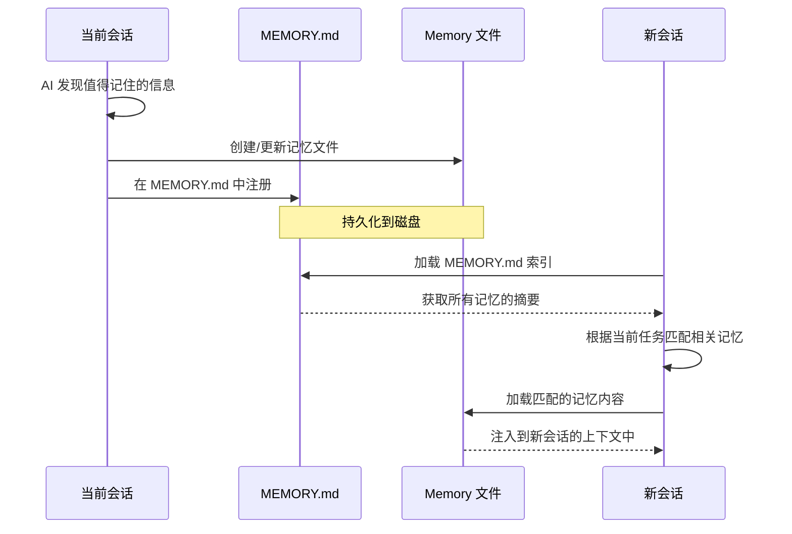

# Memory 记忆系统

## 📖 概念

> Memory 是 Claude Code 的**持久化知识系统**。它让 AI 能够"记住"跨会话的重要信息——用户偏好、项目约定、关键决策、经验教训。每次新会话启动时，相关记忆会被自动加载，让 AI 越来越了解你和你的项目。

Memory 不是"日志"或"聊天记录"。它是**结构化的、可检索的、有生命周期的知识卡片**。每一条记忆是一个独立文件，包含事实、上下文和如何应用该知识的指引。

### 记忆 vs 上下文 vs CLAUDE.md

| 机制 | 生命周期 | 用途 | 示例 |
|------|---------|------|------|
| **Memory** | 跨会话持久化 | 用户偏好、项目事实、经验教训 | "用户偏好使用 pnpm 而非 npm" |
| **CLAUDE.md** | 项目级持久化 | 项目架构、约定、指令 | "本项目使用 Clean Architecture" |
| **上下文** | 当前会话 | 当前对话的任务信息 | "你正在修复 login bug" |

## 🔧 工作原理

> Memory 系统基于**文件系统 + 前端元数据 + 索引检索**三层架构。记忆以 Markdown 文件存储，通过 frontmatter 元数据描述，在 MEMORY.md 索引中注册。

### Memory 的文件结构

```
~/.claude/projects/<project-hash>/memory/
├── MEMORY.md              # 索引文件：列出所有记忆的摘要
├── user-prefers-pnpm.md   # 单条记忆 1
├── project-uses-ddd.md    # 单条记忆 2
├── avoid-n-plus-1.md      # 单条记忆 3
└── ...
```

### 单条记忆的格式

```markdown
---
name: user-prefers-pnpm
description: 用户偏好使用 pnpm 作为包管理器
metadata:
  type: user
---

用户在所有项目中优先使用 pnpm 而非 npm 或 yarn。
**Why:** pnpm 的硬链接机制节省磁盘空间，且安装速度更快。
**How to apply:** 在需要安装依赖时，默认使用 `pnpm add` 而非 `npm install`。
```

### 记忆的生命周期



### 记忆的类型

| 类型 | 用途 | 示例 |
|------|------|------|
| `user` | 用户偏好、习惯 | "用户喜欢中文回复" |
| `feedback` | 用户对 AI 行为的反馈 | "不要自动提交 git，先展示 diff" |
| `project` | 项目事实、约定 | "api 模块使用 Prisma ORM" |
| `reference` | 外部资源引用 | "CI 配置文档地址" |

### 记忆检索机制

新会话启动时，AI 读取 `MEMORY.md` 索引，解析每条记忆的 `name` 和 `description`。根据当前任务的关键词，AI 判断哪些记忆相关，然后读取对应的记忆文件。记忆内容作为 `Claude Code` 系统提示词的一部分被注入。

## 📂 目录树位置

> Memory 存储在 `~/.claude/projects/` 下，按项目 hash 隔离。每个项目拥有独立的记忆空间。

```
用户全局目录 (~/.claude/)：
~/.claude/
└── projects/
    └── <project-hash>/            ← 每个项目的唯一 hash（基于项目路径）
        └── memory/                ← 该项目的 Memory 存储
            ├── MEMORY.md          ← 索引文件：所有记忆的摘要列表
            ├── <memory-1>.md      ← 单条记忆文件
            ├── <memory-2>.md      ← 单条记忆文件
            └── ...
```

| 文件 | 格式 | 作用 |
|------|------|------|
| `MEMORY.md` | Markdown 列表 | 索引：每条记忆一行（文件名 + 一句话描述） |
| `<name>.md` | Markdown + YAML frontmatter | 单条记忆：含 `name`、`description`、`metadata.type` 和正文内容 |

**Memory 的生命周期**：
1. **创建**：AI 调用 `Write` 工具写入 `~/.claude/projects/<hash>/memory/<name>.md`
2. **注册**：AI 在 `MEMORY.md` 中添加一行索引条目
3. **加载**：新会话启动时，系统读取 `MEMORY.md` 索引 → 匹配相关记忆 → 注入上下文
4. **更新**：AI 调用 `Edit` 或 `Write` 更新记忆文件
5. **删除**：过时记忆通过删除文件 + 移除索引条目清理

**隔离保证**：不同项目的 Memory 因 `<project-hash>` 不同而完全隔离。即使在同一台机器上，项目 A 的记忆不会污染项目 B。

## 💡 为什么重要

- **跨会话连续性**：每次对话都从"了解你"开始 → 从"记住你"开始
- **知识累积**：团队成员的发现、教训、约定逐步沉淀，新人也能受益
- **个性化体验**：AI 学习你的偏好（代码风格、工具选择、回复语言）
- **减少重复**：不需要在每个会话中解释相同的项目背景

## 🎯 实战示例

### 示例 1：建立项目技术决策日志

**场景**：你正在开发一个电商平台，团队做了几个重要的技术决策。你希望 AI 在后续所有开发中自动遵循这些决策。

**操作步骤**：

```bash
"记住以下项目决策：
1. 状态管理使用 Zustand 而非 Redux——体积小、API 简洁、TS 支持好
2. 所有 API 请求必须通过 src/api/client.ts 的统一 fetcher，不能直接用 axios
3. 测试使用 Vitest 而非 Jest——因为项目用 Vite 构建，Vitest 零配置兼容
4. 禁止使用 any 类型——所有类型必须显式定义"
```

**AI 创建的记忆**：

```markdown
// memory/project-tech-decisions.md
---
name: project-tech-decisions
description: 电商平台项目的核心技术决策和约定
metadata:
  type: project
---

## 状态管理：Zustand
所有状态管理使用 Zustand，禁止引入 Redux 或 MobX。
**Why:** Zustand 体积小(1KB)、API 简洁、TypeScript 支持优秀。
**How to apply:** 新功能的状态用 `create()` 定义 store，放在 `src/stores/` 下。

## API 请求：统一 Fetcher
所有 HTTP 请求必须通过 `src/api/client.ts` 的统一 fetcher。
**Why:** 统一处理认证、错误、重试、日志。
**How to apply:** `import { fetcher } from '@/api/client'`，禁止直接 `import axios`。

## 测试：Vitest
使用 Vitest，不用 Jest。
**Why:** 项目构建工具是 Vite，Vitest 零配置兼容。
**How to apply:** 测试文件以 `.test.ts` 结尾，放在 `__tests__/` 或与源文件同目录。

## 类型安全：禁止 any
所有 TypeScript 类型必须显式定义，禁止使用 `any`。
**Why:** `any` 破坏类型安全，掩盖潜在的运行时错误。
**How to apply:** 使用 `unknown` + 类型守卫，或定义具体的 interface/type。

[[project-architecture-overview]]
```

**后续效果**：

```bash
# 新会话中：
"添加购物车功能"

# AI 自动：
# - 用 Zustand 创建 cartStore（而非 Redux）
# - 所有 API 调用通过 fetcher（而非直接 axios）
# - 测试文件用 Vitest（而非 Jest）
# - 所有类型接口显式定义（零 any）
```

**原理分析**：Memory 使 AI 从"通用助手"变成了"了解项目约定的团队成员"。新的决策被记录后，后续所有开发自动遵循。**`[[交叉引用]]`** 让记忆之间形成知识网络，AI 可以自动发现相关记忆。例如修改 API 时，AI 会同时加载 `project-tech-decisions` 和 `project-architecture-overview`。

### 示例 2：记录和传播 Bug 修复经验

**场景**：团队花了两天时间定位一个诡异的 bug——Prisma 的 `findMany` 在特定条件下返回过期数据。你希望这个经验被 AI 和团队成员记住。

**操作步骤**：

```bash
"记录这个 bug 和修复方案：
问题：Prisma 的 findMany 在事务中使用时，如果没有传
rejectOnNotFound，可能返回缓存中的过期数据而非数据库最新状态。
修复：在所有事务中的查询添加明确的锁策略或使用 $queryRaw。
相关文件：src/services/order.ts, src/services/inventory.ts"
```

**AI 创建的记忆**：

```markdown
// memory/prisma-stale-data-bug.md
---
name: prisma-stale-data-bug
description: Prisma 事务中 findMany 可能返回过期数据
metadata:
  type: project
---

## 问题
Prisma 的 `findMany` 在事务中使用时，如果没有添加锁策略，可能
返回缓存中的过期数据，而非数据库最新提交的状态。

## 复现条件
- 使用 `prisma.$transaction([...])`
- 其中一个操作是 `findMany`
- 高并发写入场景

## 修复方案
1. **短期**：在所有事务中的查询使用 `$queryRaw` 代替 `findMany`
2. **长期**：升级 Prisma 到 5.x+，使用 Interactive Transactions
   配合 `isolationLevel: 'Serializable'`

## 影响文件
- `src/services/order.ts:45` - `OrderService.createOrder`
- `src/services/inventory.ts:78` - `InventoryService.checkStock`

## 检测方法
运行 `pnpm test:e2e:concurrency` 端到端并发测试，监控数据一致性。

[[project-tech-decisions]]
```

**后续效果**：

```bash
# 新会话中：
"给订单系统添加批量退款功能"

# AI 自动：
# - 在涉及事务的代码中使用 $queryRaw（而非 findMany）
# - 建议升级 Prisma 版本
# - 提醒运行并发测试
```

**原理分析**：Memory 在这里起到了**团队知识库**的作用。Bug 修复经验（从"发现"到"修复"再到"检测"）被结构化为一条可检索的记忆，在后续所有涉及 Prisma 事务的开发中都会被加载。这比"写在 Confluence 然后没人看"有效得多——AI 在编写代码时**自动**应用了这个经验。

### 示例 3：建立项目规划的决策追踪

**场景**：作为 Tech Lead，你做了很多架构决策。你希望每个决策都有记录，包括"为什么选择这个方案"、"考虑过的替代方案"、"最终决策"。这样新人或未来你自己回顾时，能理解当时的选择逻辑。

**操作步骤**：

```bash
"帮我建立决策追踪记忆体系。今天做一个决策：
关于 API 分页策略，我们选择 Cursor-based 分页
而非 Offset-based。记录完整决策过程。"
```

**AI 创建的记忆**：

```markdown
// memory/adr-cursor-pagination.md
---
name: adr-cursor-pagination
description: 架构决策记录：选择 Cursor-based 分页而非 Offset-based
metadata:
  type: project
---

## ADR-001: API 分页策略

### 状态
✅ 已采纳（2026-06-19）

### 背景
电商平台的商品列表和数据导出功能需要分页。

### 决策
使用 **Cursor-based 分页**（基于游标的分页）。

### 考虑过的方案

| 方案 | 优点 | 缺点 | 结论 |
|------|------|------|------|
| Offset-based | 实现简单，前端无状态 | 大偏移量性能差，并发插入导致重复/遗漏 | ❌ 不适用 |
| Cursor-based | 性能稳定，并发安全 | 前端需维护游标，无法跳页 | ✅ 采纳 |
| Keyset Pagination | 性能最优 | 需要复合索引，URL 可读性差 | ⚠️ 备选 |

### 实施细节
- 游标字段：`created_at` + `id` 组合
- API 格式：`GET /api/items?cursor=<encoded>&limit=20`
- 响应：`{ data: [...], nextCursor: "<encoded>", hasMore: true }`
- 前端：FlatList onEndReached 自动加载，不暴露游标给 UI

### 影响范围
所有需要列表的 API 端点：商品、订单、用户

### 关联决策
- [[adr-api-versioning]] - API 版本策略
- [[project-tech-decisions]] - 核心技术栈

### 参考资料
- [Slack API Pagination Guide](https://slack.engineering/evolving-api-pagination-at-slack/)
```

**后续效果**：

```bash
# 几周后：
"给订单列表添加导出功能"

# AI 自动：
# - 使用 Cursor-based 分页遍历所有订单
# - 遵循已定义的 API 格式（cursor=<encoded>&limit=20）
# - 生成符合 nextCursor/hasMore 格式的响应

# 新成员加入时：
"帮我了解项目的 API 设计规范"

# AI 自动加载所有 ADR 记忆，给出完整的设计决策历史。
```

**原理分析**：这展示了 Memory 的**决策追踪（ADR）**能力。每条 ADR 记忆不仅记录"选择了什么"，更记录"为什么这样选择"和"考虑过哪些替代方案"。这是**项目规划**中的关键实践——技术决策可追溯、可回顾、可挑战。Memory 系统让 ADR 从"写在 markdown 里没人维护的文档"变成了"AI 自动加载并遵循的活知识"。

## ✅ 最佳实践

1. **DO**：记忆应该记录**非显而易见的**信息——代码能说明的事实不需要记录
2. **DO**：使用 `[[交叉引用]]` 连接相关记忆，构建知识网络
3. **DO**：及时更新过时的记忆——删除或标记为 superseded
4. **DON'T**：把 Memory 当 todo list 用——那是 `task_plan.md` 的职责
5. **DON'T**：记录可以通过 `git log` 或代码本身推断的信息
6. **TIP**：每个项目开始时，花 2 分钟让 AI 记录项目的关键事实

## ⚠️ 常见陷阱

| 陷阱 | 表现 | 解决方案 |
|------|------|---------|
| 记忆膨胀 | 成百上千条记忆，检索效率下降 | 定期清理过时记忆；合并相关记忆；删除能被代码推断的事实 |
| 记忆冲突 | 两条记忆说不同的架构决策 | 使用 ADR 格式记录决策，过时决策标记 `superseded` |
| 过度记录 | 把每次对话都记录为记忆 | 只记录**跨会话有价值**的信息：决策、偏好、经验教训 |
| 忽略更新 | 记忆描述的技术栈已升级但未更新 | 每次技术栈变更后主动说 "更新相关记忆" |

## 🔗 关联概念

- [[Claude Code/04-Agents 代理系统\|Agents 代理系统]] — 子代理也读取和写入 Memory
- [[Claude Code/07-配置与项目管理\|配置与项目管理]] — CLAUDE.md vs Memory：指令 vs 知识
- [[Claude Code/01-Skills 技能系统\|Skills 技能系统]] — Skills 是"怎么做"，Memory 是"做过什么"

## 📚 扩展阅读

- 官方文档：[Claude Code Memory](https://docs.anthropic.com/en/docs/claude-code/memory)

---

> **下一步**：阅读 [[Claude Code/06-Hooks 钩子系统\|Hooks 钩子系统]] 了解事件驱动的自动化机制。
