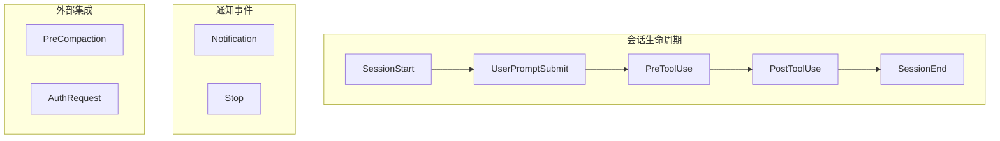

# Hooks 钩子系统

## 📖 概念

> Hooks 是 Claude Code 的**事件驱动自动化机制**。它允许你在特定生命周期事件发生时自动执行自定义逻辑——比如会话启动前注入项目上下文、工具调用前检查权限、任务完成后自动保存进度。Hooks 就像是 Claude Code 的"自动化神经反射"。

Hooks 不是"在对话中让 AI 做某事"——那是自然语言指令。Hooks 是"当事件 X 发生时，系统自动执行操作 Y"，它运行在 Claude Code 的 Harness 层，不需要 AI 主动调用。

### Hooks vs Skills vs MCP

| 机制 | 触发方式 | 执行位置 | 用途 |
|------|---------|---------|------|
| **Hooks** | 事件自动触发 | Harness 层 | 自动化流程：注入上下文、保存状态、权限检查 |
| **Skills** | 用户自然语言触发 | AI 推理层 | 扩展 AI 能力：注入领域知识、编排工具调用 |
| **MCP** | AI 调用工具时触发 | 外部进程 | 连接外部服务：调用 API、访问数据库 |

## 🔧 工作原理

> Hooks 系统基于**事件发布-订阅模型**。Claude Code 的生命周期中定义了多个事件点，每个事件点可以注册一个或多个 Hook。Hook 可以是 Shell 命令或脚本，接收事件上下文作为输入。

### Hook 事件类型



### 核心 Hook 事件

| 事件 | 触发时机 | 典型用途 | 返回值影响 |
|------|---------|---------|-----------|
| `SessionStart` | 会话创建时 | 注入项目上下文、加载状态 | 可注入额外上下文 |
| `UserPromptSubmit` | 用户提交提示词后 | 提示词增强、内容审核 | 可修改/阻止提示词 |
| `PreToolUse` | 工具调用执行前 | 权限检查、参数验证 | 可修改参数/阻止执行 |
| `PostToolUse` | 工具调用完成后 | 自动保存、通知、日志 | 无影响（仅观测） |
| `SessionEnd` | 会话结束时 | 清理、保存最终状态 | 无影响（仅观测） |
| `Notification` | 系统通知时 | 桌面通知、手机推送 | 无影响（仅观测） |
| `Stop` | AI 响应完成时 | 状态保存、后续任务触发 | 可请求继续执行 |
| `PreCompaction` | 上下文压缩前 | 保留关键信息 | 可注入需保留的上下文 |

### Hook 配置格式

```json
// .claude/settings.json
{
  "hooks": {
    "SessionStart": [
      {
        "command": "node .claude/hooks/load-project-context.js",
        "description": "加载项目状态和上次未完成的任务"
      }
    ],
    "PreToolUse": [
      {
        "matcher": "Bash",
        "command": "python3 .claude/hooks/validate-dangerous-command.py",
        "description": "检查危险命令"
      }
    ],
    "PostToolUse": [
      {
        "matcher": "Write|Edit",
        "command": "bash .claude/hooks/auto-format.sh",
        "description": "自动格式化修改的文件"
      }
    ],
    "Stop": [
      {
        "command": "node .claude/hooks/save-progress.js",
        "description": "保存当前进度"
      }
    ]
  }
}
```

### Hook 的输入与输出

每个 Hook 通过 **stdin** 接收 JSON 格式的事件上下文，通过 **stdout** 返回指令。

**输入示例**（PreToolUse 事件）：
```json
{
  "event": "PreToolUse",
  "tool": "Bash",
  "parameters": {
    "command": "rm -rf /important-data",
    "description": "清理临时文件"
  },
  "session_id": "sess_abc123"
}
```

**输出示例**（Hook 的决策指令）：
```json
{
  "decision": "block",
  "reason": "检测到删除重要目录的命令，已阻止执行"
}
```

## 💡 为什么重要

- **自动化护栏**：危险操作自动拦截，不需要依赖 AI 的判断
- **跨会话连续性**：自动保存进度，下次会话无缝恢复
- **团队标准化**：统一的代码格式化、安全检查、提交规范
- **外部系统集成**：将 Claude Code 嵌入更大的自动化流程中

## 🎯 实战示例

### 示例 1：自动进度保存与恢复

**场景**：你经常在多个功能之间切换，每次切换会话后都要重新解释"上次做到哪了"。你希望自动保存和恢复进度。

**操作步骤**：

创建进度保存 Hook（`.claude/hooks/save-progress.sh`）：

```bash
#!/bin/bash
# .claude/hooks/save-progress.sh
# 在每次 AI 响应完成后自动保存进度

STATE_FILE=".claude/project-task-state.json"

# 读取 stdin 中的事件上下文
read -r EVENT_CONTEXT

# 从上下文中提取会话信息
SESSION_ID=$(echo "$EVENT_CONTEXT" | jq -r '.session_id')

# 生成进度快照：记录当前打开的文件、任务状态、未完成事项
cat > "$STATE_FILE" << EOF
{
  "lastSessionId": "$SESSION_ID",
  "lastUpdated": "$(date -u +%Y-%m-%dT%H:%M:%SZ)",
  "activeFiles": $(git diff --name-only HEAD 2>/dev/null | jq -R -s 'split("\n")[:-1]'),
  "uncommittedChanges": $(git status --short 2>/dev/null | wc -l | tr -d ' ')
}
EOF

echo '{"decision": "continue"}'  # 不阻止正常流程
```

## 📂 目录树位置

> Hooks 通过 `settings.json` 中的 `hooks` 字段配置，实际脚本存储在 `.claude/hooks/` 目录下。

```
项目根目录/
└── .claude/
    ├── settings.json              ← hooks 字段在此配置
    │   { "hooks": { "SessionStart": [...], "PreToolUse": [...], ... } }
    ├── settings.local.json        ← 个人 Hook 覆盖配置
    └── hooks/                     ← Hook 脚本物理存储
        ├── load-context.sh
        ├── security-check.py
        ├── auto-validate.sh
        └── save-progress.js

用户全局目录 (~/.claude/)：
~/.claude/
├── settings.json                  ← 全局 Hook 配置（所有项目生效）
└── hooks/                         ← 全局 Hook 脚本
    └── *.sh / *.js / *.py
```

| 文件/目录 | 作用 | 内容 |
|----------|------|------|
| `.claude/settings.json` → `hooks` | 定义 Hook **触发规则** | 事件类型 + matcher + 命令 |
| `.claude/hooks/*` | Hook 脚本**物理文件** | 可执行的 Shell / Python / Node.js 脚本 |
| `~/.claude/settings.json` → `hooks` | 全局 Hook 配置 | 所有项目生效的 Hook |

**Hook 的生效范围**：
- **项目级** `.claude/settings.json`：仅当前项目，应提交 Git 供团队共享
- **本地级** `.claude/settings.local.json`：仅本机，覆盖项目配置，不提交 Git
- **全局级** `~/.claude/settings.json`：所有项目，适合个人偏好的通用 Hook

**Hook 与 tools/Skills 的目录关系**：
```
.claude/                    ← Claude Code 项目配置根目录
├── hooks/                  ← Hook 脚本（事件驱动触发）
├── skills/                 ← Skill 定义（自然语言触发）
└── agents/                 ← Agent 定义（Agent 工具触发）
```
三者存储在同一层级，但触发机制完全不同：Hooks 是事件自动触发，Skills 是自然语言匹配触发，Agents 是主代理通过工具调用触发。

进度恢复 Hook（SessionStart）：

```json
{
  "hooks": {
    "SessionStart": [
      {
        "command": "bash .claude/hooks/restore-progress.sh",
        "description": "恢复上次会话的进度"
      }
    ],
    "Stop": [
      {
        "command": "bash .claude/hooks/save-progress.sh",
        "description": "自动保存进度"
      }
    ]
  }
}
```

恢复脚本：

```bash
#!/bin/bash
# .claude/hooks/restore-progress.sh
STATE_FILE=".claude/project-task-state.json"

if [ -f "$STATE_FILE" ]; then
  LAST_UPDATED=$(jq -r '.lastUpdated' "$STATE_FILE")
  CHANGED_FILES=$(jq -r '.activeFiles | join(", ")' "$STATE_FILE")
  UNCOMMITTED=$(jq -r '.uncommittedChanges' "$STATE_FILE")
  
  # 将进度信息注入到会话上下文
  echo "{
    \"decision\": \"continue\",
    \"contextInjection\": \"上次会话时间: $LAST_UPDATED。修改中的文件: $CHANGED_FILES。有 $UNCOMMITTED 个未提交变更。请主动询问用户是否继续上次的工作。\"
  }"
else
  echo '{"decision": "continue"}'
fi
```

**结果**：
- 每次 AI 响应完成后，自动保存当前进度到 `.claude/project-task-state.json`
- 下次会话启动时，自动注入上次的进度信息
- AI 主动询问："检测到您上次修改了 `src/api/users.ts` 和 `src/services/auth.ts`，有 3 个未提交变更。要继续上次的工作吗？"

**原理分析**：这个示例展示了 Hooks 在**跨会话连续性**中的价值。`Stop` Hook 在每次 AI 完成响应后自动执行，`SessionStart` Hook 在每次会话开始时恢复状态。这全程不需要用户手动操作，也不需要 AI 记住——它由 Harness 层自动完成。这是 Hooks 与 Memory 的关键区别：Memory 存储"知识"，Hooks 触发"行动"。

### 示例 2：代码提交前自动安全检查

**场景**：你希望在所有文件编辑操作后自动进行安全检查，防止 AI 不小心写入包含密钥、硬编码凭证或不安全代码的文件。

**操作步骤**：

创建安全检查 Hook：

```python
#!/usr/bin/env python3
# .claude/hooks/security-check.py
import json, sys, re, os

def check_file_security(filepath):
    """检查文件是否包含安全问题"""
    issues = []
    
    try:
        with open(filepath, 'r') as f:
            content = f.read()
    except:
        return issues
    
    # 检查硬编码密钥
    patterns = [
        (r'(?i)(api_key|secret|password|token)\s*[:=]\s*["\'][^"\'`]{8,}["\']', 
         '疑似硬编码密钥'),
        (r'(?i)(BEGIN\s+(RSA|EC|DSA)\s+PRIVATE\s+KEY)', 
         '私钥不应提交到代码库'),
        (r'(?i)(sk-[a-zA-Z0-9]{20,})', 
         '疑似 OpenAI/Anthropic API Key'),
        (r'(?i)(ghp_[a-zA-Z0-9]{20,})', 
         '疑似 GitHub Personal Access Token'),
        (r'(eval\s*\(.*user.*input.*\))', 
         '危险：用户输入直接传入 eval()'),
    ]
    
    for pattern, message in patterns:
        if re.search(pattern, content):
            issues.append({
                'file': filepath,
                'type': 'security',
                'severity': 'HIGH',
                'message': message,
                'pattern': pattern
            })
    
    return issues

# 读取事件上下文
event = json.load(sys.stdin)

# 只检查文件编辑操作
if event.get('tool') in ('Write', 'Edit'):
    params = event.get('parameters', {})
    filepath = params.get('file_path', '')
    
    if filepath and os.path.exists(filepath):
        issues = check_file_security(filepath)
        
        if issues:
            print(json.dumps({
                'decision': 'block',
                'reason': f'安全检查发现 {len(issues)} 个问题',
                'details': issues
            }))
            sys.exit(0)

# 无问题，放行
print(json.dumps({'decision': 'continue'}))
```

配置 Hook：

```json
{
  "hooks": {
    "PreToolUse": [
      {
        "matcher": "Write|Edit",
        "command": "python3 .claude/hooks/security-check.py",
        "description": "文件写入前自动安全检查"
      }
    ],
    "PostToolUse": [
      {
        "matcher": "Write|Edit",
        "command": "npx prettier --write ${CLAUDE_TOOL_FILE_PATH} 2>/dev/null || true",
        "description": "自动格式化修改的文件"
      }
    ]
  }
}
```

**结果**：
- 当 AI 尝试写入包含 `sk-xxx...` API Key 的文件时，Hook 自动拦截并警告
- 写入成功后自动运行 Prettier 格式化
- 安全检查在 Harness 层执行，AI 无法绕过

**原理分析**：这个 Hook 是**项目安全护栏**的最佳实践。安全检查不在 AI 的职责范围内（AI 可能被欺骗或忽略），而是在 Harness 层作为硬性规则存在。`PreToolUse` Hook 的 `matcher` 精确匹配 `Write|Edit` 工具，确保只拦截文件写入操作。这种"自动化护栏"比"在 CLAUDE.md 中写'不要硬编码密钥'"可靠得多。

### 示例 3：自动触发 CI/CD 流程

**场景**：你希望每次 AI 完成代码修改后，自动运行类型检查、lint 和单元测试。如果失败，通知用户但不阻止继续工作。

**操作步骤**：

创建自动验证 Hook：

```bash
#!/bin/bash
# .claude/hooks/auto-validate.sh
# 在代码修改后自动运行快速检查

read -r EVENT_CONTEXT
TOOL=$(echo "$EVENT_CONTEXT" | jq -r '.tool')

# 只在文件编辑操作后运行
if [[ "$TOOL" != "Write" && "$TOOL" != "Edit" ]]; then
  echo '{"decision": "continue"}'
  exit 0
fi

RESULTS_FILE=".claude/validation-results.json"
PASS=true
ISSUES=()

# 1. TypeScript 类型检查（只检查变更文件）
if npx tsc --noEmit --pretty 2>&1 | tail -5; then
  echo "✅ TypeScript: PASS"
else
  PASS=false
  ISSUES+=('{"type":"TypeScript","status":"FAIL","message":"类型检查未通过"}')
fi

# 2. ESLint 检查
if npx eslint . --ext .ts,.tsx --max-warnings 0 --quiet 2>&1 | tail -3; then
  echo "✅ ESLint: PASS"
else
  PASS=false
  ISSUES+=('{"type":"ESLint","status":"FAIL","message":"Lint 规则未通过"}')
fi

# 3. 快速单元测试（只跑相关测试）
if npx vitest run --reporter=verbose 2>&1 | tail -10; then
  echo "✅ Tests: PASS"
else
  PASS=false
  ISSUES+=('{"type":"Tests","status":"FAIL","message":"单元测试未通过"}')
fi

# 写入结果文件
ISSUES_JSON=$(IFS=,; echo "[${ISSUES[*]}]")
cat > "$RESULTS_FILE" << EOF
{
  "timestamp": "$(date -u +%Y-%m-%dT%H:%M:%SZ)",
  "passed": $PASS,
  "issues": $ISSUES_JSON
}
EOF

# 不阻止流程，只记录结果
echo "{
  \"decision\": \"continue\",
  \"contextInjection\": \"自动验证结果：$([ $PASS = true ] && echo '全部通过 ✅' || echo '有问题需要修复 ⚠️')。详情见 $RESULTS_FILE\"
}"
```

配置：

```json
{
  "hooks": {
    "PostToolUse": [
      {
        "matcher": "Write|Edit",
        "command": "bash .claude/hooks/auto-validate.sh",
        "description": "代码修改后自动运行类型检查、lint、测试"
      }
    ]
  }
}
```

**结果**：
- 每次文件编辑后自动运行验证
- 验证结果写入 `.claude/validation-results.json`
- 如果失败，AI 在上下文中看到结果，自动提议修复
- Hook 不阻止工作流——用户可以自己决定何时修复

**原理分析**：这个 Hook 实现了**CI 前移**——将 CI 管道的检查提前到开发阶段自动执行。关键是 Hook 策略：`PostToolUse`（事后检查，不阻塞）而非 `PreToolUse`（事前拦截）。这种"观察 + 建议"的模式比"阻止"更适合开发阶段——开发者可以在测试失败时选择继续工作，稍后批量修复。

## ✅ 最佳实践

1. **DO**：`PreToolUse` 用于安全拦截（阻止危险操作），`PostToolUse` 用于自动增强（格式化、验证）
2. **DO**：Hook 脚本保持简单和幂等——同一个 Hook 可能被频繁调用
3. **DO**：使用 `matcher` 精确匹配工具/事件，避免不必要的 Hook 执行
4. **DON'T**：在 Hook 中执行耗时操作——Hook 会阻塞主流程
5. **DON'T**：用 Hook 替代正常的开发流程——它是自动化辅助，不是开发流程本身
6. **TIP**：Hook 返回的 `contextInjection` 是向 AI 传递信息的优雅方式，比写入文件让 AI 去读更高效

## ⚠️ 常见陷阱

| 陷阱 | 表现 | 解决方案 |
|------|------|---------|
| Hook 超时 | 耗时的验证 Hook 阻塞工具调用 | 异步化长时间操作，或改为 `PostToolUse` 观察模式 |
| Hook 循环 | Hook 触发的文件修改又触发 Hook | 在 Hook 脚本中检测循环（如添加标记文件） |
| 权限错误 | Hook 脚本缺少执行权限 | `chmod +x .claude/hooks/*.sh` |
| 过度拦截 | `PreToolUse` Hook 过于激进，影响正常开发 | 区分"开发阶段"和"提交阶段"，开发阶段使用观察模式 |

## 🔗 关联概念

- [[Claude Code/03-Tools 工具系统\|Tools 工具系统]] — Hooks 围绕工具调用事件工作
- [[Claude Code/05-Memory 记忆系统\|Memory 记忆系统]] — Hooks + Memory：自动记录和恢复知识
- [[Claude Code/07-配置与项目管理\|配置与项目管理]] — Hooks 配置在 settings.json 中

## 📚 扩展阅读

- 官方文档：[Claude Code Hooks](https://docs.anthropic.com/en/docs/claude-code/hooks)

---

> **下一步**：阅读 [[Claude Code/07-配置与项目管理\|配置与项目管理]] 了解如何系统化管理 Claude Code 配置。
