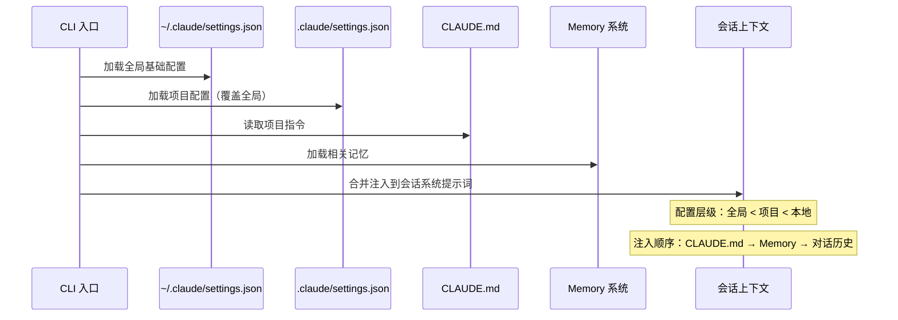

# 配置与项目管理

## 📖 概念

> Claude Code 的配置系统是一个**分层级、可继承的 JSON 配置架构**，控制着 AI 的行为边界、工具权限、外观偏好和项目约定。配合 `CLAUDE.md` 项目指令文件和 Memory 系统，形成了"你在哪儿工作，AI 就怎么适配"的智能适配层。

配置管理不只是"改几个 JSON 字段"。它是**团队标准化**的基石——通过项目级 `CLAUDE.md` 和 `settings.json`，确保团队中每个人使用 Claude Code 时都遵循相同的规范、享有相同的工具和安全边界。

### 配置的层级体系

```
全局配置 (~/.claude/settings.json)
  ├── 用户级默认值：权限策略、主题、模型偏好
  │
  └── 项目配置 (.claude/settings.json)
        ├── 项目级覆盖：项目特有的权限、MCP、Hooks
        │
        └── 项目指令 (CLAUDE.md)
              └── 项目架构、约定、禁止事项、偏好
```

### 各配置文件的职责

| 文件 | 位置 | 内容 | 影响范围 |
|------|------|------|---------|
| `settings.json` | `~/.claude/` | 用户全局设置 | 所有项目 |
| `settings.json` | `.claude/` | 项目级设置（覆盖全局） | 当前项目 |
| `settings.local.json` | `.claude/` | 本地设置（不提交 git） | 当前项目（仅本机） |
| `CLAUDE.md` | 项目根目录 | 项目指令和约定 | 当前项目 |
| `AGENTS.md` | 项目根目录 | 子代理专用指令 | 当前项目的子代理 |
| `keybindings.json` | `~/.claude/` | 快捷键绑定 | 所有项目 |

## 📂 完整目录树

> 以下是 Claude Code 配置体系的**完整目录树**，所有概念的文件位置都能在此找到。

```
项目根目录/
├── CLAUDE.md                        ← 项目指令文件
├── AGENTS.md                        ← 子代理指令文件
└── .claude/                         ← Claude Code 项目配置根目录
    ├── settings.json                ← 项目配置（权限、MCP、Hooks、模型等）
    ├── settings.local.json          ← 本地覆盖（不提交 Git）
    ├── agents/                      ← 项目自定义子代理 [[04-Agents 代理系统]]
    │   └── <agent-name>.md          ←   单文件定义（Markdown 格式）
    ├── skills/                      ← 项目自定义技能 [[01-Skills 技能系统]]
    │   └── <skill-name>/            ←   每个 Skill 一个目录
    │       └── SKILL.md             ←   核心定义（触发词 + 指令）
    ├── commands/                    ← 项目自定义斜杠命令 [[09-Slash Commands 斜杠命令]]
    │   └── <command-name>.md        ←   单文件定义
    ├── hooks/                       ← Hook 脚本存储 [[06-Hooks 钩子系统]]
    │   └── *.sh / *.js / *.py       ←   可执行脚本
    └── worktrees/                   ← Agent 工作树隔离（自动管理）[[04-Agents 代理系统]]
        └── <agent-id>/              ←   临时工作副本

用户全局目录 (~/.claude/)：
~/.claude/
├── settings.json                    ← 全局默认配置（所有项目共享）
├── keybindings.json                 ← 快捷键绑定
├── agents/                          ← 全局自定义代理
│   └── <agent-name>.md
├── skills/                          ← 全局自定义技能
│   └── <skill-name>/
│       └── SKILL.md
├── commands/                        ← 全局自定义命令
│   └── <command-name>.md
├── hooks/                           ← 全局 Hook 脚本
│   └── *.sh / *.js / *.py
├── projects/                        ← 按项目隔离的数据
│   └── <project-hash>/              ←   每个项目的唯一 hash
│       └── memory/                  ←   Memory 存储 [[05-Memory 记忆系统]]
│           ├── MEMORY.md            ←   记忆索引
│           └── <memory-name>.md     ←   单条记忆文件
└── workflows/                       ← 全局 Workflow 脚本 [[08-Workflows 工作流编排]]
    └── <workflow-name>.js

项目本地（不在项目目录内，仅出现在 ~/.claude/projects/<hash>/）：
~/.claude/projects/<hash>/
├── memory/                          ← 项目 Memory
└── .claude/                         ← 会话级状态（自动管理）
```

**配置加载优先级**（高到低）：

| 优先级 | 来源 | 说明 |
|:------:|------|------|
| 1 | `.claude/settings.local.json` | 个人本地覆盖，不提交 Git |
| 2 | `.claude/settings.json` | 项目配置，提交 Git 供团队共享 |
| 3 | `~/.claude/settings.json` | 全局默认，所有项目的基础配置 |

**各概念在目录树中的入口**：

| 概念 | 目录/文件入口 | 对应文章 |
|------|-------------|---------|
| Skills | `.claude/skills/`、`~/.claude/skills/` | [[01-Skills 技能系统]] |
| MCP | `.claude/settings.json` → `mcpServers` | [[02-MCP 模型上下文协议]] |
| Tools | 内置（CLI）+ `.claude/settings.json` → `mcpServers` | [[03-Tools 工具系统]] |
| Agents | `.claude/agents/`、`~/.claude/agents/`、`AGENTS.md` | [[04-Agents 代理系统]] |
| Memory | `~/.claude/projects/<hash>/memory/` | [[05-Memory 记忆系统]] |
| Hooks | `.claude/settings.json` → `hooks`、`.claude/hooks/` | [[06-Hooks 钩子系统]] |
| Workflows | `.claude/workflows/`（计划中）、`~/.claude/workflows/` | [[08-Workflows 工作流编排]] |
| Slash Commands | `.claude/commands/`、`~/.claude/commands/` | [[09-Slash Commands 斜杠命令]] |
| Plan Mode | 内置工具（EnterPlanMode/ExitPlanMode） | [[10-Plan Mode 规划模式]] |
| 配置 | `.claude/settings.json`、`CLAUDE.md` | [[07-配置与项目管理]] |

## 🔧 工作原理

> 配置系统通过**分层合并 + 受管注入**的方式工作。项目配置覆盖全局配置，CLAUDE.md 内容作为系统提示词注入，Memory 在会话启动时加载。

### 配置加载流程



### settings.json 的核心配置块

```json
{
  // ─── 权限管理 ───
  "permissions": {
    "allow": [
      "Bash(npm test:*)",           // 允许特定命令模式
      "Bash(git diff:*)",           // 使用通配符
      "Read",                        // 允许整个工具
      "WebSearch"                    // 允许网络搜索
    ],
    "ask": [
      "Bash(git push:*)",            // 推送前确认
      "Bash(rm:*)",                  // 删除前确认
      "Bash(curl:*)",                // 外部请求确认
      "Write(~/.zshrc)"              // 修改敏感文件确认
    ],
    "deny": [
      "Bash(rm -rf /*)",            // 禁止危险命令
      "Bash(> /dev/sda)",           // 禁止写入设备
      "Edit(~/.ssh/*)"              // 禁止修改 SSH 配置
    ]
  },

  // ─── MCP 服务器配置 ───
  "mcpServers": {
    "github": {
      "type": "stdio",
      "command": "npx",
      "args": ["-y", "@anthropic/mcp-server-github"],
      "env": { "GITHUB_TOKEN": "${GITHUB_TOKEN}" }
    }
  },

  // ─── Hooks 配置 ───
  "hooks": {
    "SessionStart": [
      { "command": "node .claude/hooks/load-context.js" }
    ],
    "PostToolUse": [
      { 
        "matcher": "Write|Edit",
        "command": "npx prettier --write ${CLAUDE_TOOL_FILE_PATH}"
      }
    ]
  },

  // ─── 外观与行为 ───
  "model": "claude-sonnet-4-6",     // 默认模型
  "theme": "system",                 // 主题
  "showTokens": true,                 // 显示 Token 用量
  "autoCompact": true,                // 自动压缩上下文
  "compactThreshold": 0.8,            // 压缩阈值

  // ─── 环境变量 ───
  "env": {
    "NODE_ENV": "development",
    "DEBUG": "claude:*"
  }
}
```

### CLAUDE.md 的最佳结构

CLAUDE.md 是整个配置体系中最重要的文件——它定义了"在这个项目中，AI 应该如何工作"。

```markdown
# CLAUDE.md — 项目指令文件

## 项目概述
<!-- 一段话描述项目是什么、为谁做、核心功能 -->

## 技术架构
<!-- 关键的技术栈、目录结构、设计模式 -->

## 编码规范
<!-- 命名约定、文件组织、代码风格 -->

## 禁止事项
<!-- AI 绝对不应该做的事情 -->

## 工作流偏好
<!-- 你偏好的协作方式 -->

## Git 约定
<!-- Commit message 格式、分支策略 -->

## 测试要求
<!-- 测试框架、覆盖率要求、测试运行方式 -->
```

## 💡 为什么重要

- **一句话适配**：新成员 clone 项目后，Claude Code 自动理解项目约定
- **团队一致性**：所有成员使用相同的 AI 行为标准
- **安全边界**：通过权限配置精确控制 AI 的能力范围
- **环境自适应**：在不同项目中，AI 自动切换不同的行为模式

## 🎯 实战示例

### 示例 1：为团队项目配置完整的 Claude Code 环境

**场景**：你作为 Tech Lead，需要为团队的项目配置 Claude Code，确保所有成员使用时遵循相同的规范。

**操作步骤**：

**第一步：创建 `.claude/settings.local.json` 模板（不提交到 Git）**

```json
// .claude/settings.local.json.example（复制为 settings.local.json）
{
  "permissions": {
    "allow": [
      "Bash(npm:*)",
      "Bash(npx:*)",
      "Bash(pnpm:*)", 
      "Bash(git diff:*)",
      "Bash(git status:*)",
      "Bash(git log:*)",
      "Bash(git branch:*)",
      "Bash(node:*)",
      "Bash(tsc:*)",
      "Read",
      "Write",
      "Edit",
      "Glob",
      "Grep",
      "WebSearch",
      "WebFetch"
    ],
    "ask": [
      "Bash(git push:*)",
      "Bash(git commit:*)",
      "Bash(npm publish:*)",
      "Bash(docker:*)",
      "Bash(rm:*)",
      "Bash(sudo:*)"
    ],
    "deny": [
      "Bash(rm -rf /:*)",
      "Bash(> /dev/:*)",
      "Bash(curl:*) | Bash(wget:*)"
    ]
  }
}
```

**第二步：创建详细的 CLAUDE.md**

```markdown
# CLAUDE.md — Team E-Commerce Platform

## 项目概述
B2C 电商平台，包含 3 个微服务：API Gateway、订单服务、商品服务。
技术栈：TypeScript + Node.js + Prisma + PostgreSQL + Redis。

## 目录结构
```
src/
├── api/          # API 路由和中间件
├── services/     # 业务逻辑层
├── models/       # Prisma Schema 生成的类型
├── stores/       # Zustand 状态管理
├── utils/        # 纯函数工具
└── types/        # 共享类型定义
```

## 编码规范
- 所有函数必须显式声明返回类型（禁止依赖类型推断）
- 错误处理：service 层抛出自定义 `AppError`，api 层用 error middleware 捕获
- 命名：文件名 kebab-case，变量 camelCase，类型 PascalCase
- 导入顺序：Node 内置 → 第三方 → 内部模块（空行分隔）

## 禁止事项
- ❌ 禁止使用 `any` 类型——用 `unknown` + 类型守卫
- ❌ 禁止直接在组件中调用 API——通过 service 层
- ❌ 禁止硬编码配置值——使用环境变量
- ❌ 禁止引入新依赖而不在 CLAUDE.md 中记录

## 工作流偏好
- 新功能先写类型定义和接口，再写实现
- 所有 PR 必须包含测试
- 优先使用 pnpm，备用 npm
- 回复用中文，代码注释用英文

## Git 约定
- Commit: [Conventional Commits](https://www.conventionalcommits.org/)
  格式：`type(scope): description`
- 分支：`feature/xxx`, `fix/xxx`, `refactor/xxx`

## 测试要求
- 单元测试：Vitest，文件与源文件同目录
- 集成测试：`__tests__/integration/`
- 运行：`pnpm test`（全量），`pnpm test:watch`（监听模式）
```

**第三步：验证配置**

```bash
# 新成员加入后，只需：
git clone <repo>
cd <repo>
# 复制本地配置模板
cp .claude/settings.local.json.example .claude/settings.local.json
# 开始工作——AI 自动理解项目一切
```

**结果**：任何团队成员打开 Claude Code 后，AI 自动：
- 理解项目是电商平台，使用 TypeScript + Prisma
- 遵循编码规范（禁止 any、函数显式返回类型）
- 使用 pnpm 而非 npm
- 新功能按"先类型 → 再实现 → 加测试"的流程
- 禁止硬编码配置值
- 回复用中文，代码注释用英文

**原理分析**：这是配置系统的**团队标准化**能力。`CLAUDE.md` 将团队的隐性知识（编码偏好、架构约定、禁止事项）转化为 AI 可读取的显式指令。`.gitignore` 中排除 `settings.local.json`，但保留 `.example` 模板。新成员克隆项目后，AI 即刻理解项目的一切，无需手动解释。

### 示例 2：多项目配置文件管理——策略模式

**场景**：你同时维护 4 个项目：一个 React 前端、一个 Node.js 后端、一个 Flutter 移动端、一个 Python 数据管道。每个项目需要不同的 AI 行为。

**操作步骤**：

为每个项目配置专属的行为策略：

**React 前端项目** (`.claude/settings.json`)：
```json
{
  "model": "claude-sonnet-4-6",
  "permissions": {
    "allow": [
      "Bash(npm run dev:*)",
      "Bash(npm run build:*)",
      "Bash(npm test:*)",
      "Bash(npx vitest:*)",
      "Bash(npx playwright:*)"
    ]
  }
}
```

**CLAUDE.md（React 前端）**：
```markdown
## 前端项目约定
- 使用 React 18 + TypeScript + Vite
- 样式：Tailwind CSS，禁止写内联 style
- 组件：每个组件一个文件夹（index.tsx + styles.ts + test.tsx）
- 状态：简单状态用 useState，跨组件用 Zustand
- AI 回复策略：UI 生成时，先展示组件结构再写代码
```

**Python 数据管道项目** (`.claude/settings.json`)：
```json
{
  "model": "claude-haiku-4-5",
  "permissions": {
    "allow": [
      "Bash(python:*)",
      "Bash(poetry:*)",
      "Bash(pytest:*)",
      "Bash(ruff:*)"
    ],
    "ask": [
      "Bash(python * --production:*)",
      "Bash(poetry add:*)"
    ]
  }
}
```

**CLAUDE.md（Python 数据管道）**：
```markdown
## 数据管道项目约定
- 使用 Python 3.12 + Polars（不用 Pandas）
- 包管理：Poetry
- 代码质量：ruff format + ruff check，禁止未格式化的代码
- 类型标注：所有函数必须有完整类型标注
- 数据安全：禁止打印或记录原始用户数据
- AI 回复策略：数据分析任务时，先展示查询计划再执行
```

**全局配置** (`~/.claude/settings.json`)：
```json
{
  "theme": "dark",
  "showTokens": true,
  "autoCompact": true,
  "env": {
    "EDITOR": "code"
  }
}
```

**结果**：
- 进入 React 前端目录：AI 用 Sonnet 模型，自动用 Tailwind，文件按组件文件夹组织
- 进入 Python 管道目录：AI 用 Haiku 模型（更便宜），自动用 Polars，严格类型标注
- 进入 Flutter 项目：AI 自动使用 Flutter Skills
- 进入 Node.js 后端：AI 自动遵循 Prisma 和 RESTful 约定
- 全局设置（主题、Token 显示）在所有项目中生效

**原理分析**：这展示了配置系统的**环境自适应**能力。项目级配置覆盖全局配置，CLAUDE.md 为每个项目注入不同的行为指令。模型选择（Sonnet vs Haiku）可以根据项目复杂度灵活调整——前端 UI 生成需要强推理能力（Sonnet），数据管道处理更多是机械性的代码生成（Haiku 足够，且更便宜）。这种"每项目一策略"的配置管理是**项目管理**层面的最佳实践。

### 示例 3：动态权限策略——开发 vs 生产环境

**场景**：你希望在开发环境和接近生产的预发布环境中有不同的权限策略。开发时可以自由执行，预发布时需要谨慎。

**操作步骤**：

创建环境感知的配置脚本：

```bash
#!/bin/bash
# .claude/scripts/setup-env.sh
# 根据当前环境生成对应的 settings.local.json

ENV=${1:-development}

case $ENV in
  development)
    cat > .claude/settings.local.json << 'EOF'
{
  "permissions": {
    "allow": [
      "Bash(npm:*)", "Bash(pnpm:*)", "Bash(npx:*)",
      "Bash(git:*)", "Bash(node:*)", "Bash(tsc:*)",
      "Bash(docker-compose:*)",
      "Read", "Write", "Edit", "Glob", "Grep",
      "WebSearch", "WebFetch"
    ],
    "ask": [
      "Bash(git push:*)"
    ],
    "deny": [
      "Bash(kubectl apply:*)",
      "Bash(terraform apply:*)",
      "Bash(aws *:*)",
      "Bash(gcloud *:*)"
    ]
  },
  "env": { "DEPLOY_ENV": "development" }
}
EOF
    ;;
    
  staging)
    cat > .claude/settings.local.json << 'EOF'
{
  "permissions": {
    "allow": [
      "Bash(npm:*)", "Bash(pnpm:*)", "Bash(npx:*)",
      "Bash(git diff:*)", "Bash(git status:*)", "Bash(git log:*)",
      "Bash(node:*)", "Bash(tsc:*)",
      "Read", "Write", "Edit", "Glob", "Grep",
      "WebSearch", "WebFetch"
    ],
    "ask": [
      "Bash(git push:*)",
      "Bash(git commit:*)",
      "Bash(npm version:*)",
      "Bash(npm publish:*)",
      "Bash(docker push:*)",
      "Bash(kubectl:*)",
      "Bash(terraform:*)",
      "Bash(aws:*)",
      "Bash(gcloud:*)"
    ],
    "deny": [
      "Bash(kubectl delete:*)",
      "Bash(terraform destroy:*)",
      "Bash(aws * delete:*)"
    ]
  },
  "env": { "DEPLOY_ENV": "staging" }
}
EOF
    ;;
esac

echo "✅ Claude Code 环境已设为: $ENV"
```

使用：

```bash
# 日常开发
bash .claude/scripts/setup-env.sh development

# 接近发布时
bash .claude/scripts/setup-env.sh staging
```

**Claude Code 中的对应行为**：

```bash
# 开发环境：
"帮我清理所有 Docker 容器，重建开发环境"  
# → AI 执行 docker-compose down && docker-compose up -d（允许）

# 预发布环境：  
"帮我更新 staging 环境的 K8s 配置"
# → AI 说："检测到当前是 staging 环境，K8s 操作需要手动确认。
#     这是修改后的配置 diff，请审查后我帮你执行。"
```

**原理分析**：这个示例展示了配置系统的**动态安全策略**。通过脚本切换 `settings.local.json`，同一台机器上的同一个项目可以有不同的权限模式。开发时自由操作不担心破坏什么；预发布时谨慎操作防止事故。这是 DevOps 思维在 AI 编程助手配置中的应用——将环境意识融入 AI 的行为边界。

## ✅ 最佳实践

1. **DO**：`.claude/settings.local.json` 加入 `.gitignore`——它包含个人偏好和本地路径
2. **DO**：提供 `.claude/settings.local.json.example` 模板，方便新成员快速上手
3. **DO**：CLAUDE.md 应该具体到"在这个项目中做什么、不做什么"，而非泛泛而谈
4. **DO**：定期 Review CLAUDE.md——项目演进时，AI 指令也要更新
5. **DON'T**：在 CLAUDE.md 中写"尽可能好"——写具体的检查项和标准
6. **DON'T**：把所有东西都放全局配置——项目特定配置应该放在项目中
7. **TIP**：用 `claude /config` 交互式修改配置，避免 JSON 语法错误

## ⚠️ 常见陷阱

| 陷阱 | 表现 | 解决方案 |
|------|------|---------|
| CLAUDE.md 过长 | 占用大量上下文窗口，影响 AI 表现 | 保持在 200 行以内，详细信息通过 Memory 管理 |
| 设置冲突 | 全局和项目配置的同一项不一致 | 理解合并规则：项目覆盖全局，local 覆盖项目 |
| 过于宽松的权限 | AI 执行了意外的 git push 或 npm publish | 对不可逆操作始终使用 `ask`，生产环境用 `deny` |
| 配置未同步 | 团队成员的 CLAUDE.md 版本不一致 | 将 CLAUDE.md 纳入 Git，作为代码审查的一部分 |
| 忽略本地配置 | settings.local.json 未加入 .gitignore | 确保 .gitignore 包含 `.claude/settings.local.json` |

## 🔗 关联概念

- [[Claude Code/00-Claude Code 入门概览\|Claude Code 入门概览]] — 配置系统在整体架构中的位置
- [[Claude Code/02-MCP 模型上下文协议\|MCP 协议]] — MCP Server 在 settings.json 中配置
- [[Claude Code/05-Memory 记忆系统\|Memory 记忆系统]] — CLAUDE.md vs Memory：指令 vs 知识
- [[Claude Code/06-Hooks 钩子系统\|Hooks 钩子系统]] — Hooks 在 settings.json 中配置
- [[Claude Code/09-Slash Commands 斜杠命令\|Slash Commands 斜杠命令]] — 自定义命令存储在 `.claude/commands/`

---

> **🎉 专题完成！** 你已学完 Claude Code 基本使用的全部 11 篇文章。
> 回到 [[00-总览/AI学习知识库总览|AI学习知识库总览]] 查看完整知识地图。
