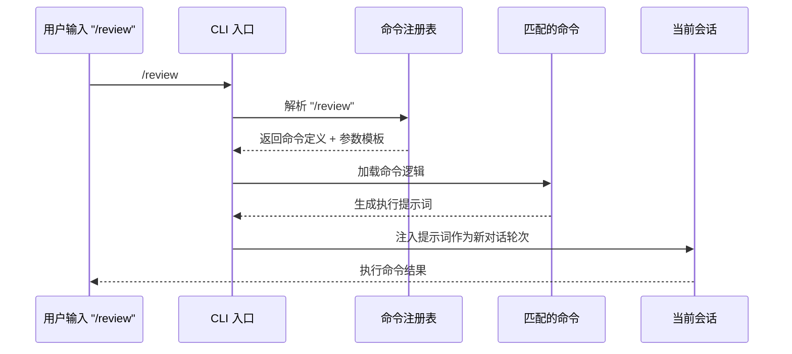

# Slash Commands 斜杠命令系统

## 📖 概念

> Slash Commands（斜杠命令）是 Claude Code 的**快捷指令系统**。以 `/` 开头输入的命令会触发预定义的操作——从代码审查（`/review`）到会话压缩（`/compact`）到项目初始化（`/init`）。Slash Commands 是"高频操作的快捷键"——不需要用自然语言描述，一个 `/` 加几个字母就能触发复杂的预定义工作流。

Slash Commands 不是自然语言对话的替代，而是**高频操作的加速器**。你可以想象它像 Photoshop 的快捷键——熟练用户用 `Ctrl+Z` 撤销而不是去菜单找，同样，熟练的 Claude Code 用户用 `/review` 审查代码而不是说"帮我审查当前的变更"。

### 命令的类别

| 类别 | 命令 | 说明 |
|------|------|------|
| **代码审查** | `/review`, `/code-review`, `/security-review`, `/simplify` | 审查和优化代码 |
| **项目管理** | `/init`, `/compact`, `/memory`, `/tasks`, `/loop` | 管理会话和项目 |
| **配置** | `/config`, `/keybindings`, `/permissions`, `/hooks` | 配置 Claude Code |
| **执行** | `/run`, `/verify`, `/workflows` | 运行和验证 |
| **信息** | `/help`, `/status`, `/doctor`, `/version` | 查看信息和诊断 |
| **自定义** | `.claude/commands/<name>.md` | 用户自定义命令 |

## 🔧 工作原理

> Slash Commands 通过**命令注册表 + 参数解析 + 上下文注入**三层机制工作。内置命令编译在 CLI 中；自定义命令从 `.claude/commands/` 或 `~/.claude/commands/` 加载。

### 命令执行流程



### 命令解析规则

```
输入：/review --comment --fix
  │         │        │
  │         │        └── 标志：同时应用修复
  │         └── 标志：发布为 PR 评论
  └── 命令名：review

输入：/loop 5m /verify
  │       │    │
  │       │    └── 参数：要循环的命令
  │       └── 参数：间隔 5 分钟
  └── 命令名：loop
```

### 自定义命令定义

自定义命令是一个 Markdown 文件，内容是在触发时注入给 AI 的提示词：

```markdown
# .claude/commands/deploy.md

## Description
部署当前分支到 Staging 环境。
触发词：/deploy

## Instructions
当用户使用 /deploy 命令时，执行以下部署流程：

1. 检查当前分支是否干净（git status）
2. 运行完整测试套件（npm test）
3. 构建生产版本（npm run build）
4. 如果全部通过，触发 Staging 部署
5. 输出部署结果和访问 URL

## 参数
- --force：跳过测试直接部署（危险，需二次确认）
- --dry-run：预览部署计划但不执行
```

## 📂 目录树位置

> 内置命令编译在 CLI 内（无文件）。自定义命令存储为 Markdown 文件。

```
项目根目录/
└── .claude/
    └── commands/                   ← 项目自定义命令
        ├── deploy.md               ←   /deploy 命令
        ├── review-all.md           ←   /review-all 命令
        └── new-feature.md          ←   /new-feature 命令

用户全局目录 (~/.claude/)：
~/.claude/
└── commands/                       ← 全局自定义命令（所有项目可用）
    ├── daily-standup.md             ←   /daily-standup 命令
    └── format-all.md                ←   /format-all 命令
```

| 文件/位置 | 作用 | 触发方式 |
|----------|------|---------|
| 内置命令 | CLI 编译的功能（60+ 个） | `/命令名` |
| `.claude/commands/<name>.md` | 项目自定义命令（团队共享） | `/<name>` |
| `~/.claude/commands/<name>.md` | 全局自定义命令（个人） | `/<name>` |

**命令优先级**：项目自定义 > 全局自定义 > 内置命令。同名命令按此顺序覆盖。

**与 Skills、Hooks、Workflows 的目录关系**：
```
.claude/
├── commands/                ← 自定义命令（手动 / 触发）
├── skills/                  ← 自定义技能（自然语言触发）
├── hooks/                   ← Hook 脚本（事件自动触发）
└── workflows/               ← Workflow 脚本（Workflow() 工具触发）
```

触发机制对比：
- Commands：用户显式输入 `/命令名`
- Skills：用户自然语言匹配触发词
- Hooks：生命周期事件自动触发
- Workflows：通过 `Workflow()` 工具在对话中调用

## 💡 为什么重要

- **效率提升**：`/review` 比"帮我审查当前代码变更"快 10 倍输入
- **标准化操作**：团队用统一的 `/deploy` 而不是各自描述部署流程
- **可组合**：`/loop 5m /verify` 组合命令创造新行为
- **学习曲线平滑**：新成员用 `/help` 发现所有可用命令

## 🎯 实战示例

### 示例 1：用自定义命令标准化团队工作流

**场景**：团队有固定的功能开发流程——从分支创建到 PR 创建的标准化步骤。你希望一条命令自动执行整个流程。

**操作步骤**：

创建 `.claude/commands/new-feature.md`：

```markdown
# /new-feature

## Description
创建新功能分支并完成初始设置。
触发：/new-feature --feature <功能名> [--from <基线分支>]

## Instructions
当用户触发 /new-feature 时，执行：

1. **拉取最新代码**：
   ```bash
   git fetch origin
   git checkout <基线分支或main>
   git pull origin <基线分支>
   ```

2. **创建功能分支**：
   ```bash
   git checkout -b feature/<功能名>
   ```

3. **生成任务计划**：
   在 `docs/features/<功能名>/` 下创建：
   - `task_plan.md` — 分解为文件级别的实现任务
   - `findings.md` — 记录实现过程中的发现和决策

4. **更新 CLAUDE.md**：
   在 CLAUDE.md 中添加此功能的关键上下文（模块名、关键文件、约束）。

5. **输出摘要**：
   - 分支名：feature/<功能名>
   - 基线提交：<commit hash>
   - 任务计划路径：docs/features/<功能名>/task_plan.md
   - 下一步：开始实现第一个任务
```

**使用**：

```bash
/new-feature --feature user-avatar-upload
```

**结果**：

```
✅ feature/user-avatar-upload 分支已从 main (a3f2c1e) 创建
📋 任务计划：docs/features/user-avatar-upload/task_plan.md
   - 5 个子任务已分解
📝 CLAUDE.md 已更新，添加本功能的上下文
💡 下一步：开始实现 Task 1 — 创建文件上传组件
```

**原理分析**：自定义命令将团队**隐性流程**（"创建功能分支后要写 task_plan、更新 CLAUDE.md"）转化为**显式脚本**。新成员用 `/new-feature` 时自动遵循流程，不会遗漏步骤。这是"团队标准化"的典型应用。

### 示例 2：组合命令实现持续验证循环

**场景**：你正在进行大规模重构，希望在开发过程中持续自动验证，一旦测试失败立即知道。

**操作步骤**：

```bash
/loop 2m /verify
```

**结果**：Claude Code 每 2 分钟自动运行一次验证（检查 lint、类型、测试），结果呈现在对话中。

```bash
# 等价于手动执行：
while true; do
  sleep 120
  # 触发 /verify：运行类型检查 + lint + 相关测试
done
```

**组合变体**：

```bash
# 每次代码变更后自动审查
/loop 5m /code-review --effort low

# 每 30 分钟检查一次依赖安全
/loop 30m "检查所有依赖的安全漏洞"

# 监控 CI 状态
/loop 3m "检查当前分支的最新 CI 运行状态"
```

**原理分析**：`/loop` 是元命令——它接收另一个命令作为参数并周期性执行。这种**命令组合**能力让简单命令产生复杂行为：`/loop` + `/verify` = 持续集成代理，`/loop` + `/code-review` = 持续代码审查。不需要 Workflow 脚本就能实现持续监控。

### 示例 3：用命令管理项目知识——多命令协作

**场景**：项目初期，你希望快速初始化项目结构、配置 Claude Code、建立知识基线。三条命令接力完成。

**操作步骤**：

```bash
# 第一步：初始化项目 Claude Code 配置
/init
# → 分析项目结构，自动生成 CLAUDE.md

# 第二步：记录关键决策
/memory "记录项目技术选型：
- 前端：React 18 + TypeScript + Vite + Tailwind CSS
- 后端：Node.js + Express + Prisma + PostgreSQL
- 测试：Vitest（前端）+ Jest（后端）
- CI/CD：GitHub Actions，部署到 Vercel（前端）+ Railway（后端）
- 禁止使用 any 类型，禁止硬编码配置值"

# 第三步：保存初始进度
/save-progress
# → 写入 .claude/project-task-state.json

# 第四步：查看当前状态
/status
# → 显示：项目、会话、Memory、配置摘要
```

**结果**：四条命令接力，5 分钟内完成项目知识初始化。后续所有协作中，AI 自动理解项目技术栈、遵循约定、记住上下文。

**原理分析**：`/init`、`/memory`、`/save-progress`、`/status` 构成项目知识管理的命令链。每条命令专注一件事，组合使用时产生系统性效果。这是 Slash Commands 的最佳实践——不是一条命令包揽一切，而是小而专注的命令可组合。

## ✅ 最佳实践

1. **DO**：为团队高频操作创建自定义命令（`/deploy`、`/new-feature`、`/review-all`）
2. **DO**：自定义命令文件写清楚 Description、Instructions、参数说明
3. **DO**：使用 `/help` 发现可用命令——新版本可能添加了新命令
4. **DON'T**：把复杂的多步骤逻辑塞进一条命令——复杂编排用 Workflows
5. **DON'T**：自定义命令覆盖内置命令的同名——可能让团队成员困惑
6. **TIP**：`/loop` + 任意命令 = 持续自动化，是最高效的命令组合模式

## ⚠️ 常见陷阱

| 陷阱 | 表现 | 解决方案 |
|------|------|---------|
| 命令不存在 | 输入 `/xxx` 无反应 | `/help` 查看可用命令列表；检查自定义命令文件格式 |
| 自定义命令未生效 | `.claude/commands/deploy.md` 存在但 `/deploy` 无反应 | 检查文件位置和扩展名（必须 `.md`），重启 Claude Code |
| 命令覆盖冲突 | 项目命令和全局命令同名，行为不符合预期 | 理解优先级：项目 > 全局 > 内置 |
| `/loop` 过频 | 短间隔触发过多会话，消耗 tokens | 根据任务的实际变化速度设置间隔（CI 状态 3min，依赖检查 30min） |

## 🔗 关联概念

- [[Claude Code/07-配置与项目管理\|配置与项目管理]] — 命令存储在 `.claude/commands/` 下
- [[Claude Code/08-Workflows 工作流编排\|Workflows 工作流编排]] — 复杂编排用 Workflows，简单操作用 Commands
- [[Claude Code/01-Skills 技能系统\|Skills 技能系统]] — Commands 手动触发，Skills 自然语言触发
- [[Claude Code/05-Memory 记忆系统\|Memory 记忆系统]] — `/memory` 命令管理记忆

## 📚 扩展阅读

- 官方文档：[Claude Code Slash Commands](https://docs.anthropic.com/en/docs/claude-code/slash-commands)
- `/help` 命令：查看所有可用命令

---

> **下一步**：阅读 [[Claude Code/10-Plan Mode 规划模式\|Plan Mode 规划模式]] 了解结构化项目规划机制。
