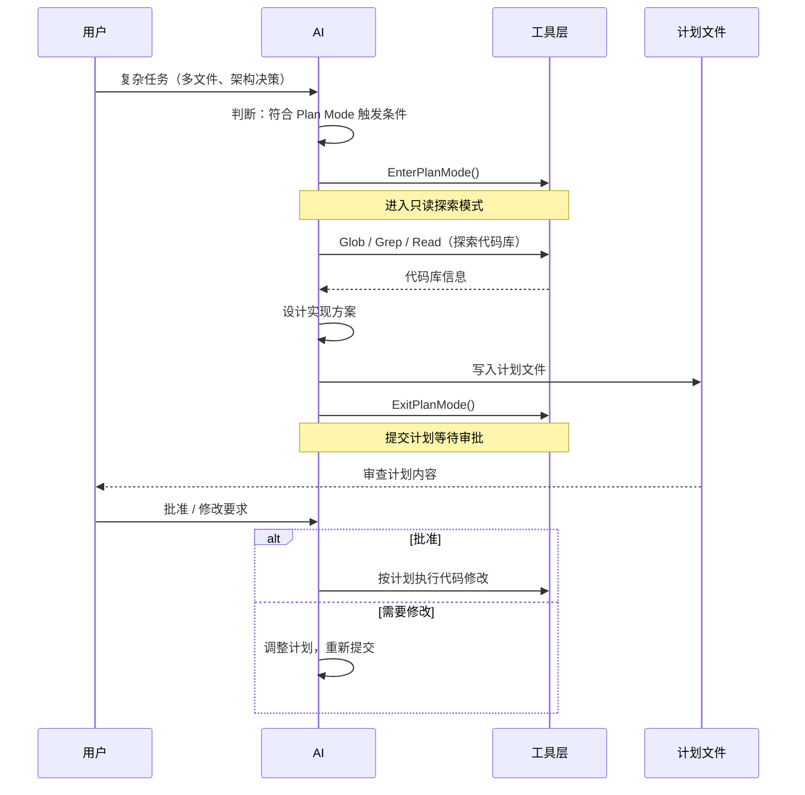

# Plan Mode 规划模式

## 📖 概念

> Plan Mode（规划模式）是 Claude Code 的**结构化规划机制**。它强制 AI 在动手写代码之前，先完成需求分析、方案设计、实施计划，并将计划以文件形式持久化。用户审查和批准计划后，AI 才进入执行阶段。这就像"建筑师先画图纸，施工队再动工"——杜绝了"上手就写，写到一半发现方向错了"的问题。

Plan Mode 通过两个内置工具实现：`EnterPlanMode`（进入规划模式，只读探索 + 设计）和 `ExitPlanMode`（退出规划模式，提交计划供用户审批）。

### Plan Mode vs 通常对话 vs Workflows

| 机制 | 适用场景 | 产出物 | 用户参与 |
|------|---------|--------|---------|
| **普通对话** | 简单问题、单文件修改 | 直接执行 | 实时观察 |
| **Plan Mode** | 复杂功能、架构决策、多文件变更 | 计划文件（plan.md） | 审批计划 + 批准执行 |
| **Workflows** | 超大规模多 Agent 编排 | Workflow 脚本 + 执行结果 | 审批脚本 + 观察进度 |

## 🔧 工作原理

> Plan Mode 通过**两阶段生命周期**工作：探索阶段（只读）和规划阶段（只写计划）。两个阶段都不做实际代码修改，确保"想清楚再动手"。

### Plan Mode 生命周期



### Plan Mode 的触发条件

AI 在以下情况应自动进入 Plan Mode：

| 触发条件 | 示例 |
|---------|------|
| **新功能实现**（3+ 文件） | "添加用户认证系统" |
| **多种可能方案** | "实现缓存层"（Redis? 内存? 文件?） |
| **架构级变更** | "将单体拆分为微服务" |
| **影响现有行为** | "修改支付流程" |
| **多文件变更**（5+ 文件） | "升级所有 API 端点的错误处理" |

### 计划文件的标准结构

```markdown
# Plan: <功能名称>

## 1. 需求分析
- 核心用例
- 非目标（本期明确不做的事）

## 2. 方案设计
- 数据模型设计
- 路由 / API 设计
- 关键设计决策

## 3. 文件变更清单
- [新增] 文件列表
- [修改] 文件列表

## 4. 实施步骤（有序）
Step 1: ...
Step 2: ...

## 5. 风险与缓解
```

## 📂 目录树位置

> Plan Mode 的持久化计划文件存储在 `.claude/plans/` 下，运行时状态由 `.meta-kim/state/` 管理。

```
项目根目录/
└── .claude/
    └── plans/                      ← Plan Mode 生成的计划文件
        └── <plan-name>.md          ← 单个计划的完整内容（需求 + 方案 + 步骤）

会话级（自动管理）：
.meta-kim/state/<profile>/runs/<runId>/
├── plan.md                         ← 当前会话的执行中计划
└── progress.md                     ← 计划执行进度跟踪
```

| 位置 | 作用 | 生命周期 |
|------|------|---------|
| `.claude/plans/<name>.md` | 持久化的计划文档 | 创建后保留，可作为项目文档提交 Git |
| `EnterPlanMode` / `ExitPlanMode` | 内置工具（编译在 CLI 中） | 触发/退出规划模式 |

**Plan Mode 与其它概念的目录关系**：
```
.claude/
├── plans/                  ← Plan Mode：设计阶段产出
├── commands/               ← 可创建 /plan 快捷命令
├── workflows/              ← Workflows：执行阶段编排
│                           ←   典型工作流：Plan Mode 设计 → Workflows 执行
└── skills/                 ← 可在 Plan Mode 中利用 Skills 做专项分析
```

## 💡 为什么重要

- **方向正确**：先设计再实施，避免"写了半天发现走错路"
- **团队对齐**：计划文件是团队的沟通工具——设计方案在代码之前被审查
- **复杂度管理**：将大功能分解为文件级步骤，可追踪、可回滚
- **知识沉淀**：计划文件本身就是项目文档，解释"为什么这样做"

## 🎯 实战示例

### 示例 1：新功能实现——从需求到计划

**场景**：你需要在电商平台中添加"优惠券系统"。涉及：数据模型、管理后台、用户端使用、订单计算、过期处理。不能"上手就写"。

**操作步骤**：

```bash
"为电商平台设计优惠券系统。包括：优惠券类型（满减/折扣）、
使用条件（最低金额、指定商品/分类）、有效期、使用次数限制。
先进入 Plan Mode 设计完整方案，我审批后再实现。"
```

**AI 进入 Plan Mode 后产出的计划**：

```markdown
# Plan: 优惠券系统

## 1. 需求分析

### 核心用例
- 管理员创建优惠券（类型、条件、有效期、数量）
- 用户在下单时输入优惠码
- 系统校验优惠码有效性并计算折扣
- 订单完成后扣减优惠券使用次数

### 非目标（本期不做）
- ❌ 自动发券（营销引擎）
- ❌ 分享裂变券
- ❌ 优惠券叠加规则（本期只支持单券）

## 2. 数据模型

Coupon {
  id, code, type (FIXED_AMOUNT | PERCENTAGE),
  discountValue, minOrderAmount,
  applicableProducts (JSON: product IDs or null=all),
  applicableCategories (JSON: category IDs or null=all),
  maxUses, usedCount,
  startsAt, expiresAt,
  isActive, createdAt
}

## 3. 文件变更清单（11 个文件）

[新增文件]
1. src/types/coupon.ts
2. src/validators/coupon.ts
3. src/services/coupon.ts
4. src/routes/admin/coupons.ts
5. src/routes/api/coupon.ts
6. tests/services/coupon.test.ts
7. tests/routes/admin/coupons.test.ts

[修改文件]
8. prisma/schema.prisma（+ Coupon 模型）
9. src/services/order.ts（+ applyCoupon 方法）
10. src/routes/api/orders.ts（+ 接收 couponCode）
11. src/app.ts（+ 注册路由）

## 4. 实施步骤（6 步）

Step 1: 数据模型 — prisma schema + migration
Step 2: 类型定义 — TypeScript types + Zod validators
Step 3: 核心逻辑 — CouponService（校验、计算、扣减）
Step 4: 管理 API — CRUD 接口
Step 5: 用户端 — 下单时应用优惠券
Step 6: 测试 — 10 个关键测试用例

## 5. 设计决策
- 优惠券使用次数在高并发下用数据库行锁保证准确
- applicableProducts/applicableCategories 存 JSON（简化查询，≤100 项）
- 折扣计算放在 CouponService 中，OrderService 只调用

## 6. 风险
- 高：并发使用优惠券时超用 → 行锁 + 事务
- 中：JSON 字段查询性能 → 限制列表长度 ≤ 100
```

**用户审批 → 批准后 AI 按 6 步顺序实施。**

**原理分析**：Plan Mode 的核心价值在"审批点"——用户在代码被写之前看到了完整的方案（数据模型、文件清单、设计决策、风险）。这避免了"AI 写了一大堆代码，审查时发现数据模型设计错了然后全部重来"的浪费。

### 示例 2：架构变更——拆分单体 Service 层

**场景**：当前项目的 `src/services/` 膨胀到 50+ 个服务文件，API 路由和业务逻辑耦合严重。你考虑将核心业务逻辑抽成独立的 service 包。

**操作步骤**：

```bash
"当前 services/ 目录过于庞大（50+ 文件）。我想将核心业务逻辑
拆分为独立的包。进入 Plan Mode 设计方案。"
```

**AI 在 Plan Mode 中的分析**：

```markdown
# Plan: Service 层拆分

## 1. 现状分析（Explore 阶段）

当前 src/services/ 包含 53 个文件，分为以下领域：

| 领域 | 文件数 | 外部依赖 |
|------|:-----:|------|
| 用户（auth, profile, permissions） | 8 | prisma, redis |
| 订单（order, cart, payment, refund） | 12 | prisma, 用户服务 |
| 商品（product, inventory, category） | 10 | prisma, redis |
| 通知（email, push, sms, template） | 7 | 外部 API |
| 通用（logger, cache, queue, storage） | 11 | 各种 |
| 其他 | 5 | 混合 |

## 2. 拆分方案（npm workspace）

packages/
├── core/                 ← 共享类型和工具
├── service-user/         ← 用户领域
├── service-order/        ← 订单领域
├── service-product/      ← 商品领域
├── service-notification/ ← 通知领域
└── service-infra/        ← 通用基础设施

## 3. 迁移策略：分批进行，保持系统始终可运行

Phase 1: 抽离 core 包（共享类型）        ← 无依赖
Phase 2: 迁移 service-infra               ← 最独立
Phase 3: 迁移 service-user                ← 被其它依赖，优先迁
Phase 4: 迁移 service-product             ← 依赖 user
Phase 5: 迁移 service-order               ← 依赖 user + product
Phase 6: 迁移 service-notification        ← 最独立，最后迁

每阶段：移动文件 → 更新导入路径 → npm test → git commit

## 4. 风险与回滚
- 每阶段独立提交，失败可单独回滚
- TypeScript 路径别名（@core/*, @service-user/*）简化导入
- 迁移期间保留原 services/ 的重新导出，确保平滑过渡
```

**原理分析**：这种规模的架构变更，没有 Plan Mode 就是灾难。Plan Mode 强制 AI 先分析依赖图（Explore → 读文件 → 理解依赖），再设计分阶段方案。"分批进行，保持系统始终可运行"这个策略来自 Plan Mode 的结构化分析——AI 发现了文件间的依赖关系后，按依赖链路从底层到高层排序迁移顺序。

### 示例 3：多方案对比——缓存策略选型

**场景**：应用的数据库查询 P99 延迟 > 2s，需要引入缓存。不确定该用 Redis 还是内存缓存。

**操作步骤**：

```bash
"应用数据库查询出现性能瓶颈（P99 延迟 > 2s）。
进入 Plan Mode，设计两种缓存方案并对比推荐。"
```

**AI 的 Plan Mode 输出**：

```markdown
# Plan: 缓存策略选型与实现

## 1. 问题定位

| 查询 | 频率 | P50 | P99 | 数据变化 |
|------|:---:|-----|-----|:------:|
| GET /api/products | 500/s | 120ms | 2.1s | 每小时 |
| GET /api/products/:id | 200/s | 80ms | 1.5s | 每小时 |
| GET /api/categories | 300/s | 60ms | 0.8s | 每天 |

## 2. 方案对比

### 方案 A：Redis 缓存
✅ 分布式支持，多实例共享 ｜ ❌ 引入外部依赖，运维成本增加

### 方案 B：Node.js 内存缓存（lru-cache）
✅ 零依赖，零网络延迟 ｜ ❌ 多实例不共享，重启丢失

| 维度 | Redis | 内存缓存 |
|------|:-----:|:-------:|
| P99 降低 | 90% ↓ | 95% ↓ |
| 运维复杂度 | +1 服务 | 0 |
| 分布式一致性 | ✅ | ❌ |
| 实现工作量 | 2 天 | 0.5 天 |

## 3. 推荐：分层缓存

请求 → 内存缓存 (L1, TTL=30s) → Redis (L2, TTL=5min) → 数据库

- L1 提供极致速度（进程内）
- L2 提供分布式一致性
- 数据更新时通过 Redis Pub/Sub 广播失效事件
- 抽象 CacheService 接口，L1/L2 可独立替换

## 4. 实施步骤

Step 1: 定义 CacheService 接口
Step 2: 实现 Redis 适配器
Step 3: 实现内存缓存适配器
Step 4: 实现分层缓存组合器
Step 5: 在 ProductService 中接入
Step 6: 压测验证（k6 脚本）
Step 7: 灰度发布（10% → 50% → 100%）
```

**原理分析**：这个 Plan 展示了 Plan Mode 的**决策支持**能力。不是"用 Redis"或"不用 Redis"的二元选择，而是通过对比矩阵发现两种方案的互补性（Redis 的分布式 + 内存的速度），设计了"组合方案"。"分层缓存"这个架构决策来自 Plan Mode 的结构化对比。

## ✅ 最佳实践

1. **DO**：复杂功能（3+ 新文件或 5+ 修改文件）主动进入 Plan Mode
2. **DO**：计划文件中写清楚：数据模型、文件变更清单、步骤顺序、设计决策、风险
3. **DO**：Plan Mode 的"探索"阶段充分利用——多读代码、理解现有架构再设计
4. **DON'T**：为单文件修改或简单 Bug 修复进入 Plan Mode——过度规划
5. **DON'T**：跳过用户审批直接执行——Plan Mode 的价值就是"审批点"
6. **TIP**：将完成的 `.claude/plans/` 文件提交 Git——它们是项目技术文档的重要组成

## ⚠️ 常见陷阱

| 陷阱 | 表现 | 解决方案 |
|------|------|---------|
| 过早退出 | Plan Mode 中未完成探索就开始设计 | 确保理解了所有相关文件后再 ExitPlanMode |
| 计划过细 | 计划文件变成"伪代码"，失去设计视角 | 计划描述"要做什么、为什么"，不描述"每行代码怎么写" |
| 审批形同虚设 | 用户不看计划直接批准 | 计划中突出设计决策和风险——让审批有价值 |
| 计划与执行脱节 | 执行时偏离计划 | 执行阶段引用计划文件，发现偏离时主动提出 Plan Amend |

## 🔗 关联概念

- [[Claude Code/08-Workflows 工作流编排\|Workflows 工作流编排]] — Plan Mode 设计，Workflows 执行
- [[Claude Code/07-配置与项目管理\|配置与项目管理]] — `.claude/plans/` 是项目知识资产
- [[Claude Code/05-Memory 记忆系统\|Memory 记忆系统]] — Plan Mode 的重要设计决策应沉淀为 Memory
- [[Claude Code/04-Agents 代理系统\|Agents 代理系统]] — Plan Mode 中可用 Explore Agent 探索代码库
- [[Claude Code/09-Slash Commands 斜杠命令\|Slash Commands 斜杠命令]] — 创建 `/plan` 自定义命令快速触发

## 📚 扩展阅读

- 官方文档：[Claude Code Plan Mode](https://docs.anthropic.com/en/docs/claude-code/plan-mode)

---

> **🎉 Claude Code 专题完成！** 你已学完 11 篇文章，从入门概览到配置管理。
> 回到 [[00-总览/AI学习知识库总览\|AI学习知识库总览]] 查看完整知识地图。
