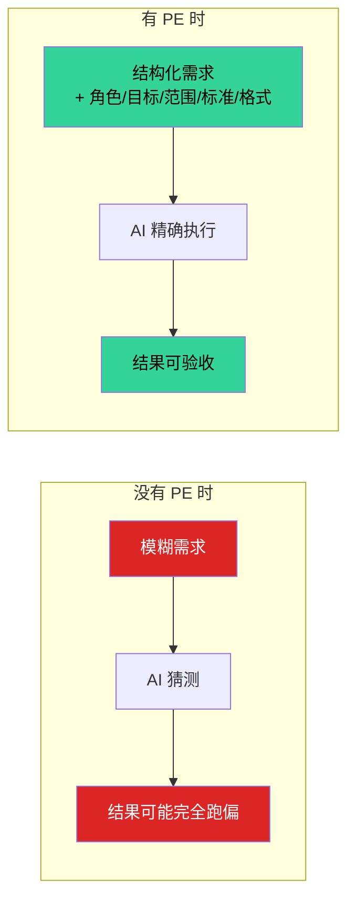
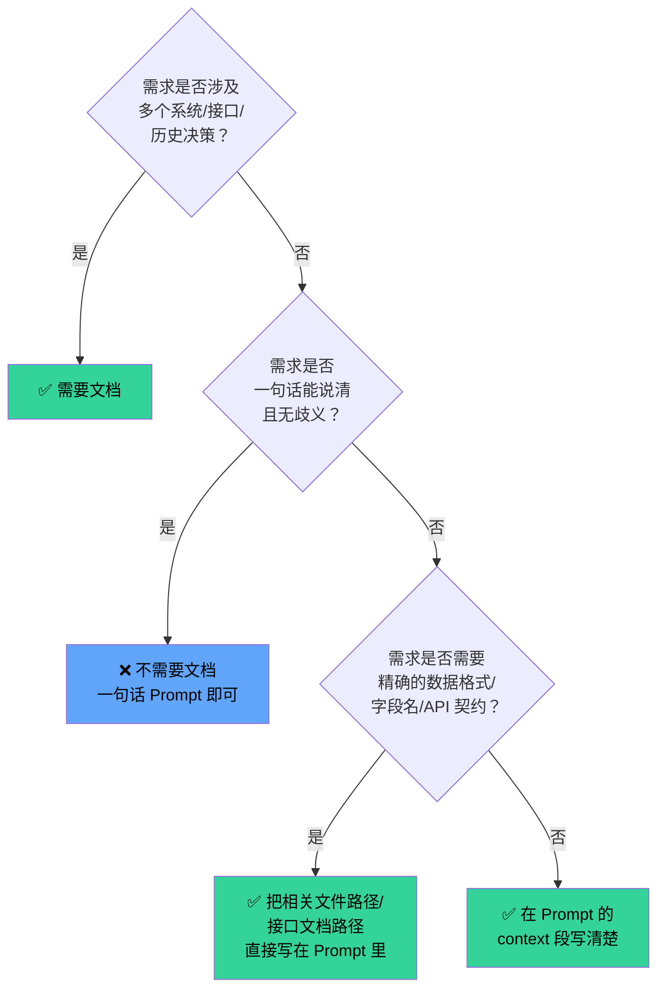
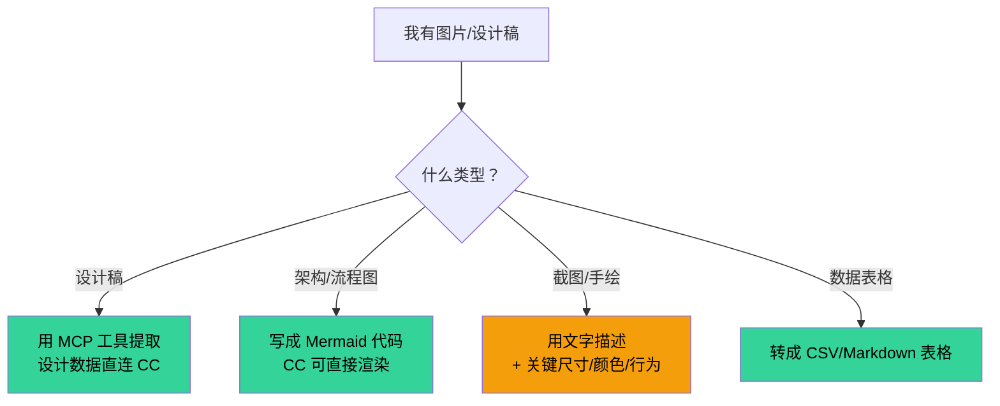
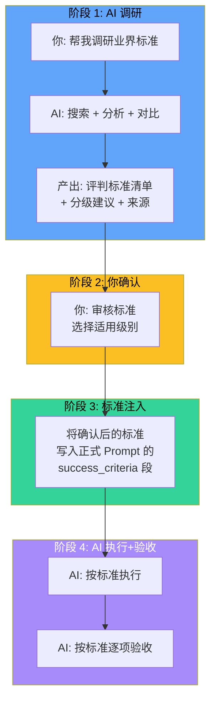
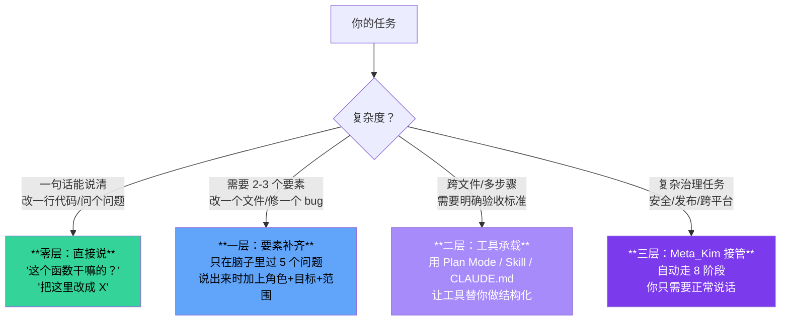
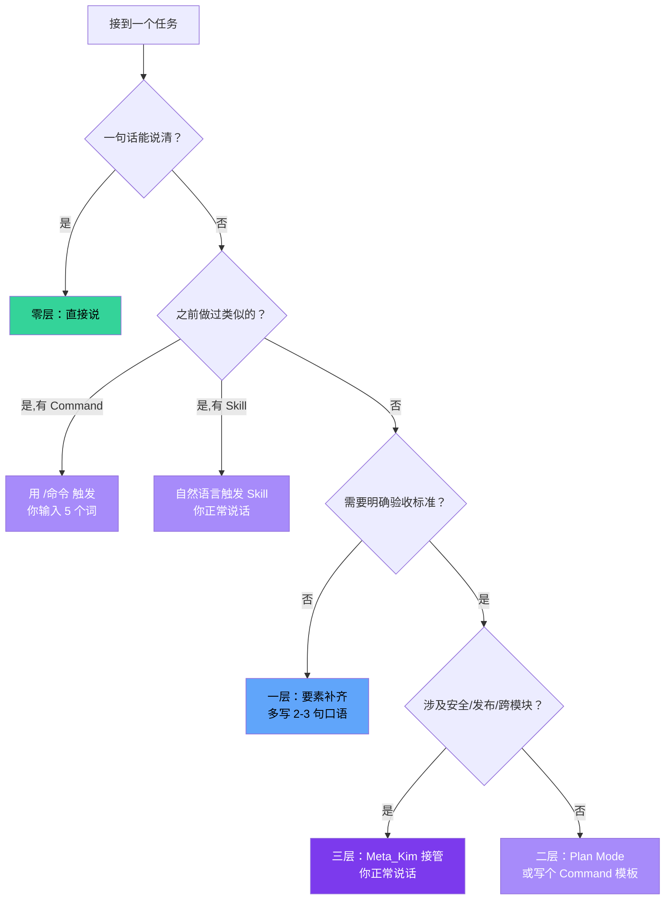

# Prompt Engineering：如何让 AI 精确理解你的意图

## 📖 概念

> Prompt Engineering（提示词工程）是**将模糊的人类意图转化为 AI 可精确执行的结构化指令**的方法论。它不是"把话说长"，而是"把话说准"——让 AI 知道你要什么、不要什么、怎么算做完、怎么算做好。

在 Claude Code 的上下文中，Prompt Engineering 直接决定了：
- AI 是猜你的意思（高偏差）还是精准执行（低偏差）
- 复杂任务是一次性完成还是反复修正
- 产出物是"看起来能用"还是"确实验收通过"

### 核心公式

```
好 Prompt = 清晰角色 + 明确目标 + 边界范围 + 验收标准 + 输出格式
```

| 要素 | 回答的问题 | 缺失后果 |
|------|-----------|---------|
| **角色** | AI 以什么专业身份来干活？ | AI 用泛泛身份，产出缺少专业深度 |
| **目标** | 最终要达成什么结果？ | AI 跑偏方向，做完了但做错了 |
| **范围** | 包含什么、不包含什么？ | AI 越界修改不该动的东西 |
| **验收标准** | 怎么判断做完了、做好了？ | "看起来完成了"但其实没达到你的心理预期 |
| **输出格式** | 结果以什么形式交付？ | AI 给了大段文字但你其实要一个 JSON |

## 🔧 工作原理

### 为什么 AI 会"理解偏差"？


你的意图经过**两次衰减**才到达 AI 的执行层：你说出来的已经损失了 30%，AI 解析又损失 20%，AI 推理补全时正确率只有约 70%。**好的 Prompt Engineering 就是在每个衰减点上做补偿。**

### Prompt Engineering 的补偿策略



---

## 🎯 好坏对比示例（6 组）

### 示例 1：修 Bug

**❌ 坏 Prompt**：
```text
"登录功能有 bug，帮我修一下"
```

**AI 可能的理解偏差**：
- 什么 bug？超时？报错？白屏？
- 登录方式是什么？账号密码？SSO？OAuth？
- 修到什么程度算修好？

**✅ 好 Prompt**：
```markdown
<role>
你是前端调试工程师，熟悉 React + JWT 认证流程。
</role>

<goal>
修复用户在 token 过期后刷新页面时被踢回登录页而非自动刷新 token 的 bug。
</goal>

<scope>
- 只修改 token 刷新逻辑，不改变登录流程、不修改后端 API
</scope>

<context>
- 技术栈：React 18 + axios + JWT
- 现象：用户登录后 15 分钟内正常，过期刷新后跳转登录页
- 预期：应自动用 refresh_token 换取新 access_token，用户无感知
- 相关文件：src/utils/apiClient.ts、src/hooks/useAuth.ts
</context>

<success_criteria>
- token 过期后刷新页面，用户保持登录态
- 不引入新的 console 报错
- refresh_token 也过期时，才跳转登录页
</success_criteria>

<output_format>
先给根因分析（一句话），再给修改方案（改哪个文件、改什么），最后给验证方法。
</output_format>
```

**为什么好**：角色给了专业方向，目标精确到具体现象和预期行为，范围防止 AI 越界改后端，验收标准让"修好"有据可查。

---

### 示例 2：新功能开发

**❌ 坏 Prompt**：
```text
"帮我做一个用户反馈收集功能"
```

**AI 可能的理解偏差**：
- 前端表单？后端 API？数据库？全栈？
- 反馈类型？文本？评分？截图？
- 给谁看？管理员后台？公开页面？

**✅ 好 Prompt**：
```markdown
<role>
你是全栈开发工程师，熟悉 React + Node.js + PostgreSQL。
</role>

<goal>
在现有应用中新增一个用户反馈收集功能：用户在页面右下角的悬浮按钮点击后弹出反馈表单，提交后写入数据库，管理员在后台可查看列表。
</goal>

<scope>
- 包含：前端反馈弹窗组件、后端 POST API、数据库 migration、后台列表页
- 不包含：邮件通知、反馈回复功能、反馈分类 AI 打标（后续迭代）
</scope>

<context>
- 项目目录：frontend/src/、backend/src/、database/migrations/
- 现有 UI 库：Ant Design 5.x
- 现有 API 风格：RESTful，路由在 backend/src/routes/
- 用户已登录，可从 session 中取 userId
- 数据库已有 users 表
</context>

<constraints>
- 反馈内容需做 XSS 过滤
- 不收集用户 IP 等隐私信息
- 不修改现有路由结构
</constraints>

<success_criteria>
- 用户点击悬浮按钮 → 弹出表单 → 填写提交 → 看到"感谢反馈"提示
- 管理员访问 /admin/feedbacks → 看到分页列表
- 3 个核心文件以上有对应的测试
</success_criteria>

<verification_plan>
- 前端：打开页面，点击按钮，提交反馈，观察网络请求和 UI 反馈
- 后端：curl POST /api/feedbacks，检查数据库写入
- 管理员：访问后台，确认列表展示
</verification_plan>
```

**为什么好**：范围精确到 4 个交付物 + 3 个非目标，上下文给出了技术细节让 AI 不需要猜，约束防止安全漏洞，验证计划让"做完"可检验。

---

### 示例 3：代码审查

**❌ 坏 Prompt**：
```text
"帮我 review 一下最近改的代码"
```

**AI 可能的理解偏差**：
- 哪些文件？什么范围的改动？
- 审查维度？只看 bug？还要看性能？风格？
- 审查结果怎么给？口头评价？结构化报告？

**✅ 好 Prompt**：
```markdown
<role>
你是资深代码审查员，擅长发现安全漏洞、性能问题和架构风险。
</role>

<goal>
审查最近 3 次 commit 中与认证模块相关的改动，关注安全性、错误处理和边界条件。
</goal>

<scope>
- 包含：认证中间件、token 刷新逻辑、登录控制器
- 不包含：UI 样式、文档、配置文件
</scope>

<context>
- 变更文件：git diff HEAD~3 -- 'src/auth/**' 'src/middleware/auth*'
- 重点关注：JWT secret 处理、SQL 注入、XSS、race condition
</context>

<output_format>
按严重程度（CRITICAL > HIGH > MEDIUM > LOW）分类列出发现，每个发现附：
- 文件位置和行号
- 问题描述
- 风险说明
- 修复建议（代码片段）
</output_format>

<success_criteria>
- 每个安全相关文件至少被审查一次
- CRITICAL/HIGH 发现必须有修复建议
- 不遗漏任何 JWT、session、password 相关的代码路径
</success_criteria>
```

**为什么好**：范围限定了 commit 范围和文件路径，审查维度明确（安全+错误处理+边界），输出格式结构化，验收标准让审查质量可衡量。

---

### 示例 4：调研型任务——"不知道什么是好"

**❌ 坏 Prompt**：
```text
"帮我研究一下 CI/CD pipeline 怎么做"
```

**AI 可能的理解偏差**：
- 给你一个概述（太浅）？给你完整配置（太深）？
- 针对什么项目？什么规模？什么预算？
- "研究"到什么程度算完成？

**✅ 好 Prompt**：
```markdown
<role>
你是 DevOps 工程师，熟悉 GitHub Actions、GitLab CI 和 Jenkins。
</role>

<goal>
帮我建立评判"一个好的 CI/CD pipeline"的标准，然后基于这些标准为我的项目设计一个 pipeline 方案。
</goal>

<scope>
- 第一阶段：调研行业标准——一个好的 CI/CD pipeline 应该包含哪些阶段/门禁/指标
- 第二阶段：将调研结果转化为本项目适用的验收标准清单
- 第三阶段：给出具体的 pipeline 配置文件
- 不包含：部署到生产环境、K8s 配置
</scope>

<context>
- 项目类型：React + Node.js 单体仓库（monorepo）
- 团队规模：3 人
- 当前状态：无 CI/CD，手动部署
- 预算：免费方案优先（GitHub Actions free tier）
</context>

<instructions>
第一阶段调研时，不要只给一个答案，而是给我：
1. 业界主流实践是什么（附来源）
2. 不同项目规模/阶段的差异化建议
3. 各实践的优劣对比
4. 然后基于我的项目情况，推荐一个"刚好够用"的标准

第二阶段将标准物化为：
- Pipeline 必须包含的阶段（和每阶段的 pass/fail 条件）
- 每个阶段的执行时间上限
- 哪些失败是 BLOCKING（阻止合并），哪些是 WARNING（提醒但不阻止）
</instructions>

<output_format>
第一阶段：Markdown 表格（维度、标准、来源、适用条件）
第二阶段：Markdown 清单（阶段、触发条件、pass/fail 条件、时间上限、阻断级别）
第三阶段：YAML 配置文件
</output_format>
```

**为什么好**：这是"让 AI 先调研标准，再把标准注入任务"的经典模式——后面会详细展开这个方法论。

---

### 示例 5：重构任务

**❌ 坏 Prompt**：
```text
"重构这个模块，代码太乱了"
```

**AI 可能的理解偏差**：
- "太乱"是什么标准？圈复杂度？重复代码？命名不规范？
- 重构范围？只改内部实现不改接口？还是可以改数据结构？
- 重构后怎么验证？功能不变怎么证明？

**✅ 好 Prompt**：
```markdown
<role>
你是专注重构的软件工程师，遵循"小步重构、保持可运行、有测试保护"的原则。
</role>

<goal>
重构 src/services/orderService.ts，目标是降低圈复杂度到 10 以下、消除重复代码、提升可测试性，同时保持所有现有行为不变。
</goal>

<scope>
- 包含：提取重复逻辑为独立函数、拆分大方法、引入接口分离关注点
- 不包含：修改数据库 schema、修改 API 接口签名（对外接口不变）、修改 UI
</scope>

<context>
- 文件：src/services/orderService.ts（847 行，圈复杂度最高 34）
- 现有测试：tests/services/orderService.test.ts（覆盖率为 62%）
- 重构前先跑一次现有测试确认基线通过
</context>

<constraints>
- 每一步重构后必须保持现有测试全部通过
- 如果某步重构导致测试失败超过 2 次，回退该步并记录原因
- 不引入新的第三方依赖
</constraints>

<success_criteria>
- 所有函数的圈复杂度 ≤ 10
- 无重复代码块（相同逻辑出现 ≥2 次）
- 现有测试 100% 通过
- 新增至少 3 个单元测试覆盖重构后提取的新函数
</success_criteria>

<verification_plan>
- 运行 npm run test -- tests/services/orderService.test.ts
- 运行 npx eslint --rule 'complexity: [error, 10]' src/services/
- 人工抽查 3 个提取后的函数，确认语义等价
</verification_plan>
```

**为什么好**："太乱"被量化（圈复杂度 ≤ 10，消除重复），范围防止动不该动的东西，约束保证小步重构不回退，验证可执行。

---

### 示例 6：配置/环境问题

**❌ 坏 Prompt**：
```text
"帮我配一下环境"
```

**✅ 好 Prompt**：
```markdown
<role>
你是开发环境配置工程师，熟悉 macOS 上的 Node.js 开发环境。
</role>

<goal>
在本机（macOS 14）上配置项目的完整开发环境，使 npm run dev 可以一键启动。
</goal>

<context>
- 项目依赖：Node.js ≥ 22、PostgreSQL 16、Redis 7
- 当前状态：Node.js 已安装（v22.13），PostgreSQL 未安装，Redis 未安装
- 配置文件：.env.example 需要复制为 .env 并填写本地值
</context>

<instructions>
1. 先检查当前环境缺什么（只检查，不安装）
2. 列出缺失项供我确认
3. 确认后再逐个安装配置
4. 每完成一步，验证该步确实生效
</instructions>

<success_criteria>
- npm run dev 成功启动，无报错
- 数据库连接成功
- Redis 连接成功
- 所有环境变量已填入（不要用默认密码）
</success_criteria>
```

---

## 📄 是否需要借助文档清晰化需求？

### 决策框架

文档不是银弹——它可以帮助，也可能拖慢。判断逻辑如下：



### 什么时候需要文档

| 场景 | 文档类型 | 怎么给 AI | 示例 |
|------|---------|----------|------|
| 跨系统集成 | API 文档、接口契约 | 路径引用或粘贴关键字段 | "按 docs/api-contract.md 中的 POST /webhooks 接口实现" |
| 历史决策追溯 | ADR、设计文档 | 引用决策结论 | "根据 docs/adr/003-选择-JWT-而非-Session.md，实现 token 刷新" |
| 数据格式约束 | JSON Schema、Proto | 粘贴 schema 定义 | "输入必须符合以下 JSON Schema：{...}" |
| 业务规则复杂 | PRD、需求文档 | 粘贴核心规则段 | "退款规则见下方，实现时严格遵循" |
| 多人协作项目 | CLAUDE.md、AGENTS.md | 已在会话中自动加载 | 无需额外操作——CC 自动读 |

### 什么时候不需要文档

| 场景 | 推荐做法 |
|------|---------|
| 单文件修改，逻辑简单 | 一句话 + context 段即可 |
| 探索型任务（"帮我看看这个项目是干嘛的"） | 让 AI 自己读代码，不需要先写文档 |
| 写新文档作为产出物 | 在 Prompt 的 output_format 中指定格式即可 |
| 纯技术问题（"这个 tsconfig 配置项是什么意思"） | 直接问 |

### 文档辅助的最佳姿势

不是"把整个文档贴进去"，而是**精确引用**：

```markdown
<!-- ✅ 好做法：精确引用 -->
<context>
- 接口定义见 src/types/api.ts 的 CreateOrderRequest 接口
- 错误码规范见 docs/error-codes.md 第 3 节
- 遵循项目 CLAUDE.md 中列出的命名规范
</context>

<!-- ❌ 坏做法：无脑贴整个文档 -->
请你读一下这 50 页 PRD，然后帮我实现第 3 章第 2 节的功能...
（AI 的上下文窗口被你塞满了不相关信息，有效注意力被稀释）
```

---

## 🖼️ 是否需要图片？

### 直接答案

**Claude Code 的本质是终端文本交互，不支持多模态图片输入。** 所以你无法直接把截图/设计稿扔给 CC 说"照着这个做"。

但你可以**转换**图片信息为文字描述：

| 图片来源 | 转换方式 | 效果 |
|---------|---------|------|
| 设计稿（Figma/MasterGo） | 用 MCP（如 MasterGo MCP）直接从设计文件提取 DSL/SVG/样式数据 | ⭐⭐⭐ 最好的方式 |
| UI 截图 | 用文字描述"布局：顶部导航栏 → 左侧侧边栏 → 右侧内容区" | ⭐⭐ 信息有损失 |
| 架构图/流程图 | 用 Mermaid 代码描述，既清晰又可渲染 | ⭐⭐⭐ 推荐 |
| 数据库 ER 图 | 用文字描述表结构和关系 | ⭐⭐ 可行 |
| 手绘草图 | 用文字描述，再加交互行为说明 | ⭐ 信息损失大 |

### 决策树



### 实操建议

1. **设计稿 → MCP 直连**：如果设计在 MasterGo 中，用 `mcp__masterGo__mcp__getDesignSections` 等工具直接提取设计 DSL，AI 能精确还原
2. **流程/架构 → Mermaid**：养成用 Mermaid 描述流程的习惯，既清晰又能渲染
3. **截图 → 文字描述**：至少描述布局结构、关键尺寸、颜色、交互行为
4. **永远不要**说"照着这个截图做"——CC 看不见图片

---

## 🔄 高级模式：当不知道"什么是好"时，让 AI 帮你定义

这是 Prompt Engineering 中最被低估的技巧。很多任务卡住不是因为 AI 不会做，而是因为**你自己也不知道"做到什么程度才算好"**。

### 模式名称：调研→标准→注入→验收（RISE）

```
Research → Inject Standards → Execute → Verify
```



### 完整实操示例：从"不知道什么是好"到"按标准交付"

#### 场景

你想在项目中引入**代码审查流程**，但你不知道：
- 一个好的代码审查应该检查哪些维度？
- 每个维度的通过标准是什么？
- 不同严重级别怎么区分？

#### 第一步：调研 Prompt（你问 AI）

```markdown
<role>
你是软件工程质量专家，熟悉 Google、Microsoft、Amazon 等公司的代码审查实践。
</role>

<goal>
帮我建立一个"好的代码审查"的评判标准体系，然后应用到我的项目。
</goal>

<context>
- 我的项目：React + Node.js，团队 3 人，CI 用 GitHub Actions
- 当前问题：代码审查靠自觉，没有固定维度和标准
- 目标：形成为可操作的审查清单
</context>

<instructions>
请分两部分回答：

**Part A — 业界调研**：
1. 业界主流的代码审查维度有哪些（附来源）？
2. 每个维度在不同严格级别下的标准是怎样的？
   - 宽松（startup 阶段）
   - 标准（growth 阶段）
   - 严格（enterprise 阶段）
3. 严重级别分类的最佳实践（CRITICAL / HIGH / MEDIUM / LOW 的划分标准）

**Part B — 适配建议**：
基于我的项目情况（3 人团队，React + Node.js），推荐"标准"级别。
逐项列出审查维度、检查项、pass/fail 条件。
</instructions>

<output_format>
Part A：Markdown 表格（维度、来源、宽松/标准/严格标准）
Part B：结构化的审查清单（维度、检查项、严重级别、pass 条件）
</output_format>
```

#### AI 调研产出（示例摘要）

| 维度 | 来源 | 宽松 | 标准 | 严格 |
|------|------|------|------|------|
| **安全性** | OWASP Top 10, Google Secure Code Review Guide | 无硬编码密钥 | + SQL 注入、XSS 防护 | + 完整的威胁建模 |
| **正确性** | Microsoft Code Review Checklist | 逻辑无明显错误 | + 边界条件、错误处理 | + 形式化验证 |
| **性能** | Amazon Builder's Library | 无明显 N+1 查询 | + 时间复杂度 + 内存 | + 性能基准测试 |
| **可维护性** | Clean Code, Google Style Guide | 命名清晰 | + 圈复杂度 ≤ 10、DRY | + 架构审查、SOLID |
| **测试覆盖** | Google Testing Blog | 有测试 | + 关键路径 ≥ 80% | + 分支覆盖 ≥ 90% |
| **可读性** | Airbnb JS Style Guide | 格式一致 | + 注释解释"为什么" | + 文档自动生成 |

推荐我的项目用**标准级别**，适配为 6 个维度 18 个检查项。

#### 第二步：你把标准注入到正式任务 Prompt

```markdown
<role>
你是代码审查员。审查标准采用已确认的"标准级别"规范。
</role>

<goal>
审查本次 PR 中的所有变更，按以下标准逐项检查并出具审查报告。
</goal>

<success_criteria>
<!-- 以下标准来自上一轮 AI 调研 + 你确认的结果 -->

**安全性（CRITICAL）**：
- [ ] 无硬编码密钥/token/密码
- [ ] 所有用户输入经过校验和转义（防 XSS/SQL 注入）
- [ ] 敏感操作有权限检查

**正确性（HIGH）**：
- [ ] 边界条件已处理（空值、超长、负数、0）
- [ ] 错误路径有适当的错误处理和用户提示
- [ ] 异步操作的竞态条件已考虑

**性能（MEDIUM）**：
- [ ] 无 N+1 查询
- [ ] 循环或递归有明确的终止条件和复杂度约束

**可维护性（MEDIUM）**：
- [ ] 新增函数圈复杂度 ≤ 10
- [ ] 无明显重复代码（相同逻辑块 ≥3 行且出现 ≥2 次）
- [ ] 函数/变量命名自解释

**测试覆盖（HIGH）**：
- [ ] 新增逻辑有对应的单元测试
- [ ] 关键路径的测试覆盖率 ≥ 80%

**可读性（LOW）**：
- [ ] 复杂逻辑有注释解释"为什么这么做"
- [ ] 代码风格与项目现有风格一致
</success_criteria>

<output_format>
每个发现包含：维度、严重级别、文件位置、问题描述、修复建议。
先列 CRITICAL/HIGH，再列 MEDIUM/LOW。
</output_format>
```

#### 为什么这个模式强大

1. **你不是在凭空编标准**——AI 调研了业界的实际做法，给你提供了有来源的依据
2. **标准有分级**——你知道"宽松/标准/严格"的差异，可以根据项目阶段选择
3. **标准可复用**——这次确认的标准，下次同类任务可以直接复用
4. **验收可以逐项打钩**——不再是"我觉得 ok"，而是 18 个检查项逐一判定

---

## ✅ 最佳实践

1. **DO**：每次写 Prompt 前先问自己 5 个问题——角色？目标？范围？验收标准？输出格式？
2. **DO**：把"非目标"写清楚——告诉 AI 不要做什么和告诉它做什么同样重要
3. **DO**：复杂需求先用 RISE 模式调研标准，再把标准注入任务
4. **DO**：在 context 段给出技术栈、文件路径、约束条件——不要让 AI 猜
5. **DON'T**：不要写"帮我做 XXX"一句话 Prompt 然后期待 AI 完美理解——你说的损失 30%，AI 解析又损失 20%
6. **DON'T**：不要把整份文档塞进 Prompt——精确引用关键段落
7. **TIP**：用 Mermaid 描述流程，用表格描述结构，用代码块描述格式——结构化的信息 AI 理解得更精确
8. **TIP**：需求不清时，先用一个"调研 Prompt"搞清楚标准，再用一个"执行 Prompt"按标准干活

## ⚠️ 常见陷阱

| 陷阱 | 表现 | 解决方案 |
|------|------|---------|
| **需求膨胀** | 你想做 A，Prompt 写得太大，AI 把 B/C/D 都做了 | 在 scope 段明确写"不包含 " |
| **过度约束** | Prompt 写得太死，AI 没有合理发挥空间 | 区分 hard constraint 和 soft guideline |
| **验收标准模糊** | "代码质量好"、"性能优化"这种无法判定 | 量化：圈复杂度 ≤ 10、响应时间 ≤ 200ms、覆盖率 ≥ 80% |
| **上下文缺失** | AI 不知道技术栈、项目结构、已有模式 | 在 context 段给出关键信息 |
| **一次性超大 Prompt** | 把所有需求写在一个超长 Prompt 里 | 拆成 RISE 模式：先调研标准 → 再按标准执行 |
| **忽略非功能性需求** | 只描述功能，不提安全/性能/可维护/可测试 | 在 success_criteria 中为每个非功能维度设标准 |

---

## 🪜 分层策略：不是每次都手写全套 XML

看完前面的 6 组对比示例，一个合理的问题是：**难道每次问 AI 都要写这么一大串？** 答案是：结构化 Prompt 不是让你每天手写的，它是一个**分层的、有工具支撑的体系**。

### 四层使用模型



### 零层（~90% 的日常交互）：直接说

```text
"把 formatDate 的默认格式改成 ISO 8601"
"这个函数干嘛的？"
"跑一下测试"
```

**不需要结构化**。CC 从项目上下文（CLAUDE.md、当前文件、git 状态）已经掌握了足够信息来做判断。零层不需要任何额外努力。

### 一层（~9% 的交互）：要素补齐——在心里过 5 个问题

不是写 XML 标签，而是**脑子里过一遍核心公式，把缺失的要素加进一句话里**：

```text
❌ "修一下登录 bug"

✅ "修一下登录 token 过期后被踢回首页的 bug。
    只改前端 token 刷新逻辑，不动后端。
    技术栈 React + axios。
    修完后 token 过期刷新时用户无感知。"
```

你多加了 3 句口语，但每句都对应一个要素：

| 你加的 | 对应要素 |
|--------|---------|
| "token 过期后被踢回首页" | 目标精确定位（不是笼统的"bug"） |
| "只改前端 token 刷新逻辑，不动后端" | 范围约束 |
| "react + axios" | 上下文 |
| "token 过期刷新时用户无感知" | 验收标准 |

**没有 XML 标签，没有 markdown 代码块，只是多说了几句——但要素齐全了。**

### 二层（~1% 的复杂任务）：工具承载——写一次，反复触发

核心思想：**结构化内容写一次，存到 CC 生态工具里，以后每次用一行触发——不需要重新写。**

#### CC 生态中的"Prompt 承载工具"

| 工具 | 做什么 | 写一次 | 怎么触发 | 适合场景 |
|------|--------|--------|---------|---------|
| **CLAUDE.md** | 项目级常驻上下文 | 写一个文件 | 每次 CC 启动自动加载 | 项目技术栈、命名规范、架构约定 |
| **Skills** | 可安装/可触发的能力包 | 写一个 SKILL.md | 自然语言触发词自动匹配 | 重复性任务流程（代码审查、部署检查） |
| **Commands** | 快捷指令模板 | 写 `.claude/commands/xxx.md` | `/命令名` | 你经常做的固定操作 |
| **Agents** | 预定义角色的专业 agent | 写 agent 定义文件 | `Agent("name")` 或自然语言匹配 | 专门负责某类任务的 AI |
| **Plan Mode** | 先设计再动手的结构化规划 | 不需要写——CC 内置 | 复杂任务自动触发或手动进入 | 中大型功能开发 |
| **Memory** | 跨会话持久化偏好和规则 | AI 在会话中自动写入 | 后续会话自动读取 | 你的偏好、习惯、项目特定规则 |
| **HookPrompt** | 用户输入自动优化层 | 安装一次 | 每次提交 Prompt 自动注入优化 | 所有对话——自动补齐结构化要素 |

#### 核心逻辑：一次写好，反复触发

```mermaid
flowchart LR
    subgraph write["你写一次"]
        CLAUDE_MD["CLAUDE.md<br/>项目上下文"]
        SKILL["Skill 定义<br/>触发词 + 流程"]
        COMMAND["Command 模板<br/>斜杠命令"]
        AGENT_DEF["Agent 定义<br/>角色 + 边界"]
        MEMORY["Memory<br/>偏好/规则"]
    end

    subgraph trigger["每次自动/手动触发"]
        AUTO[CC 启动时自动加载]
        KEYWORD[自然语言触发词]
        SLASH[/命令名]
        AGENT_CALL[Agent 调用]
        MEM_AUTO[会话中自动读写]
    end

    CLAUDE_MD --> AUTO
    SKILL --> KEYWORD
    COMMAND --> SLASH
    AGENT_DEF --> AGENT_CALL
    MEMORY --> MEM_AUTO

    style write fill:#1e1b4b,stroke:#7c3aed,color:#e0e7ff
    style trigger fill:#14532d,stroke:#22c55e,color:#dcfce7
```

#### 实战：同一个任务，三种用法

**任务**：给新 API 端点加单元测试。

**❌ 每次手写全套 XML（累，不需要）**：

```markdown
<!-- 每次都要写这 20 行？没人这么干。 -->
<role>你是测试工程师...</role>
<goal>给 POST /api/orders 加测试...</goal>
<scope>包含...不包含...</scope>
...
```

**✅ 用法 A：一层要素补齐（推荐）**：

```text
"给 POST /api/orders 加单元测试。覆盖正常请求、参数校验失败、
数据库写入失败三种情况。测试写在 tests/api/orders.test.ts。"
```

角色 CC 从项目上下文推断，目标清楚，范围自明。3 句话就够了。

**✅ 用法 B：写成 Command 模板（一劳永逸）**：

在 `.claude/commands/add-tests.md` 写一次：

```markdown
请为以下 API 端点添加单元测试，覆盖：
1. 正常请求成功路径
2. 参数校验失败（必填缺失、类型错误、越界）
3. 内部错误（数据库/网络/第三方超时）
4. 边界条件（空值、超长输入、特殊字符）

测试文件放在 tests/api/ 下，命名 {模块名}.test.ts。
使用项目已有的 vitest + @testing-library 体系。
确保每个测试有明确的 given/when/then 结构。
```

以后每次用：`/add-tests POST /api/orders`——**你输入了 5 个词，AI 收到了 10 行结构化指令。**

**✅ 用法 C：让 Plan Mode 帮你结构化（零手写）**：

直接说：`"给 POST /api/orders 加单元测试"`，然后输入 `/plan` 进入 Plan Mode。CC 会自动走"理解需求 → 设计测试策略 → 展示计划给你确认 → 执行"的流程。**你没有写结构化 Prompt，但 CC 内部走了完整的结构化流程。**

### 三层（极少数）：Meta_Kim 自动接管

对于跨模块重构、安全审查、发布前检查这类复杂治理任务：

```text
"审查这次认证模块重构的安全性、正确性和性能"
```

安装了 Meta_Kim 后，**你正常说话就行**。Meta_Kim 的 meta-theory skill 会自动：
1. Critical — 确认审查范围和成功标准
2. Fetch — 搜索可用审查能力
3. Thinking — 规划审查维度，选定 owner
4. Execution — 分派执行
5. Review + Meta-Review — 双重审查
6. Verification — 验证每个发现
7. Evolution — 沉淀经验

### 你已经在用的"自动结构化"

回顾你当前看到的这个交互——你只输入了一段自然语言，但 HookPrompt 自动做了三件事：

1. 📝 **原始输入**：把你的原文逐字展示
2. 🔄 **优化后的理解**：拆成 Context / Task / Format 三段
3. ✅ **优化后的完整提示词**：生成带 `<role>` / `<goal>` / `<scope>` / `<success_criteria>` / `<verification_plan>` 标签的结构化版本

这三个步骤是 **HookPrompt 在你的输入到达 AI 之前自动注入的**。你没有写任何 XML 标签——工具替你写了。CLAUDE.md 中的项目规则、graphify 知识图谱、已有的文件上下文，也都在后台自动加载——同样不需要你手动写。

### 工具速查：什么时候用什么



### 一句话总结

> **结构化 Prompt 的核心是"要素齐全"，不是"格式繁重"。** 90% 的情况一句话或要素补齐就够；9% 的情况用 Skill/Command/CLAUDE.md 一次写好反复触发；1% 的复杂治理交给 Meta_Kim 自动接管。你不需要给 AI 写论文——你需要在 CC 生态中建立**可复用的结构化资产**，然后每次用一行触发。

## 🔗 关联概念

- [[Claude Code/00-Claude Code 入门概览|CC 入门概览]] — 了解 AI 怎么处理你的输入
- [[Claude Code/01-Skills 技能系统|Skills 技能系统]] — 好的 Skill 定义本身就是精心设计的 Prompt
- [[Claude Code/03-Tools 工具系统|Tools 工具系统]] — tool description 的写法直接影响 AI 调用工具的质量
- [[Claude Code/04-Agents 代理系统|Agents 代理系统]] — agent 的 prompt 定义 = Prompt Engineering 的集大成应用
- [[Claude Code/05-Memory 记忆系统|Memory 记忆系统]] — 把确认过的标准写入 memory，跨会话复用
- [[Claude Code/10-Plan Mode 规划模式|Plan Mode]] — Plan Mode 本质上是把 Prompt Engineering 结构化到了 CC 的工具层面
- [[Meta_Kim/03-协议、门与动态发牌|Meta_Kim 协议]] — Meta_Kim 的协议思想来源：每个阶段明确交付契约
- [[Meta_Kim/05-场景判断：何时用 meta-theory|Meta_Kim 场景判断]] — 复杂任务用 Meta_Kim 治理，简单任务用好 Prompt 就行

## 📚 扩展阅读

- Anthropic 官方 Prompt Engineering Guide：https://docs.anthropic.com/en/docs/build-with-claude/prompt-engineering/
- OWASP Top 10（安全审查标准来源）：https://owasp.org/www-project-top-ten/
- Google Engineering Practices — Code Review：https://google.github.io/eng-practices/review/

---

> **下一步**：选一个你最近的实际任务，按「四层模型」判断它属于哪一层——大部分人 90% 在零层和一层就够了。如果想更进一步，把你做过的重复任务写成一个 Command 模板（`.claude/commands/xxx.md`），体验"写一次，一行触发"。也可以阅读 [[Claude Code/10-Plan Mode 规划模式|Plan Mode]]、[[Claude Code/01-Skills 技能系统|Skills]]、[[Claude Code/09-Slash Commands 斜杠命令|Commands]] 了解工具承载层如何帮你自动结构化。
