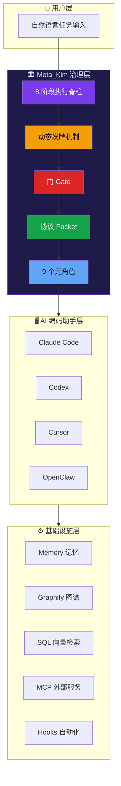

# Meta_Kim 入门概览

## 📖 概念

> Meta_Kim 是面向持续性 AI 编码工作的**治理层（Governance Layer）**，它在 AI 编码助手之上增加了意图确认、能力搜索、边界分发、审查验证和经验沉淀，把混乱的 AI 编码变成可审查、可验证、可沉淀的执行。

Meta_Kim 不是又一个 AI 编码工具，也不是另一个模型。它是一套**可运行的工程纪律系统**——用 agents、skills、contracts、hooks、scripts 和证据门，把复杂任务从"一锅乱炖"变成可治理执行。

### 一句话总结

> **先搞清楚要干什么 → 再决定谁去干 → 干完审查 → 审完沉淀经验 → 经验反哺下一轮。**

### 核心问题

AI 编码现在最难的已经不是让模型改文件。真正难的是：

| 问题 | 没有 Meta_Kim 时 | Meta_Kim 的做法 |
|------|------------------|-----------------|
| 先做什么？ | 一个超长聊天回复试图包办所有事 | 任务经过意图→能力→owner→审查→验证→写回 |
| 由什么能力负责？ | 因为某个工具能用，所以就直接用它 | 因为某个能力适合当前任务、工具端、OS、依赖和风险才选它 |
| 怎么证明真的做对？ | 命令跑绿就被误认为目标完成 | 证据必须回到用户真实目标上验收 |
| 经验怎么复用？ | 好经验沉没在聊天记录里 | 可复用经验沉淀成 skill、agent、script、contract |

### 打个比方

你现在用的 Claude Code 本质上是"手"——能写代码、能改文件。但谁来决定先改哪个文件？改完谁来检查？检查出了问题谁来修？修完了怎么保证下次不会再犯同样的错？

Meta_Kim 就是干这个的。**它不是另一只手，而是在手上面加了一层大脑**：用可运行的 agents、skills、contracts、hooks、scripts 和证据门，把复杂任务管起来。

## 🔧 工作原理

> Meta_Kim 的核心是一套**8 阶段执行脊柱（8-stage spine）**，每个阶段都有明确的输入、输出和放行条件。复杂任务会叠加**11 阶段业务工作流**和**动态发牌机制**。

### 架构全景图



### 四大核心机制

Meta_Kim 的设计基于四个相互咬合的核心机制：


> **8 大流程负责推进，门负责准入，协议负责交付，发牌负责动态介入。**

### 先拆开核心概念

| 概念 | 它是什么 | 它不是什么 |
| --- | --- | --- |
| **隐形骨架** | 表层流程下面必然存在的后台框架节点 | 一张先天写死的职责清单 |
| **8 大流程** | 隐形骨架在执行层露出的人可读主链 | 全部治理逻辑本身 |
| **11 阶段业务工作流** | 复杂 run 被判断后叠加的 run 包装递进方式 | 8 大流程的替代物 |
| **发牌** | 围绕 8 大流程和 agent 单元做动态管控 | 简单派任务 |
| **门** | 放行条件 | 阶段本身 |
| **协议** | 节点必须交出的结构化东西 | 口号或抽象价值观 |
| **agent 单元治理** | 让边界、能力、升级、回滚有抓手 | 角色菜单 |
| **三层记忆体系** | memory / graphify / SQL 分工协作的长期记忆 | 一份大杂烩笔记 |

### Before / After

| 没有 Meta_Kim | 使用 Meta_Kim |
|---|---|
| 一个超长聊天回复试图包办所有事 | 任务会经过意图、能力、owner、审查、验证、写回 |
| 因为某个工具能用，所以就直接用它 | 因为某个能力适合当前任务、工具端、OS、依赖和风险，才选择它 |
| 命令跑绿就被误认为目标完成 | 证据必须回到用户真实目标上验收 |
| 好经验沉没在聊天记录里 | 可复用经验会沉淀成 skill、agent、script、contract 或一次性任务 |

### 9 个元角色一览

Meta_Kim 有 9 个分工明确的治理 agent，各管一摊：

| 角色 | 职责 | 不管什么 |
| --- | --- | --- |
| **meta-warden** | 协调、仲裁、最终综合 | 不直接写代码 |
| **meta-conductor** | 工作流、节奏控制 | 不做安全检查 |
| **meta-genesis** | Agent 设计、SOUL.md | 不管工具选型 |
| **meta-artisan** | 技能、MCP、工具匹配 | 不管 agent 人设 |
| **meta-sentinel** | 安全、权限、回滚 | 不管节奏编排 |
| **meta-librarian** | 记忆、连续性 | 不管代码执行 |
| **meta-prism** | 质量审查、反糊弄 | 不管能力搜索 |
| **meta-scout** | 外部能力发现 | 不管内部协调 |
| **meta-chrysalis** | 演化写回、scar 记录、递归安全门 | 不演化自己，也不绕过 Warden gate |

## 💡 为什么重要

- **解决的问题**：AI 编码中"做对了但做错了方向"、"改了但没验证"、"这次学到的下次又忘了"三大顽疾
- **带来的价值**：
  - **意图不跑偏**：Critical 阶段锁定真实意图和成功标准
  - **能力不浪费**：Fetch 先搜索已有能力，避免重复发明
  - **执行有边界**：每个子任务有明确 owner、依赖关系、交付物
  - **质量可追溯**：Review + Meta-Review 双重审查，每个 finding 都要闭合
  - **经验可复用**：Evolution 把经验沉淀成结构性升级
- **不使用时的影响**：复杂任务容易迷失方向；经验无法跨会话积累；质量靠自觉而不是靠系统

## 🎯 实战示例

### 示例 1：用 Meta_Kim 治理一次代码审查

**场景**：你有一个跨越多文件的重构 PR 需要审查

**操作步骤**：

```bash
# 直接说出你的需求（不需要 /meta-theory 前缀）
"帮我审查这次重构的质量、安全性和架构合规性"
```

**结果**：Meta_Kim 会自动：
1. Critical — 确认审查范围和成功标准
2. Fetch — 搜索可用审查能力（meta-prism、git diff、lint 工具）
3. Thinking — 规划审查维度（正确性、安全、性能），分配 owner
4. Execution — 并行执行各维度审查
5. Review — meta-prism 做质量审查
6. Meta-Review — 确认审查标准本身没偏
7. Verification — 每个 finding 验证是否真实
8. Evolution — 记录审查模式，沉淀经验

**原理分析**：不需要你手动指定"用 meta-prism 审安全性，用 xxx 审性能"，Meta_Kim 自动走完 8 阶段，最后给你一份每个 finding 都有证据支撑的审查报告。

### 示例 2：单文件修改，不需要 Meta_Kim

**场景**：你只需要修改一个函数内部的逻辑

```bash
# 直接问 Claude Code 就好
"把 src/utils/format.ts 里的 formatDate 函数改成支持 ISO 8601 格式"
```

**原理分析**：这种简单任务走 Meta_Kim 的 full spine 是"大炮打蚊子"。直接让 Claude Code 改就行。判断标准见 [[Meta_Kim/05-场景判断：何时用 meta-theory|场景判断]]。

### 示例 3：3 分钟证明链

**场景**：你想快速验证 Meta_Kim 到底做了什么

```bash
npm run meta:theory:demo        # 跑一次示例 governed run
npm run meta:run-status:latest  # 查看最新 run 的状态
npm run meta:theory:report -- --run-id latest  # 生成报告
npm run meta:delivery:bundle    # 查看交付物打包
```

**结果**：这四条命令会展示五件事：
1. 模糊需求变成明确意图和成功标准
2. 先搜索能力，再决定谁执行
3. 复杂任务拆成有边界的 worker task
4. Review 和 Verification 留下产物证据
5. 兼容证据保持分层，smoke 不会被冒充成 live proof

## ✅ 最佳实践

1. **DO**：复杂跨文件任务直接用自然语言描述，让 Meta_Kim 自动走治理路线
2. **DO**：简单单文件修改直接用普通 Prompt，不要过度治理
3. **DON'T**：不要显式输入 `/meta-theory` 作为日常入口——斜杠命令只是维护者快捷方式
4. **TIP**：安装后跑一次 `npm run meta:theory:demo` 理解 governed run 的全流程
5. **TIP**：先理解 8 大流程，再理解 11 阶段工作流，最后看发牌机制

## ⚠️ 常见陷阱

| 陷阱 | 表现 | 解决方案 |
|------|------|---------|
| 大炮打蚊子 | 改一行代码也走完整治理 | 单文件简单修改直接用普通 Prompt |
| 以为 /meta-theory 是唯一入口 | 每次都手动输入斜杠命令 | 自然语言就会触发，斜杠命令只是维护者快捷方式 |
| 混淆 8 大流程和 11 阶段 | 觉得有两套矛盾流程 | 8 大流程是骨架（执行逻辑），11 阶段是骨架之上的业务递进 |
| 认为 Meta_Kim 是另一个 AI | 期望 Meta_Kim 自己写代码 | Meta_Kim 是治理层，不是代码生成器；代码仍由 Claude Code 等助手生成 |

## 🔗 关联概念

- [[Meta_Kim/01-8 阶段脊柱与路径分类|8 阶段脊柱与路径分类]] — 深入理解执行脊柱和三种路径
- [[Meta_Kim/02-元角色体系与能力优先分发|元角色体系与能力优先分发]] — 9 个元角色怎么分工协作
- [[Meta_Kim/03-协议、门与动态发牌|协议、门与动态发牌]] — Packet、Gate、Card 三种治理工具
- [[Meta_Kim/04-三层记忆与进化闭环|三层记忆与进化闭环]] — 记忆体系和经验沉淀
- [[Meta_Kim/05-场景判断：何时用 meta-theory|场景判断：何时用 meta-theory]] — 实战决策框架
- [[Claude Code/00-Claude Code 入门概览|Claude Code 入门概览]] — Meta_Kim 运行的宿主平台
- [[Claude Code/01-Skills 技能系统|Skills 技能系统]] — meta-theory 本身就是 CC 的一个 skill
- [[Claude Code/04-Agents 代理系统|Agents 代理系统]] — 9 个元角色在 CC 中的运作方式

## 📚 扩展阅读

- Meta_Kim 仓库：https://github.com/KimYx0207/Meta_Kim
- README.zh-CN.md：Meta_Kim 中文完整文档
- 方法依据论文：https://zenodo.org/records/18957649（DOI: 10.5281/zenodo.18957649）
- 飞书知识库：https://my.feishu.cn/wiki/OhQ8wqntFihcI1kWVDlcNdpznFf

---

> **下一步**：阅读 [[Meta_Kim/01-8 阶段脊柱与路径分类|8 阶段脊柱与路径分类]]，深入理解 Meta_Kim 如何对任务进行分类和路由——这是理解"哪些 Prompt 会走治理、哪些不会"的关键。
