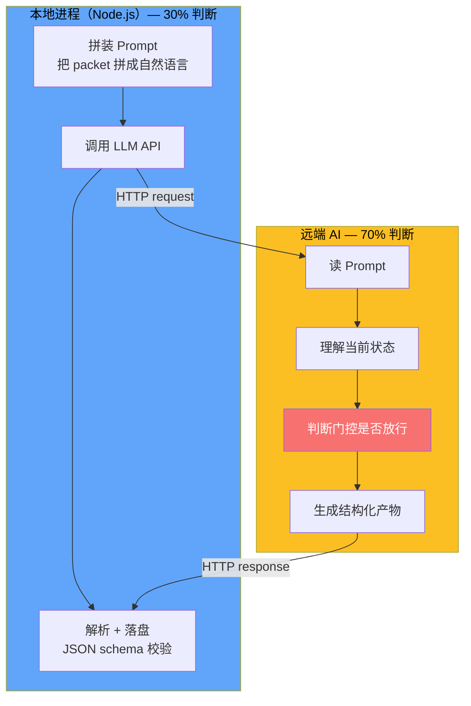
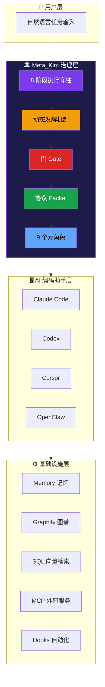

# Meta_Kim 入门概览

## 📖 概念

> Meta_Kim 是面向持续性 AI 编码工作的**治理层（Governance Layer）**，它在 AI 编码助手之上增加了意图确认、能力搜索、边界分发、审查验证和经验沉淀，把混乱的 AI 编码变成可审查、可验证、可沉淀的执行。

Meta_Kim 不是又一个 AI 编码工具，也不是另一个模型。它是一套**可运行的工程纪律系统**——用 agents、skills、contracts、hooks、scripts 和证据门，把复杂任务从"一锅乱炖"变成可治理执行。

### 一句话总结

> **先搞清楚要干什么 → 再决定谁去干 → 干完审查 → 审完沉淀经验 → 经验反哺下一轮。**

### 核心问题

AI 编码现在最难的已经不是让模型改文件。真正难的是：

| 问题 | 没有 Meta_Kim 时 | Meta_Kim 的做法 |
|------|------------------|-----------------|
| 先做什么？ | 一个超长聊天回复试图包办所有事 | 任务经过意图→能力→owner→审查→验证→写回 |
| 由什么能力负责？ | 因为某个工具能用，所以就直接用它 | 因为某个能力适合当前任务、工具端、OS、依赖和风险才选它 |
| 怎么证明真的做对？ | 命令跑绿就被误认为目标完成 | 证据必须回到用户真实目标上验收 |
| 经验怎么复用？ | 好经验沉没在聊天记录里 | 可复用经验沉淀成 skill、agent、script、contract |

### 打个比方

你现在用的 Claude Code 本质上是"手"——能写代码、能改文件。但谁来决定先改哪个文件？改完谁来检查？检查出了问题谁来修？修完了怎么保证下次不会再犯同样的错？

Meta_Kim 就是干这个的。**它不是另一只手，而是在手上面加了一层大脑**：用可运行的 agents、skills、contracts、hooks、scripts 和证据门，把复杂任务管起来。

## 🔧 工作原理

> Meta_Kim 的核心是一套**8 阶段执行脊柱（8-stage spine）**，每个阶段都有明确的输入、输出和放行条件。复杂任务会叠加**11 阶段业务工作流**和**动态发牌机制**。

### ⚡ 关键认知：Meta_Kim 的本质

> **Meta_Kim 不是一段确定性的程序代码，而是一套"用 JSON packet 串起来的多次 LLM 调用"的编排框架。**

你看到的所有"治理概念"——8 阶段、发牌、门、协议 packet——**最终都是 LLM 调用的 prompt 设计艺术**。但并不是 100% 都靠 AI 判断，关键路径上的硬约束仍由本地代码守住。



**具体分工**：

| 判断内容 | 由谁判断 | 比例 | 例子 |
|---------|---------|------|------|
| 必填字段是否非空 | **本地 JS** | 100% | `if (!state.intentPacket?.realIntent) return "missing_real_intent"` |
| 路线是否成立（owner + weapon + dependency 配齐） | **本地 JS** | 100% | 协议 schema 校验 |
| "意图是否清晰到可以执行" | **AI** | 100% | Critical 阶段 prompt 调用 |
| "选择哪条路径、哪个 owner" | **AI** | 100% | Thinking 阶段 prompt 调用 |
| "findings 是否真实、可证伪" | **AI** | 100% | meta-prism 做 Adversarial verify |
| "是否触发 Pause / Fix / Risk 牌" | **AI** | 100% | 发牌机制 prompt 调用 |
| "是否值得写入 canonical 源" | **AI 判定 + Warden 审批** | 50:50 | Evolution 写回 |

**所以"治理"的实现机制是**：
- **本地**用结构化 JSON packet 串起多次 LLM 调用（30% 的硬逻辑）
- **AI** 在每次 prompt 调用中做真正的语义判断（70% 的软决策）
- **本地 hard gate** 守住结构性安全（防 AI 漏判造成灾难）
- **JSON schema** 强制 AI 输出有结构、可校验、可重放

> 💡 **这一认知对后续阅读很关键**：当你看到"8 阶段"、"发牌"、"门"这些概念时，知道它们最终是 prompt 模板的精妙设计 + JSON schema 的严格约束——这正是 Meta_Kim 的创新点：**把"每一步要喂给 AI 什么 prompt"这个问题工程化、可验证化、可沉淀化**。

### 🔄 闭环：Prompt → LLM 响应 → 状态文件

一个自然的问题是：**AI 回复了之后，本地具体是怎么把响应变成状态文件的？** 用真实链路来解释。

#### 两种运行模式

Meta_Kim 在 CC 中的运行和 `npm run meta:theory:demo` 的 CLI demo 不是同一层。前者依赖 **AI 的回复被 CC 的 Stop hook 自动扫描和落盘**；后者是 **Node.js 脚本直接拼装和写入 JSON**。但核心架构是一样的：

```mermaid
flowchart TD
    subgraph mode_a["模式 A：Claude Code 真实会话"]
        A1["1. meta-theory SKILL.md<br/>作为 CC prompt 加载"]
        A2["2. CC 每轮对话都是<br/>AI 用 SKILL.md 的规则来推理"]
        A3["3. AI 回复中包含<br/>8 阶段的自然语言声明"]
        A4["4. Stop hook 扫描<br/>对话 transcript"]
        A5["5. 正则匹配找出<br/>当前阶段 + findings"]
        A6["6. 写入 compaction 包"]
        A1 --> A2 --> A3 --> A4 --> A5 --> A6
    end

    subgraph mode_b["模式 B：npm run meta:theory:demo（Node.js 脚本）"]
        B1["1. buildOrchestrationReport<br/>在内存中拼装 50+ packet"]
        B2["2. assembleRunArtifact<br/>合并为 3.5MB JSON"]
        B3["3. writeFile 落盘<br/>到 governed-executions/"]
        B4["4. persistDecisionRuns<br/>索引到 SQLite"]
        B1 --> B2 --> B3 --> B4
    end

    style mode_a fill:#1e1b4b,stroke:#7c3aed,color:#e0e7ff
    style mode_b fill:#14532d,stroke:#22c55e,color:#dcfce7
```



#### 模式 A 详解：Stop hook 如何从 AI 回复中提取状态

这是最接近你问题的场景——**AI 在 CC 里说话，说完了，本地怎么知道它说了什么**。

**1. AI 在对话中输出了这样的自然语言**：

```
## Stage: Critical → Fetch — intent locked, 3 success criteria defined

## Findings Review
- CRITICAL: authMiddleware.ts 缺少 token 过期检查
- MEDIUM: orderService.ts 圈复杂度 = 34, 建议 ≤ 10
```

**2. CC 会话结束时，Stop hook 自动触发**：

`stop-compaction.mjs`（实际源码）读取 CC 传给它的 **对话 transcript 路径**，用正则扫描：

```javascript
// 来自 .claude/hooks/stop-compaction.mjs 第 35-43 行 — 真实代码
const STAGE_PATTERNS = {
  Critical:     /\b(Critical|clarify|intentPacket|需求澄清|明确意图)\b/gi,
  Fetch:        /\b(Fetch|搜索|capability|能力搜索|findskill)\b/gi,
  Thinking:     /\b(Thinking|规划|dispatchBoard|分派|owner|Task Card)\b/gi,
  Execution:    /\b(Execution|执行|分派执行|dispatch|Worker Task)\b/gi,
  Review:       /\b(Review|审查|reviewPacket|findings)\b/gi,
  "Meta-Review": /\b(Meta-Review|元审查|review.*standard)\b/gi,
  Verification: /\b(Verification|验证|verified|verify.*gate)\b/gi,
  Evolution:    /\b(Evolution|进化|writeback|evolutionWriteback)\b/gi,
};
```

**3. 扫描出状态后，写入 compaction 包**：

```javascript
// 同样来自 stop-compaction.mjs — 真实代码
const compaction = {
  packetVersion: "1.0",
  runRef: "run-1781789885047",
  profile: "default",
  stageState: {
    current: "Review",              // ← 从 transcript 正则匹配得出
    completed: ["Critical", "Fetch", "Thinking", "Execution", "Review", "Meta-Review", "Verification"],
    resumeFrom: "Review",
    stepNumber: 5
  },
  openFindings: [],                 // ← 从 transcript 中的 'findings' 匹配得出
  verifyGateState: "verified",      // ← 从 'verified' 关键词匹配得出
  writebackDecision: {
    decision: "none",
    targets: [],
    continuityOnly: true
  }
};
```

**4. 写到文件**：

```
.meta-kim/state/default/compaction/run-1781789885047.json  ← 完整 compaction
.meta-kim/state/default/compaction/latest.json              ← 指针
```

#### 模式 B 详解：demo 脚本如何拼装和落盘

这是你之前跑 `npm run meta:theory:demo` 的真实路径：

**Step 1 — 分类入口**：
```javascript
// run-meta-theory-governed-execution.mjs 第 8432 行
const task = taskArg ?? positional[0] ?? null;
// task = "What should this project become as a product?"
const classify = classifyMetaTheoryEntry(task);
// → { taskClass: "A", requestClass: "execute", governanceFlow: "complex_dev" }
```

**Step 2 — 拼装所有 packet（无 LLM 调用，demo 是纯合成）**：
```javascript
// 第 5892 行: buildCoreLoopArtifact
// 内部拼装 50+ 个 packet 结构:
//   intentPacket.realIntent = "Run Meta_Kim governed execution for: ..."
//   fetchPacket.capabilityMatches = 2
//   thinkingPacket.owner = "meta-conductor"
//   executionResult.mainThreadRole = "scope_delegate_review_synthesize"
//   reviewPacket.findings = [{ severity: "medium", ... }]
//   verificationResult.status = "pass"
//   evolutionWritebackDecision.decision = "none-with-reason"
```

**Step 3 — 合并为一个 JSON 并落盘**：
```javascript
// 第 8070 行附近
const artifact = { /* 50+ packet 全部合并 */ };
await fs.writeFile(
  ".meta-kim/state/default/governed-executions/meta-run-ac39aed4aaca.json",
  JSON.stringify(artifact, null, 2)  // 3.5 MB
);
```

**Step 4 — 生成人类可读报告并索引到 SQLite**：
```javascript
await fs.writeFile(
  ".meta-kim/state/default/governed-executions/meta-run-ac39aed4aaca.zh-CN.md",
  markdownReport  // 25 KB
);
await persistDecisionRuns({ dbPath, decisionResults });
```

#### 一个具体 packet 的完整流转示例

以 `intentPacket` 为例，追踪它从产生到落盘的全过程：

```
1. Prompt（喂给 AI）
   ┌─────────────────────────────────────────────────┐
   │ Critical 阶段: 先锁定真实目标、成功标准、      │
   │ 非目标和权限边界，再进入证据收集。              │
   │                                                 │
   │ 输出格式: {                                     │
   │   "realIntent": "string (锁定真实意图)",        │
   │   "successCriteria": ["string (可验收标准)"],   │
   │   "nonGoals": ["string (排除范围)"],            │
   │   "blockingUnknowns": ["string (阻塞项)"]       │
   │ }                                               │
   └─────────────────────────────────────────────────┘
            │
            ▼ LLM 调用 → AI 回复
   ┌─────────────────────────────────────────────────┐
   │ {                                               │
   │   "realIntent": "Run governed execution for:    │
   │     What should this project become?",          │
   │   "successCriteria": [                          │
   │     "artifact validates without claiming        │
   │      release-grade public readiness"            │
   │   ],                                            │
   │   "nonGoals": [                                 │
   │     "Do not require private docs, publish,      │
   │      deploy"                                    │
   │   ],                                            │
   │   "blockingUnknowns": []                        │
   │ }                                               │
   └─────────────────────────────────────────────────┘
            │
            ▼ 本地 Node.js 脚本处理
   ┌─────────────────────────────────────────────────┐
   │ // 1. JSON.parse(aiResponse)                    │
   │ const parsed = JSON.parse(llmOutput)            │
   │                                                 │
   │ // 2. 硬门: 检查必填字段非空                    │
   │ if (!parsed.realIntent)                          │
   │   return "missing_real_intent"                  │
   │                                                 │
   │ // 3. 合并到 artifact                           │
   │ artifact.intentPacket = parsed                  │
   │                                                 │
   │ // 4. 落盘                                      │
   │ await fs.writeFile(                             │
   │   ".meta-kim/.../meta-run-xxx.json",            │
   │   JSON.stringify(artifact, null, 2)             │
   │ )                                               │
   └─────────────────────────────────────────────────┘
            │
            ▼ 写入的文件
   .meta-kim/state/default/
   └── governed-executions/
       ├── meta-run-ac39aed4aaca.json       ← intentPacket 在其中的 intentPacket 字段
       ├── meta-run-ac39aed4aaca.zh-CN.md   ← 报告中的人类可读版本
       └── latest.json                       ← 指针: { "runId": "meta-run-ac39aed4aaca", ... }
```

#### 状态文件层全景

最终所有"AI 输出"和"本地处理"都物化到这些文件中：

```
.meta-kim/state/default/
├── compaction/                    ← Stop hook 自动写入（模式 A）
│   ├── latest.json                ← 当前 compaction 状态
│   └── run-1781789885047.json     ← 历史 compaction
├── governed-executions/           ← demo/脚本写入（模式 B）
│   ├── meta-run-ac39aed4aaca.json ← 完整的 3.5MB artifact（50+ packet）
│   ├── meta-run-ac39aed4aaca.zh-CN.md ← 人类可读报告
│   ├── capability-inventory.json  ← 能力清单（496 条）
│   └── latest.json                ← 指针
├── capability-index/              ← 能力索引
│   ├── capability-search-index.tsv
│   └── global-capabilities.json
├── profile.json                   ← profile 元信息
└── spine/                         ← spine 状态（实时阶段的轻量记录）
    └── spine-state.json
```

> **一句话总结**：Meta_Kim 的"状态文件"有两种产生方式——CC 会话中是通过 **Stop hook 扫描 AI 的对话 transcript** 用正则提取阶段信息后写入 compaction 包；demo 模式是通过 **Node.js 脚本在内存中合成 50+ packet** 后直接 `writeFile`。两种方式的最终产物都是 `.meta-kim/state/` 下的结构化 JSON。**核心流程始终是：Prompt（喂给 AI 的治理规则）→ LLM 调用 → AI 回复（自然语言或 JSON）→ 本地解析（正则/JSON.parse）→ 落盘（state 文件）。**

### 架构全景图



### 四大核心机制

Meta_Kim 的设计基于四个相互咬合的核心机制：


> **8 大流程负责推进，门负责准入，协议负责交付，发牌负责动态介入。**

### 先拆开核心概念

| 概念 | 它是什么 | 它不是什么 |
| --- | --- | --- |
| **隐形骨架** | 表层流程下面必然存在的后台框架节点 | 一张先天写死的职责清单 |
| **8 大流程** | 隐形骨架在执行层露出的人可读主链 | 全部治理逻辑本身 |
| **11 阶段业务工作流** | 复杂 run 被判断后叠加的 run 包装递进方式 | 8 大流程的替代物 |
| **发牌** | 围绕 8 大流程和 agent 单元做动态管控 | 简单派任务 |
| **门** | 放行条件 | 阶段本身 |
| **协议** | 节点必须交出的结构化东西 | 口号或抽象价值观 |
| **agent 单元治理** | 让边界、能力、升级、回滚有抓手 | 角色菜单 |
| **三层记忆体系** | memory / graphify / SQL 分工协作的长期记忆 | 一份大杂烩笔记 |

### Before / After

| 没有 Meta_Kim | 使用 Meta_Kim |
|---|---|
| 一个超长聊天回复试图包办所有事 | 任务会经过意图、能力、owner、审查、验证、写回 |
| 因为某个工具能用，所以就直接用它 | 因为某个能力适合当前任务、工具端、OS、依赖和风险，才选择它 |
| 命令跑绿就被误认为目标完成 | 证据必须回到用户真实目标上验收 |
| 好经验沉没在聊天记录里 | 可复用经验会沉淀成 skill、agent、script、contract 或一次性任务 |

### 9 个元角色一览

Meta_Kim 有 9 个分工明确的治理 agent，各管一摊：

| 角色 | 职责 | 不管什么 |
| --- | --- | --- |
| **meta-warden** | 协调、仲裁、最终综合 | 不直接写代码 |
| **meta-conductor** | 工作流、节奏控制 | 不做安全检查 |
| **meta-genesis** | Agent 设计、SOUL.md | 不管工具选型 |
| **meta-artisan** | 技能、MCP、工具匹配 | 不管 agent 人设 |
| **meta-sentinel** | 安全、权限、回滚 | 不管节奏编排 |
| **meta-librarian** | 记忆、连续性 | 不管代码执行 |
| **meta-prism** | 质量审查、反糊弄 | 不管能力搜索 |
| **meta-scout** | 外部能力发现 | 不管内部协调 |
| **meta-chrysalis** | 演化写回、scar 记录、递归安全门 | 不演化自己，也不绕过 Warden gate |

## 💡 为什么重要

- **解决的问题**：AI 编码中"做对了但做错了方向"、"改了但没验证"、"这次学到的下次又忘了"三大顽疾
- **带来的价值**：
  - **意图不跑偏**：Critical 阶段锁定真实意图和成功标准
  - **能力不浪费**：Fetch 先搜索已有能力，避免重复发明
  - **执行有边界**：每个子任务有明确 owner、依赖关系、交付物
  - **质量可追溯**：Review + Meta-Review 双重审查，每个 finding 都要闭合
  - **经验可复用**：Evolution 把经验沉淀成结构性升级
- **不使用时的影响**：复杂任务容易迷失方向；经验无法跨会话积累；质量靠自觉而不是靠系统

## 🎯 实战示例

### 示例 1：用 Meta_Kim 治理一次代码审查

**场景**：你有一个跨越多文件的重构 PR 需要审查

**操作步骤**：

```bash
# 直接说出你的需求（不需要 /meta-theory 前缀）
"帮我审查这次重构的质量、安全性和架构合规性"
```

**结果**：Meta_Kim 会自动：
1. Critical — 确认审查范围和成功标准
2. Fetch — 搜索可用审查能力（meta-prism、git diff、lint 工具）
3. Thinking — 规划审查维度（正确性、安全、性能），分配 owner
4. Execution — 并行执行各维度审查
5. Review — meta-prism 做质量审查
6. Meta-Review — 确认审查标准本身没偏
7. Verification — 每个 finding 验证是否真实
8. Evolution — 记录审查模式，沉淀经验

**原理分析**：不需要你手动指定"用 meta-prism 审安全性，用 xxx 审性能"，Meta_Kim 自动走完 8 阶段，最后给你一份每个 finding 都有证据支撑的审查报告。

### 示例 2：单文件修改，不需要 Meta_Kim

**场景**：你只需要修改一个函数内部的逻辑

```bash
# 直接问 Claude Code 就好
"把 src/utils/format.ts 里的 formatDate 函数改成支持 ISO 8601 格式"
```

**原理分析**：这种简单任务走 Meta_Kim 的 full spine 是"大炮打蚊子"。直接让 Claude Code 改就行。判断标准见 [[Meta_Kim/05-场景判断：何时用 meta-theory|场景判断]]。

### 示例 3：3 分钟证明链

**场景**：你想快速验证 Meta_Kim 到底做了什么

```bash
npm run meta:theory:demo        # 跑一次示例 governed run
npm run meta:run-status:latest  # 查看最新 run 的状态
npm run meta:theory:report -- --run-id latest  # 生成报告
npm run meta:delivery:bundle    # 查看交付物打包
```

**结果**：这四条命令会展示五件事：
1. 模糊需求变成明确意图和成功标准
2. 先搜索能力，再决定谁执行
3. 复杂任务拆成有边界的 worker task
4. Review 和 Verification 留下产物证据
5. 兼容证据保持分层，smoke 不会被冒充成 live proof

## ✅ 最佳实践

1. **DO**：复杂跨文件任务直接用自然语言描述，让 Meta_Kim 自动走治理路线
2. **DO**：简单单文件修改直接用普通 Prompt，不要过度治理
3. **DON'T**：不要显式输入 `/meta-theory` 作为日常入口——斜杠命令只是维护者快捷方式
4. **TIP**：安装后跑一次 `npm run meta:theory:demo` 理解 governed run 的全流程
5. **TIP**：先理解 8 大流程，再理解 11 阶段工作流，最后看发牌机制

## ⚠️ 常见陷阱

| 陷阱 | 表现 | 解决方案 |
|------|------|---------|
| 大炮打蚊子 | 改一行代码也走完整治理 | 单文件简单修改直接用普通 Prompt |
| 以为 /meta-theory 是唯一入口 | 每次都手动输入斜杠命令 | 自然语言就会触发，斜杠命令只是维护者快捷方式 |
| 混淆 8 大流程和 11 阶段 | 觉得有两套矛盾流程 | 8 大流程是骨架（执行逻辑），11 阶段是骨架之上的业务递进 |
| 认为 Meta_Kim 是另一个 AI | 期望 Meta_Kim 自己写代码 | Meta_Kim 是治理层，不是代码生成器；代码仍由 Claude Code 等助手生成 |

## 🔗 关联概念

- [[Meta_Kim/01-8 阶段脊柱与路径分类|8 阶段脊柱与路径分类]] — 深入理解执行脊柱和三种路径
- [[Meta_Kim/02-元角色体系与能力优先分发|元角色体系与能力优先分发]] — 9 个元角色怎么分工协作
- [[Meta_Kim/03-协议、门与动态发牌|协议、门与动态发牌]] — Packet、Gate、Card 三种治理工具
- [[Meta_Kim/04-三层记忆与进化闭环|三层记忆与进化闭环]] — 记忆体系和经验沉淀
- [[Meta_Kim/05-场景判断：何时用 meta-theory|场景判断：何时用 meta-theory]] — 实战决策框架
- [[Claude Code/00-Claude Code 入门概览|Claude Code 入门概览]] — Meta_Kim 运行的宿主平台
- [[Claude Code/01-Skills 技能系统|Skills 技能系统]] — meta-theory 本身就是 CC 的一个 skill
- [[Claude Code/04-Agents 代理系统|Agents 代理系统]] — 9 个元角色在 CC 中的运作方式

## 📚 扩展阅读

- Meta_Kim 仓库：https://github.com/KimYx0207/Meta_Kim
- README.zh-CN.md：Meta_Kim 中文完整文档
- 方法依据论文：https://zenodo.org/records/18957649（DOI: 10.5281/zenodo.18957649）
- 飞书知识库：https://my.feishu.cn/wiki/OhQ8wqntFihcI1kWVDlcNdpznFf

---

> **下一步**：阅读 [[Meta_Kim/01-8 阶段脊柱与路径分类|8 阶段脊柱与路径分类]]，深入理解 Meta_Kim 如何对任务进行分类和路由——这是理解"哪些 Prompt 会走治理、哪些不会"的关键。
