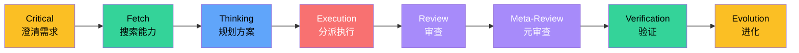
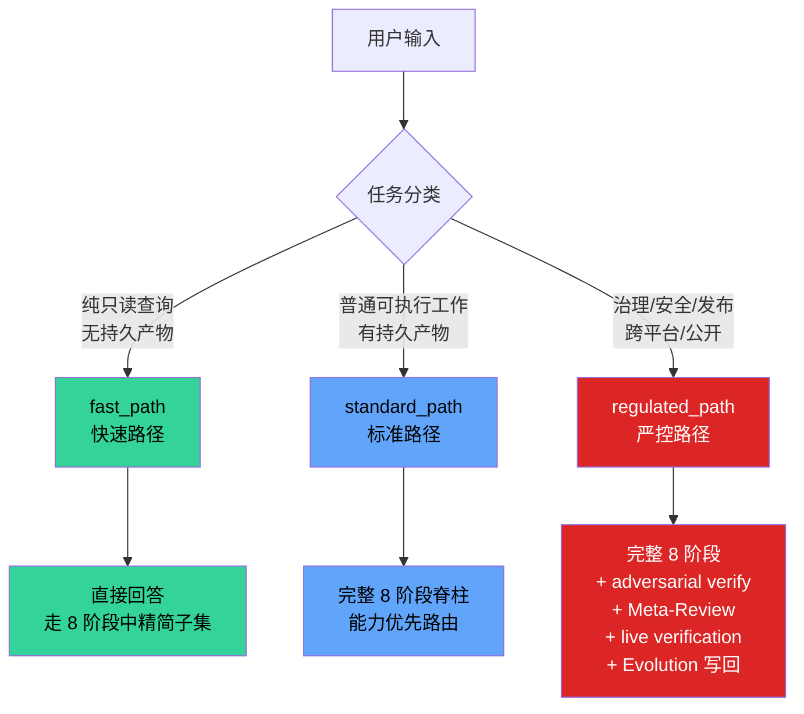
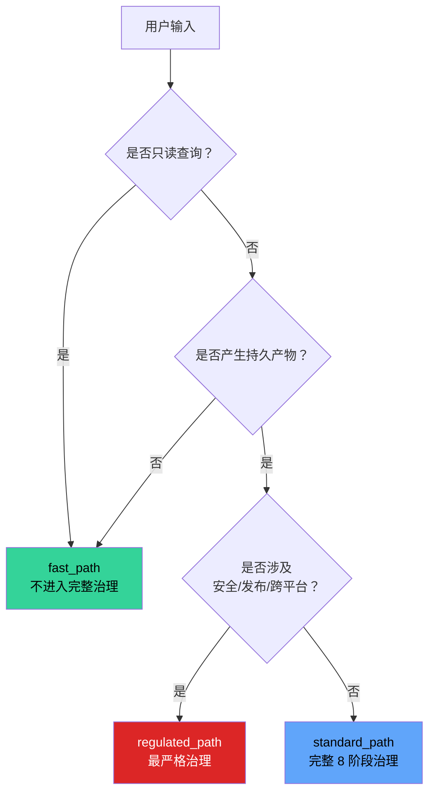

# 8 阶段脊柱与路径分类

## 📖 概念

> Meta_Kim 的 **8 阶段执行脊柱（8-stage execution spine）** 是贯穿所有 governed run 的固定骨架：Critical → Fetch → Thinking → Execution → Review → Meta-Review → Verification → Evolution。它不是一套"建议流程"，而是有明确输入输出、门控条件和协议产物的**可执行治理引擎**。

这 8 个阶段合在一起，定义了 AI 编码工作从"收到需求"到"经验沉淀"的完整生命周期。每个阶段的输出是下一个阶段的输入，形成一条不中断的**证据链**。

### 8 大流程全景



## 🔧 工作原理

### 8 阶段逐一解析

#### 阶段 1：Critical — 先把真实问题钉住

**核心职责**：防止整个执行建立在误解之上。

需求模糊时追问澄清，而不是猜。这一步产出 `intentPacket`（意图锁定），把真实用户意图、成功标准、排除范围全写死。如果需求已经清晰，系统显式记录跳过原因，不是偷偷跳过。

| 项目 | 内容 |
|------|------|
| **输入** | 用户原始请求、项目上下文、权限边界 |
| **输出** | `intentPacket`：真实意图、成功标准、非目标、阻塞未知项 |
| **门控** | 意图不明、架构类型不清 → 阻塞 |
| **默认 owner** | `meta-warden` |
| **可跳过** | 纯只读查询 + 无持久产物 |

**CC 底层依赖**：Critical 阶段依赖 Claude Code 的对话能力和上下文理解能力，通过追问机制补齐缺失信息。在 Codex/Claude Code 中通过 `AskUserQuestion` / `request_user_input` 原生选择表面交互。

#### 阶段 2：Fetch — 先找已有能力，不自己发明

**核心职责**：搜索现有 agent、skill、工具、MCP 能不能覆盖需求。

这是 Meta_Kim 最核心的差异点之一。**能力优先（Capability-First）**：先定义需要什么能力 → 再搜索谁声明了这个能力 → 最后派给最匹配的 owner。能力索引查找顺序是 `config/capability-index/` → 工具端镜像 → 本地库存 → fallback。不是一开始就写死一个 agent 名字。

Fetch 阶段必须收集：
- **在线/web 证据**：定价、版本、第三方 API、平台规则等需要实时验证的信息
- **本地证据**：项目配置、脚本、依赖、文件清单
- **能力清单**：可用 agents、skills、MCP tools、runtime tools、commands、hooks、prompts/rules

| 项目 | 内容 |
|------|------|
| **输入** | `intentPacket`、任务分类 |
| **输出** | `fetchPacket`：证据摘要、决策影响地图、能力发现搜索日志、能力清单、能力缺口 |
| **门控** | 能力发现缺失、路径变更源未读、已知不支持的 runtime/OS → 阻塞 |
| **默认 owner** | `meta-conductor` |

**CC 底层依赖**：Fetch 的核心操作——搜索文件、运行命令、调用 MCP 工具、网络搜索——全部通过 CC 的 Tools 层和 MCP 层实现。`findskill` 是外部 skill，用于搜索社区可安装技能。`meta-scout` agent 负责外部能力发现。

#### 阶段 3：Thinking — 定义边界、owner、顺序、交付物

**核心职责**：把任务拆成子任务，指定 owner，明确依赖关系和并行分组。

这一步产出 `dispatchBoard`——谁干什么、哪些可以并行跑、最终谁负责合并。关键约束：**必须探索至少 2 条方案路径**，不能只走一条路。

| 项目 | 内容 |
|------|------|
| **输入** | `intentPacket`、`fetchPacket`、能力清单 |
| **输出** | `dispatchBoard`：owner、weapon、workerTaskPackets、并行分组、依赖策略、融合 owner、路径方案对比 |
| **必须包含** | 至少 2 条候选方案 + 推荐默认 |
| **门控** | owner 未选定、weapon 未选定、依赖策略缺失 → 阻塞 |
| **默认 owner** | `meta-conductor` |

#### 阶段 4：Execution — 分派执行，产出物

**核心职责**：分派给专业 agent 执行。每个子任务打包成 `workerTaskPacket`，包含完整的文件上下文、约束条件、审查 owner 和验证 owner。

**执行 ≠ 完成**——产出物后面还要过审查和验证。

关键原则：
- 独立子任务**必须并行跑**，不串行拖慢
- 每个 worker 有明确的 `dependsOn` 和 `parallelGroup`
- 执行中如果出现路径变更级的发现，**暂停并通知用户**

| 项目 | 内容 |
|------|------|
| **输入** | `dispatchBoard`、`workerTaskPackets` |
| **输出** | `workerResultPackets`、执行证据 |
| **约束** | 不得让治理 agent（meta-warden 等）充当实现 worker；不得用 general-purpose 临时替代 |

**CC 底层依赖**：Execution 阶段的"分派"通过 CC 的 **Agent 工具**（`Agent()` / subagent spawn）实现。每个 `workerTaskPacket` 分派给一个 agent 实例执行。这是 CC Agent 系统的直接应用——[[Claude Code/04-Agents 代理系统|CC Agents]] 是 Meta_Kim 分发的执行载体。对于 2+ 独立 worker 且依赖关系安全的场景，通过 `agent-teams-playbook` skill 做 fan-out 编排——参见 [[Claude Code/08-Workflows 工作流编排|CC Workflows]]。

#### 阶段 5：Review — 检查执行是否靠谱

**核心职责**：审查代码质量、安全性、架构合规、边界越界。

产出 `reviewPacket`，里面是结构化的审查发现（findings）。每个发现都有严重等级（CRITICAL → LOW）。**发现没关就不能往前推。**

对于 `regulated_path`，Review 必须走 **adversarial verify** 模式：N 个独立审查者（默认 3 个），各自从不同视角（正确性、安全性、完整性）尝试**证伪**每个 finding。只有多数（≥ ceil(N/2)）证伪失败，finding 才算存活。

| 项目 | 内容 |
|------|------|
| **输入** | `workerResultPackets` |
| **输出** | `reviewPacket.findings`（结构化发现 + 严重等级 + 证据） |
| **默认 owner** | `meta-prism` |

#### 阶段 6：Meta-Review — 审查"审查"本身

**核心职责**：确保审查标准本身没偏、没漏、没松。

如果 review 标准本身太松，等于没审；如果标准偏了，等于审错了方向。这一步保证审查系统的质量，而不是只保证被审代码的质量。

| 项目 | 内容 |
|------|------|
| **输入** | `reviewPacket` |
| **输出** | meta-review 质量判定 |
| **默认 owner** | `meta-warden` |

#### 阶段 7：Verification — 确认真实世界里成立

**核心职责**：验证修复是否真的把 review finding 关了。

产出 `verificationResult` + `closeFindings`。如果修复没关上 finding，回修再验证，直到闭合。**这步是最诚实的关卡——文本上看起来修了不等于真修了。**

关键区分：
- **Smoke 验证**：轻量级，适合低风险修改（prompt 文案、changelog 等）
- **Live 验证**：需要真实命令、日志、产物或人工确认记录支撑
- **Release-grade 验证**：最严格，需要完整证据链

| 项目 | 内容 |
|------|------|
| **输入** | `revisionResponses`（修复响应） |
| **输出** | `verificationResult`、`closeFindings`、验证证据 |
| **门控** | 命令过 ≠ 目标完成；smoke 不能冒充 live proof |

**CC 底层依赖**：Verification 依赖 CC 的 Bash 工具执行测试命令、读取日志、检查产物。验证证据必须是**新鲜执行的**，不能是之前缓存的结果。

#### 阶段 8：Evolution — 经验沉淀，反哺下一轮

**核心职责**：把本轮能力缺口、可复用模式、升级需求写回系统。

每轮必须给出 `writebackDecision`——要么明确写回目标，要么说明为什么没有可落盘的内容。**不沉淀经验的 run 等于白干。**

| 缺口类型 | 进化目标 |
| --- | --- |
| prompt gap | 升级 canonical skill 或 reference contract |
| agent boundary gap | 升级目标 agent 定义 / SOUL.md |
| capability gap | `capabilityGapPacket` → Type B owner 升级管线 |
| dependency gap | 依赖注册和兼容性校验器 |
| runtime/OS gap | runtime 矩阵或 OS 矩阵 |
| warning/hook scar | 校验器、hook 策略、回归测试 |

| 项目 | 内容 |
|------|------|
| **输入** | 全部前序阶段的产物和发现 |
| **输出** | `evolutionWritebackPacket`、`scarPacket`（失败模式记录） |
| **默认 owner** | `meta-chrysalis` |

**CC 底层依赖**：Evolution 的写回载体包括 CC 的 Memory 系统（[[Claude Code/05-Memory 记忆系统|Memory]]）、Graphify 知识图谱（代码结构经验），以及 canonical agents/skills 源文件。

### 阶段协议快速对照

| # | 阶段 | 核心产出 | 默认 owner | 关键门控 |
|---|------|---------|-----------|---------|
| 1 | Critical | `intentPacket` | meta-warden | 意图不明则阻 |
| 2 | Fetch | `fetchPacket` + 能力清单 | meta-conductor | 能力未发现则阻 |
| 3 | Thinking | `dispatchBoard` + 方案对比 | meta-conductor | 无 owner/weapon 则阻 |
| 4 | Execution | `workerResultPackets` | 专业 agent | 治理 agent 不得执行 |
| 5 | Review | `reviewPacket.findings` | meta-prism | 发现未关则阻 |
| 6 | Meta-Review | 审查质量判定 | meta-warden | 无交互 |
| 7 | Verification | `verificationResult` | 独立验证 owner | 命令过 ≠ 目标完 |
| 8 | Evolution | `evolutionWriteback` | meta-chrysalis | 必须给出写回决策 |

## 💡 路径分类：什么会触发治理，什么不会

这是理解和用好 Meta_Kim 最关键的判断。Meta_Kim 定义了三种执行路径：



### fast_path（快速路径）

**触发条件**：纯只读查询，不产生持久产物，不修改文件。

**示例**：
- "这个函数是干什么的？"
- "帮我解释一下这段代码"
- "列出项目中的所有 API 端点"
- "Claude Code 的 Skills 和 MCP 有什么区别？"

**行为**：可以跳过 Fetch、Thinking、Execution 的完整流程。证据声明仍需有源可查。**不需要用户手动声明——系统自动识别。**

### standard_path（标准路径）

**触发条件**：有持久产物的普通可执行工作。这是最常见的路径。

**示例**：
- "帮我修复这个 bug"
- "重构这个模块"
- "给这个 PR 做代码审查"
- "创建一个新的 skill"

**行为**：走完整 8 阶段脊柱，采用**能力优先路由**（Capability-First）。系统自动搜索匹配的 agent/skill/MCP/tool，而不是写死某个 agent。独立子任务并行执行。

### regulated_path（严控路径）

**触发条件**：涉及治理、安全、runtime、依赖、发布、公开就绪或跨平台的工作。

**示例**：
- "部署到生产环境"
- "修改认证系统"
- "升级 Meta_Kim 的全局安装"
- "发布新的 skill 到社区"

**行为**：在 standard_path 基础上叠加：
- Adversarial verify（3 个独立审查者从不同视角证伪）
- Meta-Review（审查"审查标准"本身）
- Live verification（真实命令 + 日志 + 产物证据）
- Evolution 写回（强制性经验沉淀）
- `publicDisplay gate` 通过才能宣称"完成"

### 关键结论：什么走治理，什么不走



> **一句话总结**：只读查询不进入完整治理；任何产生持久产物的工作都自动进入治理路线；涉及安全、发布或跨平台的进入最严格治理。

**重要澄清**：`/meta-theory` 是**维护者快捷方式**，不是唯一入口。普通用户只需要用自然语言描述任务，Meta_Kim 通过其 skill 定义的触发条件自动判断是否进入治理路线。你不需要显式输入 `/meta-theory` 来"开启治理"——系统在后台自动分类和路由。

## 🎯 实战示例

### 示例 1：fast_path — 只读查询

**场景**：你想了解项目中 MCP 配置

**操作**：
```text
"这个项目配置了哪些 MCP 服务？"
```

**Meta_Kim 行为**：识别为只读查询 → fast_path → 直接搜索 `.mcp.json` 和 settings.json 回答，不走完整 8 阶段。

### 示例 2：standard_path — 修 Bug

**场景**：一个跨两个文件的 Bug 需要修复

**操作**：
```text
"登录接口超时了，帮我排查修复"
```

**Meta_Kim 行为**：
1. Critical — 确认超时现象和成功标准
2. Fetch — 搜索日志、代码库、已有 issue
3. Thinking — 规划诊断路径（网络层/数据库层/代码层），选 owner
4. Execution — 并行诊断各层，定位根因，修复
5. Review — 审查修复代码
6. Meta-Review — 确认审查标准
7. Verification — 验证修复真的管用
8. Evolution — 记录这次故障模式

### 示例 3：regulated_path — 发布相关

**场景**：你要部署到生产环境

**操作**：
```text
"准备发布 v2.0，帮我做发布前检查"
```

**Meta_Kim 行为**：自动进入 regulated_path → 叠加 adversarial verify → 需要 live evidence → publicDisplay gate 放行才能说"可以发布"。

## ✅ 最佳实践

1. **DO**：日常编码直接说任务，不用管路径分类——Meta_Kim 自动判断
2. **DO**：安全敏感或发布相关工作，接受 regulated_path 的额外审查——它是保护不是阻碍
3. **DON'T**：不要试图绕过门控——门控不是为难你，是防止"看起来完成了但其实没有"
4. **TIP**：如果 Execution 阶段被门控拦住，回头看 Critical 和 Thinking 阶段的产物是否完整

## ⚠️ 常见陷阱

| 陷阱 | 表现 | 解决方案 |
|------|------|---------|
| 以为所有对话都走 8 阶段 | 只读查询也期待看到 governance 输出 | 只读查询自动走 fast_path，不会展示完整 8 阶段 |
| 误触发治理 | 简单任务产生意外 durable work | 单文件修改通常不需要完整 governance |
| 混淆 /meta-theory 和自然语言触发 | 每次都手动输 /meta-theory | 自然语言就会触发，/meta-theory 只是维护者快捷方式 |
| 跳过阶段导致门控失败 | Execution 被拦住，不知道为什么 | 检查前序阶段产物是否完整：intent 明确？能力搜了？owner 选了？ |

## 🔗 关联概念

- [[Meta_Kim/00-Meta_Kim 入门概览|入门概览]] — 四大核心机制的全景
- [[Meta_Kim/02-元角色体系与能力优先分发|元角色体系]] — 8 阶段由哪些 agent 负责执行
- [[Meta_Kim/03-协议、门与动态发牌|协议、门与发牌]] — Packet、Gate、Card 如何配合 8 阶段
- [[Meta_Kim/05-场景判断：何时用 meta-theory|场景判断]] — 实际决策框架
- [[Claude Code/04-Agents 代理系统|CC Agents]] — Meta_Kim 分发的执行载体
- [[Claude Code/05-Memory 记忆系统|CC Memory]] — Evolution 阶段的写回目标之一
- [[Claude Code/08-Workflows 工作流编排|CC Workflows]] — 复杂 run 的并行编排机制

## 📚 扩展阅读

- `config/contracts/core-loop-contract.json`：8 阶段的完整输入输出规范
- `config/contracts/path-selection.md`：路径评分和带宽细节
- `canonical/skills/meta-theory/references/`：meta-theory skill 参考文档

---

> **下一步**：阅读 [[Meta_Kim/02-元角色体系与能力优先分发|元角色体系与能力优先分发]]，理解 9 个治理 agent 如何分工协作，以及 Meta_Kim 如何在 CC 的 Agent/Skill/MCP 基础设施之上构建能力优先分发。
