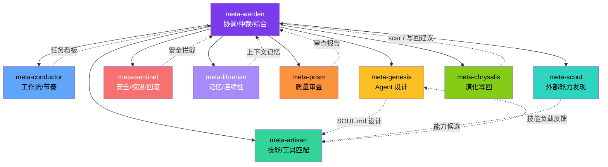
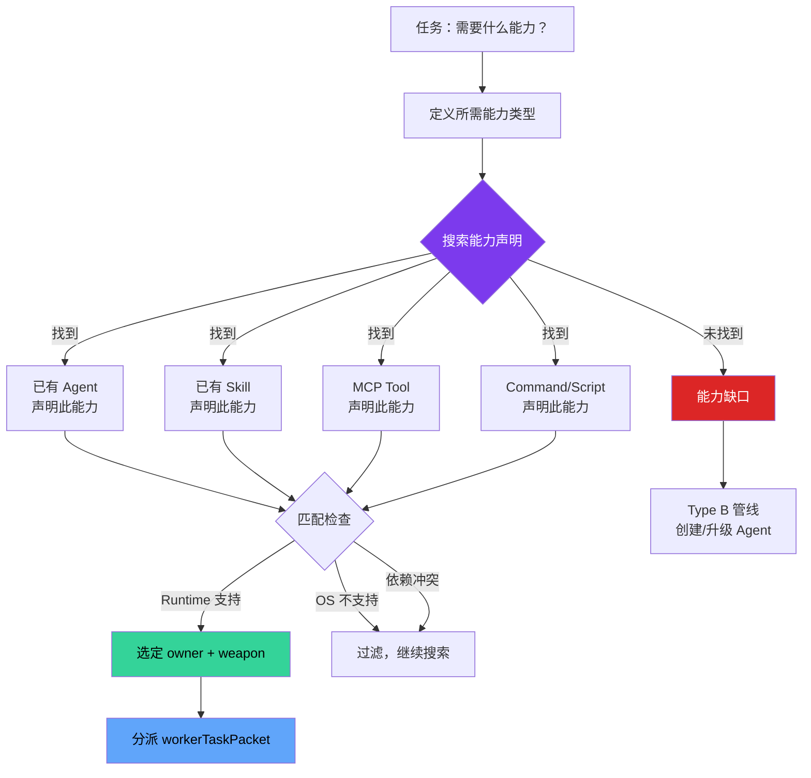
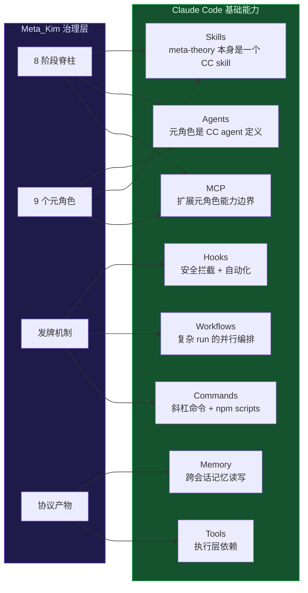

# 元角色体系与能力优先分发

## 📖 概念

> Meta_Kim 的 **元角色体系** 由 9 个专业治理 agent 组成，每个 agent 拥有明确的职责边界、拒绝清单和能力负载。它们不直接写代码，而是负责**治理**：协调、搜索、匹配、审查、验证、沉淀。工作执行由它们发现的**外部专业 provider**（skill、MCP、tool、command）完成。

核心理念是**能力优先分发（Capability-First Dispatch）**：
1. 先定义需要什么**能力**（capability）
2. 再搜索谁**声明**了这个能力（agent / skill / MCP tool / command / runtime tool）
3. 最后**派给**最匹配的 owner

这与传统思路相反——传统是"我知道 agent X 能干什么，所以调 agent X"。Meta_Kim 的思路是"这个任务需要什么能力？世界上谁有这个能力？那就派给谁。"

## 🔧 工作原理

### 9 个元角色全景



### 角色逐一详解

#### meta-warden（元典狱长）— 总协调者

| 维度 | 说明 |
|------|------|
| **职责** | 协调、仲裁、最终综合。作为 Meta_Kim 的公开前门 |
| **在 8 阶段中** | Critical 阶段默认 owner、Meta-Review 判断者、Evolution 写回审批者 |
| **不管什么** | 不直接写代码；不充当实现 worker |
| **CC 实现** | 通过 CC Agent 定义，在 governed run 中作为主调度者被调用 |

#### meta-conductor（元指挥）— 工作流引擎

| 维度 | 说明 |
|------|------|
| **职责** | 工作流编排、节奏控制、Task DAG 规划 |
| **在 8 阶段中** | Fetch 和 Thinking 阶段的默认 owner |
| **关键输出** | `dispatchBoard`（分派看板）、`workerTaskPackets`（任务包）、并行分组 |
| **不管什么** | 不做安全检查（那是 sentinel 的事）；不直接执行任务 |
| **CC 实现** | 通过 CC Agent + Workflow 工具实现任务 DAG 编排 |

#### meta-genesis（元创世）— Agent 设计师

| 维度 | 说明 |
|------|------|
| **职责** | 设计 agent 身份、SOUL.md、边界定义 |
| **触发条件** | Fetch 证明存在能力缺口 → Thinking 决定创建新 agent → Type B 管线 |
| **不管什么** | 不管工具选型（那是 artisan 的事）；不管 agent 人设之外的东西 |
| **CC 实现** | 通过 CC Agent 定义文件（`.claude/agents/*.md`）来创建/升级 agent |

#### meta-artisan（元工匠）— 技能匹配师

| 维度 | 说明 |
|------|------|
| **职责** | 技能（skill）、MCP、工具、命令的匹配和推荐 |
| **工作方式** | 根据任务需求，从能力清单中匹配最合适的武器（weapon）组合 |
| **不管什么** | 不管 agent 身份设计（那是 genesis 的事） |
| **CC 实现** | 通过 CC Skills 系统 + MCP 工具清单进行匹配；元角色可集成社区技能 |

#### meta-sentinel（元哨兵）— 安全守卫

| 维度 | 说明 |
|------|------|
| **职责** | 安全审查、权限控制、回滚判断 |
| **工作方式** | 在执行阶段介入，拦截危险操作；在 Risk 牌触发时抢占 |
| **不管什么** | 不管工作节奏编排（那是 conductor 的事） |
| **CC 实现** | 通过 CC Hooks 实现自动化拦截（如危险命令拦截、git push 提醒）；通过 CC 权限系统控制 |

#### meta-librarian（元图书馆员）— 记忆管理者

| 维度 | 说明 |
|------|------|
| **职责** | 记忆连续性、上下文管理、跨会话恢复 |
| **工作方式** | 在 run 开始时加载相关记忆，在 run 结束时保存关键发现 |
| **不管什么** | 不管代码执行 |
| **CC 实现** | 通过 CC Memory 系统（`~/.claude/projects/*/memory/`）读写记忆文件 |

#### meta-prism（元棱镜）— 质量审查者

| 维度 | 说明 |
|------|------|
| **职责** | 多维度质量审查（正确性、安全性、完整性、架构合规） |
| **在 8 阶段中** | Review 阶段的默认 owner |
| **关键输出** | `reviewPacket.findings`：结构化的审查发现 + 严重等级 + 证据 |
| **不管什么** | 不管能力搜索（那是 scout 的事） |
| **CC 实现** | 通过 CC Agent + Review 标准合约执行；regulated_path 下运行 adversarial verify（3 个独立 skeptics） |

#### meta-scout（元侦察兵）— 外部能力发现者

| 维度 | 说明 |
|------|------|
| **职责** | 发现外部能力——在线搜索、社区 skill、新 MCP server、新工具 |
| **工作方式** | 当 Fetch 阶段本地能力不够时，向外搜索 |
| **不管什么** | 不管内部协调（那是 warden 的事） |
| **CC 实现** | 通过 CC WebSearch + `findskill` + MCP 发现机制实现 |

#### meta-chrysalis（元蛹）— 进化执行者

| 维度 | 说明 |
|------|------|
| **职责** | Evolution 阶段写回：scar 记录、agent 升级、能力缺口回填 |
| **在 8 阶段中** | Evolution 阶段的默认 owner |
| **关键约束** | **不演化自己**，也不绕过 Warden gate——所有写回需要 Warden 审批 |
| **CC 实现** | 通过 CC Memory + Graphify + canonical 源文件编辑实现 |

### 能力优先分发流程

这是 Meta_Kim 与传统"调 agent X 干 Y"最关键的区别：



**能力索引查找顺序**：
1. `config/capability-index/` — Meta_Kim 内置能力索引
2. 工具端镜像 — `.claude/agents/`、`.codex/agents/` 等
3. 本地库存 — 项目内 agents、skills、MCP、commands
4. 全局库存 — `~/.claude/`、`~/.codex/` 等用户级能力
5. 外部发现 — meta-scout 搜索社区 skill、在线注册表
6. Fallback — 仅在以上全部为空时触发

### Meta_Kim 如何构建在 CC 基础能力之上

Meta_Kim 不是从零发明的。它的每个治理机制都建立在 CC 的基础概念之上：



| Meta_Kim 概念 | 依赖的 CC 基础能力 | 说明 |
|--------------|-------------------|------|
| 8 阶段脊柱 | **Skills**、**Agents**、**Hooks** | meta-theory 是一个 CC skill；脊柱通过 skill 定义触发和路由 |
| 9 个元角色 | **Agents** | 每个元角色是一个 CC agent 定义（`.claude/agents/*.md`） |
| 能力优先分发 | **Skills**、**MCP**、**Tools** | 通过 CC skill 系统 + MCP 工具清单匹配 provider |
| 协议产物 | **Memory**、**Tools** | packet 通过 CC memory 写回；执行通过 CC tools |
| 动态发牌 | **Hooks**、**Workflows** | 门控通过 hooks 实现；fan-out 通过 Workflow 工具 |
| 三层记忆 | **Memory**、**MCP**、**Graphify** | 分别利用 CC memory、MCP Memory Service、Graphify |
| 危险操作拦截 | **Hooks** | 利用 CC hook 事件系统做 PreToolUse 拦截 |

> **核心洞察**：Meta_Kim 不"替代"任何 CC 能力，而是在 CC 的能力之上**叠加了一层治理逻辑**。CC 的 Skills、Agents、Hooks、MCP、Memory、Workflows 是砖块，Meta_Kim 用这些砖块建造了一座有纪律的建筑。

## 💡 为什么重要

- **解决的问题**：
  - "谁来做"不再凭感觉——能力优先分发让匹配有据可查
  - "做完了怎么审"不再靠自觉——每个审查维度有明确的 owner
  - "agent 边界模糊"有了硬边界——每个元角色明确列出"不管什么"
- **带来的价值**：
  - **可替换性**：每个元角色可以被独立替换，不影响整体架构
  - **可审查性**：每个元角色的输出有明确的协议格式
  - **可升级性**：发现能力缺口后走 Type B 管线创建/升级 agent
- **不使用时的影响**：分发乱（谁都能干任何事）、审查漏（少审一个维度没人知道）、边界混（agent 职责重叠）

## 🎯 实战示例

### 示例 1：一次 governed 代码审查的元角色协作

**场景**：审查一个跨 3 个文件的认证模块重构

**操作**：
```text
"帮我审查认证模块重构的代码质量"
```

**元角色协作流程**：

1. **meta-warden** 接收请求，判断需要进入 standard_path
2. **meta-conductor** 做 Fetch + Thinking：搜索可用审查能力
3. **meta-artisan** 匹配武器：发现 meta-prism（代码审查）+ ESLint（静态分析）+ git diff（变更范围）
4. **meta-conductor** 规划并行审查维度：正确性、安全性、性能，生成 `dispatchBoard`
5. **Execution**：3 个独立 worker 并行审查
6. **meta-prism** 汇总审查发现，产出 `reviewPacket.findings`
7. **meta-warden** 做 Meta-Review：审查标准本身是否合适
8. **meta-chrysalis** 记录本次审查模式，沉淀为 scar 或 skill 升级

### 示例 2：能力缺口触发 Type B 管线

**场景**：你需要一个专门的数据库迁移审查能力，但现有 agent 都不具备

**操作**：
```text
"帮我审查这次数据库迁移的安全性和向后兼容性"
```

**流程**：
1. Fetch 发现 meta-prism 可以审安全性，但没有专门的"迁移兼容性"审查能力
2. 记录 `capabilityGapPacket`
3. 如果这个缺口是项目持续需要的 → Type B 管线：**meta-genesis** 设计新 agent 身份 → **meta-artisan** 匹配工具负载 → **meta-prism** 审查 → **meta-warden** 审批 → 写回

### 示例 3：meta-sentinel 安全拦截

**场景**：worker 尝试执行 `rm -rf` 命令

**流程**：
1. **meta-sentinel** 通过 CC Hooks 的 PreToolUse 事件检测到危险命令
2. 触发 **Risk 牌**抢占——打断当前执行流程
3. 向用户确认："检测到危险命令 `rm -rf`，是否确认执行？"
4. 用户确认后继续，或拒绝后回滚

## ✅ 最佳实践

1. **DO**：理解每个元角色的"不管什么"——这比"职责"更重要，能帮你判断什么时候该找谁
2. **DO**：接受能力优先分发的匹配结果——如果系统选了你不认识的 provider，先验证其能力而不是拒绝
3. **DON'T**：不要让治理 agent 充当实现 worker——meta-warden 不应该写代码，meta-conductor 不应该做安全审查
4. **TIP**：如果反复遇到同类能力缺口，考虑走 Type B 管线创建一个持久的 agent 而不是每次都临时凑合

## ⚠️ 常见陷阱

| 陷阱 | 表现 | 解决方案 |
|------|------|---------|
| 把元角色当万能 agent | 让 meta-warden 直接写代码 | 元角色只做治理，执行由专业 provider 完成 |
| 跳过能力搜索直接指定 agent | "我知道 agent X 能干，直接用" | 让 Fetch 先搜索，可能发现更好的 provider |
| 元角色边界混淆 | 让 meta-conductor 同时做安全审查 | 每个元角色有明确的"不管什么"边界 |
| 忽视能力缺口 | 遇到缺口用临时方案凑合 | 记录 `capabilityGapPacket`，后续走 Type B 管线 |

## 🔗 关联概念

- [[Meta_Kim/00-Meta_Kim 入门概览|入门概览]] — 9 个元角色在整体架构中的位置
- [[Meta_Kim/01-8 阶段脊柱与路径分类|8 阶段脊柱]] — 元角色在 8 阶段中的分工
- [[Meta_Kim/03-协议、门与动态发牌|协议、门与发牌]] — 元角色之间如何通过协议交接
- [[Claude Code/01-Skills 技能系统|CC Skills]] — meta-theory skill 的实现载体
- [[Claude Code/04-Agents 代理系统|CC Agents]] — 元角色的运行时实现
- [[Claude Code/02-MCP 模型上下文协议|CC MCP]] — 扩展元角色能力边界的协议
- [[Claude Code/06-Hooks 钩子系统|CC Hooks]] — meta-sentinel 安全拦截的实现机制

## 📚 扩展阅读

- `canonical/agents/` — 9 个元角色的 agent 定义源文件
- `canonical/skills/meta-theory/SKILL.md` — meta-theory skill 完整定义
- `config/capability-index/` — 能力索引，搜索 provider 的事实来源

---

> **下一步**：阅读 [[Meta_Kim/03-协议、门与动态发牌|协议、门与动态发牌]]，理解 Packet、Gate、Card 三种治理工具如何保证执行质量和灵活性。
