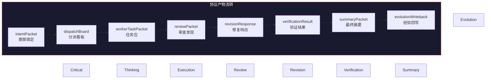
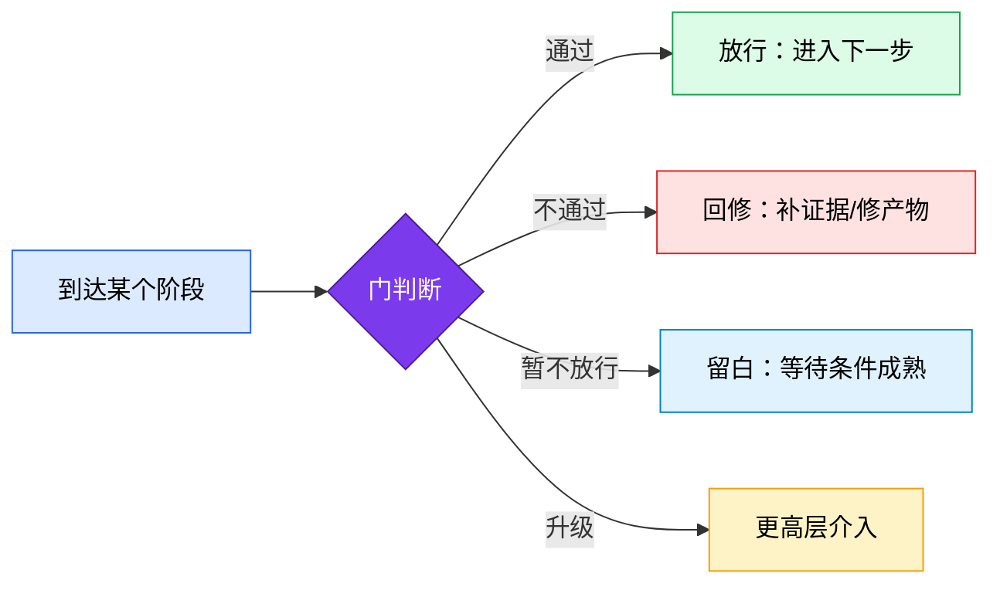
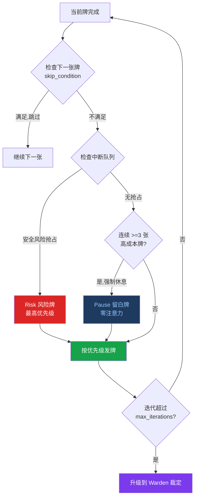
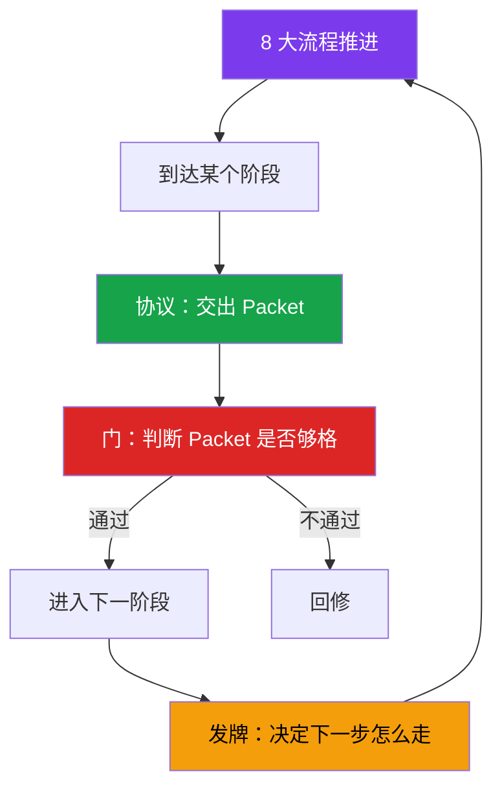

# 协议、门与动态发牌

## 📖 概念

> 如果把 8 大流程比作**高速公路**，那么**协议（Packet）**就是每个服务区必须交接的货物清单，**门（Gate）**是收费站的放行杆，**动态发牌（Cards）**是路上的智能导航——根据实时路况调整路线。

三者的关系一句话说死：

> **协议解决"节点必须交出什么"，门解决"这些东西够不够放行"，发牌解决"下一步该走哪条路"。**

没有协议，门没有判断依据；没有门，协议就是走过场；没有发牌，骨架太僵硬。

## 🔧 工作原理

### 协议（Packet）— 每个阶段的交付契约

Meta_Kim 的协议不是口头约定，是**结构化的数据包（packet）**。每个 8 阶段节点都有明确的交付物要求：

#### 核心协议一览

| 协议产物 | 所属阶段 | 包含内容 | 为什么必须 |
|---------|---------|---------|-----------|
| `intentPacket` | Critical | 真实意图、成功标准、非目标（non-goals）、阻塞未知项 | 防止全程建立在误解之上 |
| `taskClassification` | Critical | 路径分类（fast/standard/regulated）、架构类型 | 决定后续走哪条治理路线 |
| `fetchPacket` | Fetch | 证据摘要、能力发现搜索日志、能力清单、能力缺口 | 证明"搜过了"，不是凭感觉选 owner |
| `dispatchBoard` | Thinking | owner、weapon、workerTaskPackets、并行分组、融合 owner | 谁干什么、哪些可以并行——执行前的唯一事实源 |
| `workerTaskPacket` | Execution | 子任务完整上下文：文件、约束、审查者、验证者 | 每个 worker 明确知道做什么和边界在哪 |
| `reviewPacket.findings` | Review | 结构化发现：描述、文件位置、严重等级、证据 | 不是"看起来没问题"这种空话 |
| `revisionResponse` | Revision | 对每个发现的修复响应：怎么修的、改了哪里 | 证明每个发现都被处理了 |
| `verificationResult` | Verification | 每个修复是否真的关了对应的发现 | 文本上修了 ≠ 真修了 |
| `summaryPacket` | Summary | 最终摘要：做了什么、怎么做的、还有什么遗留 | 对外发布的最后一道信息门 |
| `evolutionWriteback` | Evolution | 写回决策：目标文件、原因、或 `none-with-reason` | 经验不沉淀等于白干 |

> 这些协议产物不是可有可无的文档——它们是系统运行的**事实来源**。没有协议，下一节点其实不是在"接力"，而是在"猜上一个节点到底想表达什么"。这就是很多 AI 协作一到复杂任务就开始失真的原因。

#### 协议校验

Meta_Kim 提供 `npm run meta:validate:run` 命令，校验协议产物链是否完整闭合。如果发现链断裂（比如有 review finding 但没有对应的 revisionResponse），校验会报错。

### 门（Gate）— 准入判断

门不关心你怎么到这一步的，只关心**你带没带够东西**。

#### 关键门一览

| 门 | 把什么关 | 放行条件 | 阻塞后果 |
| --- | --- | --- | --- |
| **planning gate** | 从规划进入执行前 | 边界、owner、交付物、风险都定了 | 不能执行——回去补 Thinking |
| **execution gate** | 执行开始前 | 意图明确、能力搜了、owner 选定、runtime/OS 不冲突、memory 策略有 | 不能执行——返回对应阶段 |
| **metaReview gate** | 元审查够不够格 | 审查标准本身没偏、没漏、没松 | 审查不可信——重新校准审查标准 |
| **verify gate** | 修复是不是真的关了 | finding → revision → verification 闭合 | 不能宣称修好——回去重修 |
| **summary gate** | 能不能对外发布 | 验证通过 + 摘要完成 | 不能公开发布 |
| **publicDisplay gate** | 能不能宣称"已完成" | verifyPassed + summaryClosed + singleDeliverableMaintained + deliverableChainClosed | **不能假装"做完了"** |

**最关键的是 publicDisplay gate**——没有通过验证、摘要未闭合、交付链断裂，就不能假装"做完了"。这是 Meta_Kim 对"命令跑绿 = 做完了"这种常见错觉的纠正。

#### 门 vs 协议

| 维度 | 协议（Packet） | 门（Gate） |
|------|---------------|-----------|
| 解决什么 | 节点必须交出什么 | 这些东西够不够放行 |
| 偏重 | 交付契约 | 准入判定 |
| 谁产生 | 各阶段 agent | meta-warden（最终仲裁） |
| 可跳过？ | 可记录跳过原因 | 门本身不可跳过，但可以通过或阻塞 |

### 动态发牌（Cards）— 固定骨架的灵活性

8 大流程相对固定，但现实中的任务千变万化。**发牌机制**给固定骨架增加了"呼吸感"——该严的地方严，该灵活的地方灵活。

#### 10 张牌

| 牌 | 触发条件 | 注意力成本 | 作用 |
| --- | --- | --- | --- |
| **Clarify（澄清）** | 需求模糊 | 低 | 追问澄清，不让模糊需求进入执行 |
| **Shrink scope（范围收缩）** | 仓库太大、文件太多 | 低 | 缩小范围到可管理的大小 |
| **Options（方案）** | 需求清晰但路径很多 | 中 | 列出 2+ 方案让用户选择 |
| **Execute（执行）** | 方案确定 | 高 | 真正执行任务 |
| **Verify（校验）** | 执行完成 | 中 | 验证执行结果是否符合预期 |
| **Fix（修复）** | 校验失败 | 中 | 修复校验发现的问题 |
| **Rollback（回滚）** | 风险扩散 | 高 | 回滚到安全状态 |
| **Risk（风险）** | 涉及安全/全局/多方 | 高 | 安全审查，可抢占当前流程 |
| **Nudge（建议）** | 用户卡住了 | 低 | 轻轻推一下，给建议 |
| **Pause（留白）** | 连续 3 张高成本牌后 | 零 | 强制暂停休息 |

#### 发牌决策流程

#### 发牌机制的关键特性

- **Risk 牌可抢占**：当安全风险出现时，立即打断当前流程，不管当前在哪张牌
- **Pause 强制休息**：连续 3 张高成本（高注意力）牌后，系统自动暂停——不是等用户提醒，是自己知道该停了
- **智能跳过**：用户已经知道的信息，对应的牌被跳过——不做无用功
- **Warden 兜底**：迭代超过上限时升级到 meta-warden 裁定——不会无限循环
- **每张牌的决策必须可解释**：发牌记录要包含触发信号、证据、证伪检查，评分 ≥ 80 分才能往前走

### 三者的协同关系

## 💡 为什么重要

- **协议**让 AI 协作不再是"猜你在想什么"——每个阶段留下结构化产物，下一阶段基于事实接力
- **门**防止"看起来做完了但其实没做完"——必须交出合格的证据才能往前走
- **发牌**防止固定流程要么太死板要么太随意——该严的 8 阶段不变，该活的牌动态调整
- **三者协同**形成"推进 → 交付 → 判断 → 决策"的完整治理循环

## 🎯 实战示例

### 示例 1：门拦住了一次"假完成"

**场景**：worker 改完了代码，commit 了，宣称"做完了"

**门控行为**：
1. Verify gate 检查：有 `verificationResult` 吗？→ 没有
2. 门控判断：**不放行**。commit 不是验证证据，需要真实的测试命令输出
3. 系统回到 Verification 阶段：运行测试，产生 `verificationResult`
4. 如果测试失败 → Fix 牌触发 → 修复 → 再验证
5. 直到 verify gate 通过 → summary gate → publicDisplay gate → 才能宣称"完成"

### 示例 2：Risk 牌抢占

**场景**：执行过程中 worker 试图执行 `git push --force origin main`

**发牌行为**：
1. meta-sentinel 检测到 force push 到 main 分支（安全风险）
2. **Risk 牌抢占**——不管当前在执行什么牌，立即打断
3. 弹出用户确认："检测到强制推送到 main 分支，可能覆盖他人代码。确认吗？"
4. 如果用户拒绝 → Rollback 牌触发 → 回滚相关操作

### 示例 3：Pause 牌自动休息

**场景**：连续执行了 3 个高成本任务：代码审查 → 安全审计 → 大规模重构

**发牌行为**：
1. 计数器检测到连续 3 张高注意力牌
2. **Pause 牌强制插入**："连续执行了 3 个高强度任务，建议暂停休息一下。要继续吗？"
3. 用户选择继续 → 继续发牌；选择暂停 → 保存状态，等待恢复

## ✅ 最佳实践

1. **DO**：接受门控的阻拦——它不是找茬，是保护你不在假完成上继续走
2. **DO**：协议产物虽然看起来"繁琐"，但它们是跨会话恢复的唯一事实来源
3. **DON'T**：不要跳过门控强行继续——那样执行链会断裂，后面无法验证
4. **DON'T**：不要忽视 Pause 牌——连续高强度会降低判断质量
5. **TIP**：如果反复被同一个门拦住，回头看协议产物——很可能是前面的 packet 不完整

## ⚠️ 常见陷阱

| 陷阱 | 表现 | 解决方案 |
|------|------|---------|
| 把 protocol 当文档看 | 觉得 packet 是可有可无的纸面文章 | 协议是数据结构，不是文档——它是门控的判断依据 |
| 忽略门控的反馈 | 门控拦住后反复用同样的 payload 重试 | 门控拦你说明证据不够——回去补证据，不是重试 |
| 觉得发牌多余 | 觉得 8 阶段就够了，发牌增加复杂度 | 8 阶段是高速公路，发牌是导航——不同场景不同路径 |
| 连续高强度不停 | 忽视 Pause 牌的休息建议 | Pause 不是装饰——连续高强度降低判断质量 |

## 🔗 关联概念

- [[Meta_Kim/01-8 阶段脊柱与路径分类|8 阶段脊柱]] — 协议、门、发牌依附于 8 阶段
- [[Meta_Kim/02-元角色体系与能力优先分发|元角色体系]] — 每个元角色负责产生/审查特定的协议
- [[Meta_Kim/04-三层记忆与进化闭环|进化闭环]] — Evolution 阶段的写回协议
- [[Claude Code/08-Workflows 工作流编排|CC Workflows]] — fan-out 时发牌机制如何协调并行 worker
- [[Claude Code/06-Hooks 钩子系统|CC Hooks]] — 门控的底层实现机制

## 📚 扩展阅读

- `config/contracts/core-loop-contract.json`：每个阶段的输入输出协议定义
- `config/contracts/validation-contract.json`：协议校验规则
- `canonical/skills/meta-theory/references/spine-state.md`：阶段状态和 packet 转换

---

> **下一步**：阅读 [[Meta_Kim/04-三层记忆与进化闭环|三层记忆与进化闭环]]，理解 Meta_Kim 如何让经验不沉没——三层记忆体系和 Evolution 闭环的全部细节。
