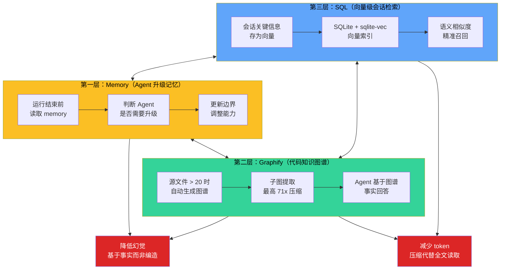
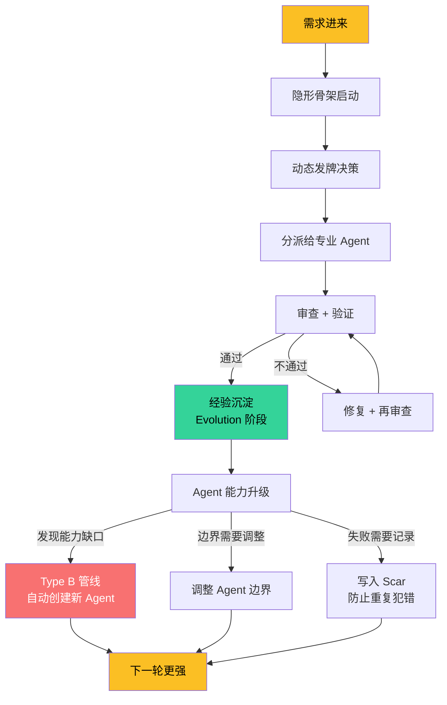

# 三层记忆与进化闭环

## 📖 概念

> Meta_Kim 的记忆不止"记下来"——它是一套三层分工的**长期记忆与进化体系**：第一层 Memory 驱动 Agent 持续升级，第二层 Graphify 构建项目代码知识图谱，第三层 SQL 实现向量级会话检索。三层共同作用，让 agent 越用越聪明，且对项目越来越熟。

配合 Evolution 阶段的写回机制，每一轮 governed run 的经验都会被沉淀为结构性升级：可复用模式写入 memory，失败记录成伤疤，能力缺口标记追踪，agent 边界调整写回 canonical。**不沉淀经验的 run 等于白干。**

## 🔧 工作原理

### 三层记忆全景

### 第一层：Memory（Agent 升级记忆）

| 维度 | 说明 |
|------|------|
| **负责什么** | Agent 的升级和持续学习 |
| **存储位置** | `~/.claude/projects/<hash>/memory/` |
| **工作机制** | 每次运行结束前，系统读取 memory 判断 agent 是否需要升级、边界是否需要调整 |
| **核心价值** | 让 agent 越用越聪明，而不是每次都从零开始 |
| **激活方式** | 自动——AI 在每次会话中自动读写 memory |
| **CC 底层实现** | 直接使用 [[Claude Code/05-Memory 记忆系统|CC Memory 系统]] |

Memory 文件轻量但关键。它不是"记住一切"，而是记住**决策依据**：上次为什么选择了方案 A 而不是方案 B？这个 agent 的能力边界上次被证明不足够在哪里？这些记录驱动 Evolution 阶段的升级决策。

### 第二层：Graphify（项目级 LLM Wiki）

| 维度 | 说明 |
|------|------|
| **负责什么** | 项目级别的代码知识图谱 |
| **存储位置** | `graphify-out/graph.json`（NetworkX 节点链接格式） |
| **工作机制** | git hook 在 commit/checkout 时自动重建；Agent 通过子图提取代替原始文件读取 |
| **核心价值** | 降低幻觉（基于图谱事实回答）+ 减少 token（最高 71 倍压缩） |
| **激活方式** | `node setup.mjs` 可选 Python 步骤安装 |

**质量门槛**（达不到则回退到直接文件读取）：

| 指标 | 阈值 | 处理 |
|------|------|------|
| 模糊节点比例 | > 30% | 标记为低质量图谱，回退到文件读取 |
| 总节点数 | < 10 | 图谱太稀疏，回退到 Glob/Grep |
| 上帝节点（入度过高） | 存在 | 标记为串行瓶颈 |

**CC 底层实现**：Graphify 通过 CC 的 git hooks（post-commit/checkout 触发重建）+ CC 子 agent 上下文注入（通过 `subagent-context.mjs` 给子 agent 注入图谱短提示，不会把整份 `graph.json` 塞进上下文）。

### 第三层：SQL（向量级会话检索）

| 维度 | 说明 |
|------|------|
| **负责什么** | 项目会话的向量级存储和检索 |
| **存储方式** | SQLite + 向量扩展（sqlite-vec） |
| **工作机制** | 把每次会话的关键信息存为向量，下次通过语义相似度检索 |
| **核心价值** | 跨会话连续性——上次聊到哪了这次能接上；语义检索而非关键词匹配 |
| **激活方式** | `node setup.mjs` 安装 MCP Memory Service + 各工具端 memory hooks |

**跨工具端支持**：

| 工具端 | Hook 注册方式 |
|--------|-------------|
| **Claude Code** | SessionStart Hook + Stop 记忆保存 Hook，自动注册 |
| **Codex** | `~/.codex/hooks.json` 桥接（SessionStart、UserPromptSubmit、Stop） |
| **OpenClaw** | `~/.openclaw/hooks/mcp-memory-service` managed hook |
| **Cursor** | `~/.cursor/hooks.json` 桥接（beforeSubmitPrompt、stop） |

**CC 底层实现**：通过 CC MCP + CC Hooks 实现。`.mcp.json` 注册 MCP Memory server（`http://localhost:8000`）；lifecycle hooks（SessionStart/Stop）自动写回会话记忆。

### Evolution 闭环：从经验到升级

三层记忆是存储，Evolution 是**把存储变成行动**。

#### Evolution 写回目标

| 缺口/发现类型 | 进化目标 | 写入载体 |
|-------------|---------|---------|
| prompt gap | 升级 canonical skill 或 reference contract | `canonical/skills/`、`config/contracts/` |
| agent boundary gap | 升级目标 agent 定义 / SOUL.md | `canonical/agents/*.md` |
| capability gap | `capabilityGapPacket` → Type B 创建 agent | `canonical/agents/` + 同步到工具端 |
| dependency gap | 依赖注册和兼容性校验器 | `config/capability-index/dependency-project-registry.json` |
| runtime/OS gap | runtime 矩阵或 OS 矩阵 | `config/runtime-capability-matrix.json`、`config/os-compatibility-matrix.json` |
| 失败模式 | Scar（伤疤）记录 | `config/governance/` + agent SOUL.md |

#### Scar（伤疤）机制

当同一种失败出现第二次时，不是再修一次，而是：
1. 判断为 **bottom_design_failure**（底层设计缺陷）
2. 回到 Critical / Fetch / Thinking 改目标合同、路径设计、owner/weapon 选择
3. 写入 **Scar**：`failurePattern`（失败模式）+ `preventionRule`（预防规则）+ `test`（回归测试）+ `nextRunReuseKey`（下次复用键）
4. 下次遇到类似模式时，Scar 自动触发预防规则

**这防止了"同一个坑跳两次"——第一次是经验，第二次就是系统缺陷了。**

## 💡 为什么重要

- **不遗忘**：三层记忆各司其职，确保上次学到的下次还在
- **不编造**：Graphify 让 agent 基于代码事实回答，而不是凭"记忆"瞎编
- **不重复犯错**：Scar 机制让每次失败都变成可执行的预防规则
- **不吃老本**：Evolution 不是"记下来就好"——必须变成结构性升级（agent 定义、skill、合约、配置）

## 🎯 实战示例

### 示例 1：Memory 驱动的 Agent 升级

**场景**：meta-prism 在上次审查中漏掉了一个 SQL 注入漏洞

**Evolution 流程**：
1. Review 阶段发现漏审 → 分析为什么 meta-prism 没发现
2. Evolution 阶段：升级 meta-prism 的审查标准——增加 SQL 注入检查项
3. 写回 `canonical/agents/meta-prism.md` 的 SOUL.md 部分
4. 同步到工具端（`npm run meta:sync`）
5. 下次 meta-prism 审查时自动包含 SQL 注入检查

### 示例 2：Graphify 降低幻觉

**场景**：agent 需要回答"这个项目的认证流程是怎么实现的"

**没有 Graphify**：agent 凭训练数据中的印象猜测，可能把 A 项目的流程说成 B 项目的

**有 Graphify**：
1. Agent 先查询 Graphify：`python -m graphify query "认证流程"`
2. Graphify 返回子图：AuthController → UserModel → JWTService → Middleware 的关系图
3. Agent 基于子图事实回答，不凭记忆编造
4. Token 消耗：子图提取比全文读取压缩了最高 71 倍

### 示例 3：Scar 防止重复犯错

**场景**：两次因为同样的 hook 配置错误导致部署失败

**Evolution 流程**：
1. 第二次失败时触发 **Same-Type Failure Design Gate**：这不是偶然，是设计缺陷
2. 写入 Scar：
   - `failurePattern`：hook 配置中的 `preToolUse` 正则表达式缺少锚定导致误匹配
   - `preventionRule`：所有 hook 正则必须用 `^...$` 锚定
   - `test`：新增 hook 配置校验脚本
   - `nextRunReuseKey`：`scar-hook-regex-anchor-check`
3. 下次任何 hook 配置变更时，系统自动检查这个 Scar

## ✅ 最佳实践

1. **DO**：每次 Evolution 阶段认真给出 `writebackDecision`——哪怕答案是"本轮无可沉淀"，也要说明原因
2. **DO**：项目源文件 > 20 时启用 Graphify——它的 ROI 在这种情况下已经明显为正
3. **DON'T**：不要跳过 Scar 写入——第二次同类失败说明需要系统级修复，不能再用一次性补丁
4. **TIP**：用 `npm run meta:query:runs -- --owner <agent>` 查看历史 run，追溯 agent 能力进化轨迹

## ⚠️ 常见陷阱

| 陷阱 | 表现 | 解决方案 |
|------|------|---------|
| 以为三层记忆很重 | 担心资源消耗不敢全开 | Memory 几个 markdown 文件，Graphify 源文件 > 20 才启用，SQL 用本地 SQLite——三层加起来远小于每次从零读项目的 token 消耗 |
| 跳过 Evolution 写回 | run 结束时不给出 writebackDecision | 每个 run 必须给出写回决策，哪怕是 `none-with-reason` |
| 忽视 Scar | 同类错误出现第二次还在原地修 | 第二次同类错误 = 系统设计缺陷，必须写入 Scar + 改设计 |
| Graphify 图谱质量低 | 模糊节点 > 30% 仍使用图谱 | 质量门槛硬性规定：模糊节点 > 30% 回退到文件读取 |

## 🔗 关联概念

- [[Meta_Kim/01-8 阶段脊柱与路径分类|8 阶段脊柱]] — Evolution 是 8 阶段的最后一环
- [[Meta_Kim/02-元角色体系与能力优先分发|元角色体系]] — meta-librarian（记忆管理）和 meta-chrysalis（进化执行）
- [[Meta_Kim/03-协议、门与动态发牌|协议、门与发牌]] — evolutionWriteback 协议和 publicDisplay gate
- [[Claude Code/05-Memory 记忆系统|CC Memory]] — 第一层记忆的底层实现
- [[Claude Code/06-Hooks 钩子系统|CC Hooks]] — Graphify git hooks 和 memory hooks 的底层实现
- [[Claude Code/02-MCP 模型上下文协议|CC MCP]] — 第三层 SQL 记忆的 MCP Memory Service

## 📚 扩展阅读

- `config/contracts/evolution-contract.json`：Evolution 阶段的完整协议
- `config/contracts/scar-protocol.md`：Scar 机制的详细规范
- Meta_Kim README 三层记忆章节

---

> **下一步**：阅读 [[Meta_Kim/05-场景判断：何时用 meta-theory|场景判断：何时用 meta-theory]]，这是本专题的实战决策篇——基于前面 4 篇文章的全部知识，给你一个清晰的判断框架。
