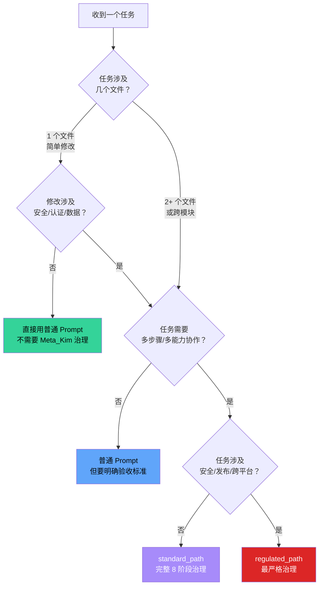
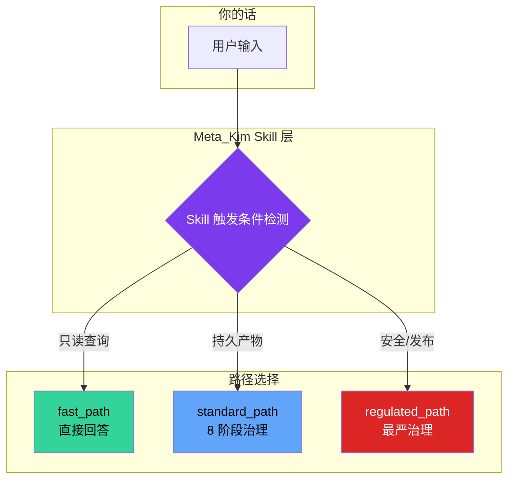

# 场景判断：何时用 meta-theory，何时用普通 Prompt

## 📖 概念

> Meta_Kim 不是你每句话都要念的咒语。它是**为复杂任务准备的治理层**——改一个文件里的一个函数？直接用 Claude Code 就行。重构一个跨模块的认证系统？Meta_Kim 会帮你管住每一步。

本文给出一个清晰的**决策框架**，帮你判断什么时候用 `/meta-theory`（或更准确地说，什么时候接受 Meta_Kim 的治理），什么时候用普通 Prompt 就够了。

**先记住最重要的一句话**：`/meta-theory` 只是维护者快捷方式，**你不需要显式输它**。Meta_Kim 通过自然语言自动判断任务是否需要治理。

## 🔧 决策框架

### 三步判断法



### 场景速查表

| 你的任务 | 用什么 | 原因 |
|---------|--------|------|
| "这个函数干嘛的？" | 普通 Prompt | 只读查询 → fast_path |
| "帮我解释这段代码" | 普通 Prompt | 只读查询 → fast_path |
| "把 `formatDate` 改成 ISO 8601" | 普通 Prompt | 单文件简单修改 |
| "修一个变量命名错误" | 普通 Prompt | 单文件简单修改 |
| "给这个函数加个单元测试" | 普通 Prompt（建议） | 单文件修改 + 明确验收标准即可 |
| "修 Bug：登录超时" | **Meta_Kim 治理** | 可能需要排查多层（网络/DB/代码） |
| "重构认证模块" | **Meta_Kim 治理** | 跨文件 + 安全相关 |
| "审查这个 PR" | **Meta_Kim 治理** | 多维度审查需要 coordination |
| "创建新的 CI/CD pipeline" | **Meta_Kim 治理** | 跨文件配置 + 需要验证 |
| "给项目添加一个新的 skill" | **Meta_Kim 治理** | 能力创建 → Type B 管线 |
| "部署到生产环境" | **regulated_path** | 发布 + 安全 → 最严格治理 |
| "升级 Meta_Kim 全局安装" | **regulated_path** | Runtime 变更 → 最严格治理 |
| "修改认证/鉴权逻辑" | **regulated_path** | 安全相关 → Adversarial verify |

### 四个核心问题

把上面具体场景抽象一下，回答这 4 个问题就能判断：

#### Q1：这个任务是只读查询吗？

**是 → 普通 Prompt 直接回答**。系统自动走 `fast_path`，不需要完整治理。

✅ 示例：
- "解释一下这段代码"
- "项目中哪些地方用到了 JWT？"
- "列出所有 API 端点"

❌ 不是只读：
- "修复 JWT 过期处理"（要改代码）
- "给 API 端点加 rate limiting"（要改代码 + 配置）

#### Q2：修改范围是否超出了单个文件的简单改动？

**否（单文件简单改） → 普通 Prompt 通常够用**。

✅ 普通 Prompt 合适：
- 修改一个函数内部实现（不改签名）
- 修复一个 console.log 遗留
- 调整一个变量名
- 添加一个简单的工具函数

⚠️ 边界情况——单文件但需要治理：
- 修改的是认证/安全核心逻辑（→ Q4）
- 修改影响多个调用方（→ 实际跨文件影响）
- 修改涉及数据库 schema（→ 需要验证）

#### Q3：任务是否需要多个不同能力的协作？

**是 → Meta_Kim 治理**。这是 Meta_Kim 最有价值的场景。

需要治理的信号：
- 需要同时改前端 + 后端
- 改代码 + 改配置 + 改测试 + 改文档
- 需要安全审查 + 性能分析 + 代码审查
- 需要先诊断 → 再修复 → 再验证
- "帮我做一个功能"（通常跨多层）

**为什么这类场景需要 Meta_Kim？**
- 需要能力发现：谁最适合做安全审查？谁最适合写测试？
- 需要并行编排：多个独立子任务可以并行执行
- 需要门控验证：每步做完后确认真的做对了
- 需要经验沉淀：下次类似任务可以复用这次的经验

#### Q4：任务是否涉及安全、认证、发布、或跨平台？

**是 → regulated_path**。这是最严格的治理路径。

必须走 regulated_path 的场景：
- 修改认证/鉴权系统
- 修改数据库 schema 或迁移脚本
- 涉及用户数据/隐私
- 部署到生产环境
- 修改 CI/CD pipeline
- 升级全局依赖
- 发布新版本
- 跨平台兼容修改

**regulated_path 额外提供什么？**
- Adversarial verify：3 个独立审查者从正确性、安全性、完整性角度**尝试证伪**每个发现
- Meta-Review：确认审查标准本身没有偏、漏、松
- Live verification：需要真实的测试命令输出，不是"看起来修好了"
- 强制 Evolution 写回：经验必须沉淀

## 💡 关于 `/meta-theory` 指令的关键澄清

这是最常见的误解。让我们彻底说清楚。

### 问题 1：普通 Prompt 会不会也走 meta-theory？

**答案：看你说的"走"是什么意思。**



- **只读查询**：不走 Meta_Kim 治理。系统识别为 `fast_path`，直接回答。
- **有持久产物的 durable work**：**自动进入 Meta_Kim 治理路线**。不需要你手动输入 `/meta-theory`。Meta_Kim 的 skill 定义中包含自然语言触发规则——任何非查询的 durable work 都会自动分类并进入对应的治理路径。
- **安全/发布级任务**：自动进入 `regulated_path`，叠加最严格治理。

### 问题 2：`/meta-theory` 和自然语言触发有什么区别？

| 入口 | 什么时候用 | 效果 |
|------|-----------|------|
| **自然语言** | 任何时候，正常说任务 | **推荐方式**。系统自动判断是否需要治理以及用哪条路径 |
| **`/meta-theory` 指令** | 维护者快捷方式 | 显式告诉系统"这个任务要走治理路线"——效果等同于自然语言触发，只是更明确 |

> **结论**：`/meta-theory` 是**显式声明意图**的方式，不是唯一入口。普通用户完全不需要记住这个指令——正常说话就行。维护者在需要确保治理路线时用它作为快捷方式。

### 问题 3：哪些路径是必经的？

**不是所有 Prompt 都经过 Meta_Kim。** 必经路径取决于任务分类：

| 任务类型 | 必经路径 | 可否跳过 |
|---------|---------|---------|
| 只读查询 | 不经过 Meta_Kim 治理 | N/A（本来就不走） |
| 单文件简单修改 | 不经过完整治理 | 用户可以选择不触发治理 |
| 多文件/多步骤 durable work | **必须经过** standard_path 的 8 阶段脊柱 | 不可跳过（系统自动路由） |
| 安全/认证/发布 | **必须经过** regulated_path 的全部阶段 | 不可跳过（安全要求） |
| 显式输入 `/meta-theory` | **必须经过** 对应路径的完整治理 | 不可跳过（用户显式要求） |

### 问题 4：我在 Claude Code 中正常聊天，Meta_Kim 在后台做什么？

```
你："帮我修复这个登录超时 Bug"
                    ↓
        Meta_Kim Skill 检测触发条件
        → 非查询 + 有持久产物 + 非平凡修改
        → 分类：standard_path
                    ↓
        Critical：确认超时现象、成功标准
        Fetch：搜索日志、相关代码、已有 issue
        Thinking：选择诊断路径 + owner
        Execution：并行诊断 + 修复
        Review：审查修复
        Meta-Review：确认审查靠谱
        Verification：验证修复真的管用
        Evolution：记录故障模式
                    ↓
        你收到：修复代码 + 验证结果 + 经验沉淀
```

你不需要看中间的 8 阶段——它们在后端自动运行。你只需要说你要什么，然后收到经过治理的可靠结果。

## 🎯 实战示例

### 示例 1：单文件修改，走普通 Prompt

**输入**：
```text
"把 src/utils/format.ts 里的 formatDate 函数的默认格式改成 ISO 8601"
```

**Meta_Kim 判断**：
- 只涉及 1 个文件
- 修改范围明确：一个函数的默认参数
- 不涉及安全/认证
- → `fast_path`（如果只是问怎么改）或轻量 direct execution

**你应该怎么做**：直接说就好，不用管 Meta_Kim。

### 示例 2：跨模块 Bug 修复，自动进入治理

**输入**：
```text
"用户反馈登录后偶尔被踢回首页，帮我排查修复"
```

**Meta_Kim 自动判断**：
- 涉及认证（安全相关）
- 可能需要排查前端 session 管理 + 后端 token 刷新 + 中间件逻辑
- 需要诊断 → 修复 → 验证三步
- → `standard_path`，走完整 8 阶段

**你看到的过程**：
1. 系统先追问你具体现象（Critical）
2. 搜索相关代码和日志（Fetch）
3. 给出诊断方案让你确认（Thinking）
4. 执行诊断和修复（Execution）
5. 自动审查和验证（Review + Verification）
6. 记录这次故障模式（Evolution）

**你应该怎么做**：正常说任务，Meta_Kim 自动接管。不要显式输 `/meta-theory`（除非你想确保走治理路线）。

### 示例 3：安全敏感修改，自动进入最严格治理

**输入**：
```text
"修改密码重置流程，允许用户通过短信验证码重置"
```

**Meta_Kim 自动判断**：
- 认证 + 安全相关 → `regulated_path`
- 叠加 adversarial verify（3 个独立审查者）
- 需要 live verification（真实测试）

**额外保护**：
- meta-sentinel 检查是否有安全漏洞
- 3 个 skeptics 从正确性、安全性、完整性角度尝试证伪
- verify gate 要求真实的测试证据才能放行
- 未通过 publicDisplay gate 不能宣称"完成"

**你应该怎么做**：接受 regulated_path 的额外审查——它不是为难你，是保护你的用户数据安全。

## ✅ 最佳实践

1. **DO**：简单任务直接问，不自我审查——系统会判断
2. **DO**：复杂任务放心说——Meta_Kim 在后台接管治理，你不需要额外操作
3. **DO**：安全敏感任务接受 regulated_path 的额外审查——它是保护层
4. **DON'T**：不要每次都说 `/meta-theory`——斜杠命令只是维护者快捷方式
5. **DON'T**：不要因为 Meta_Kim 存在就不敢做简单修改——"大炮打蚊子"既不必要也不高效
6. **TIP**：如果拿不准任务复杂度，直接正常说——Meta_Kim 会自己判断该走哪条路

## ⚠️ 常见陷阱

| 陷阱 | 表现 | 解决方案 |
|------|------|---------|
| 过度使用 | 改一行代码也走完整治理 | 单文件简单改直接用普通 Prompt |
| 使用不足 | 跨模块重构也当简单任务处理 | 跨文件/多步骤任务让 Meta_Kim 治理 |
| 显式输 /meta-theory | 以为必须输这个指令才能开启治理 | 自然语言就会自动触发，不需要显式输 |
| 误以为所有话都走治理 | 问"这个函数干嘛的"也期待 governance 输出 | 只读查询走 fast_path，不会展示治理流程 |
| 拒绝 regulated_path | 觉得 adversarial verify 太慢 | 安全相关任务多花这几分钟远好于出安全事故 |

## 🔗 关联概念

- [[Meta_Kim/00-Meta_Kim 入门概览|入门概览]] — Meta_Kim 是什么，解决什么问题
- [[Meta_Kim/01-8 阶段脊柱与路径分类|8 阶段脊柱与路径分类]] — fast_path、standard_path、regulated_path 的详细机制
- [[Meta_Kim/02-元角色体系与能力优先分发|元角色体系]] — governance 路线由哪些 agent 执行
- [[Meta_Kim/03-协议、门与动态发牌|协议、门与动态发牌]] — 治理路线中的质量保障机制
- [[Meta_Kim/04-三层记忆与进化闭环|三层记忆与进化闭环]] — 治理完成后经验如何沉淀
- [[Claude Code/00-Claude Code 入门概览|Claude Code 入门概览]] — Meta_Kim 运行的宿主环境

## 📚 扩展阅读

- Meta_Kim `README.zh-CN.md` FAQ 部分：官方对"什么时候用 Meta_Kim"的回答
- Meta_Kim `canonical/skills/meta-theory/SKILL.md`：skill 触发条件的完整定义
- Meta_Kim `config/contracts/path-selection.md`：路径评分和选择逻辑

---

> **回到总览**：[[00-总览/AI学习知识库总览|AI 学习知识库总览]] — 查看全部专题和推荐学习路径。
