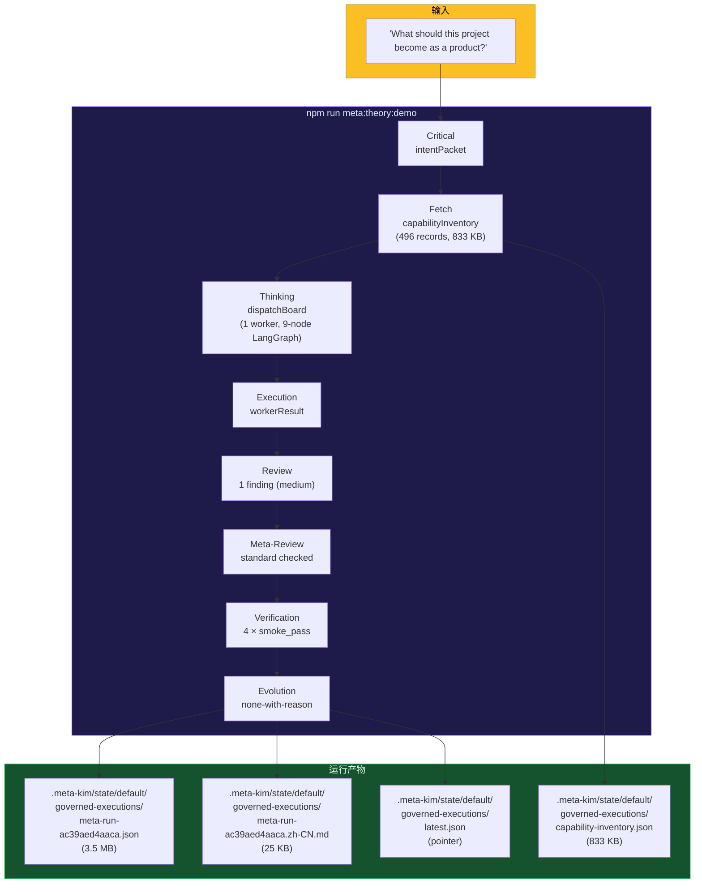
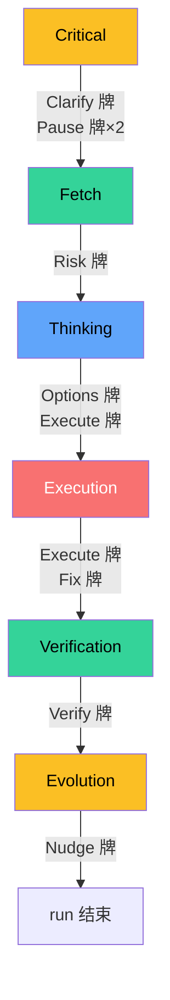

# 实战案例：一次完整的 8 阶段运行

## 📖 概述

> 本文记录了一次真实的 Meta_Kim governed run（Run ID: `meta-run-ac39aed4aaca`），从任务输入到产物输出，完整覆盖 8 阶段脊柱。通过对运行产物的逐阶段分析，揭示 Meta_Kim 的治理机制在 Claude Code 基础设施上的底层映射关系。

**任务输入**：`"What should this project become as a product?"`

**运行方式**：`npm run meta:theory:demo`（等价于 `node scripts/run-meta-theory-governed-execution.mjs "What should this project become as a product?"`）

**运行时间**：2026-06-20

**最终状态**：`partial`（部分完成——8 阶段核心已通过，11 阶段业务流中 Review 阻塞、Revision/Feedback 等待外部输入）

---

## 🔧 运行前：触发与分类

### 入口触发

当执行 `npm run meta:theory:demo` 时，入口脚本 `scripts/run-meta-theory-governed-execution.mjs` 首先调用 `classifyMetaTheoryEntry` 对任务进行分类：

| 分类维度 | 值 | 含义 |
|---------|---|------|
| `taskClass` | A | 需要完整治理的 durable work |
| `requestClass` | execute | 执行型任务 |
| `governanceFlow` | complex_dev | 复杂开发流程 |
| `triggerReasons` | durable_artifact, verification_required, user_explicit_review | 3 个触发信号 |

**底层映射**：这里的"触发分类"本质上是 **Meta_Kim skill 定义的触发规则**在 Node.js 脚本中的等价实现。在真正的 Claude Code 会话中，这个分类由 meta-theory skill（`canonical/skills/meta-theory/SKILL.md`）通过 CC 的 **Skill 系统**（[[Claude Code/01-Skills 技能系统|CC Skills]]）自动完成——skill 定义中包含自然语言触发条件，任何 durable work 都会自动进入治理路线。

---

## 🔧 阶段 1：Critical — 意图锁定

### 实际行为

Critical 阶段由 **meta-warden** 执行，产出了 `intentPacket`：

```json
{
  "realIntent": "Run Meta_Kim governed execution for: What should this project become as a product?",
  "trueUserIntent": "Produce a strict governed execution artifact for: What should this project become as a product?",
  "successCriteria": [
    "The generated artifact validates through scripts/validate-run-artifact.mjs",
    "without claiming release-grade public readiness."
  ],
  "nonGoals": [
    "Do not require private docs, publish, deploy,",
    "or claim live runtime public-ready evidence."
  ],
  "blockingUnknowns": []
}
```

**触发发牌**：
- **Clarify 牌**：发现目标或验收边界可能改变路线
- **Pause 牌**（第 1 次）：检测到需要消化窗口或决策窗口
- **Pause 牌**（第 2 次）：状态摘要后的消化窗口

### 文件变更

| 操作 | 路径 | 说明 |
|------|------|------|
| 写入 | `.meta-kim/state/default/governed-executions/meta-run-ac39aed4aaca.json` | `intentPacket` 嵌入在 JSON artifact 的 `intentPacket` 字段 |
| 写入 | `.meta-kim/state/default/governed-executions/meta-run-ac39aed4aaca.zh-CN.md` | 报告中的"判定摘要"和"开始原因"部分 |

### CC 底层映射分析

| Meta_Kim 行为 | 依赖的 CC 机制 | 映射关系 |
|-------------|--------------|---------|
| intentPacket 结构化输出 | CC **Tools 系统** | 工具调用产生结构化 JSON，而不是自由文本 |
| "非目标"边界定义 | CC **Agent 系统** | meta-warden agent 的 prompt 定义中包含"必须列出 non-goals"的指令 |
| 追问澄清机制 | CC **对话能力** + **AskUserQuestion** | 如果 intent 不明确，通过 CC 原生选择面追问；本次 demo 是 CLI 模式，跳过交互 |
| 意图作为后续阶段输入 | CC **Memory 系统** | intentPacket 写入 run artifact JSON，后续阶段读取——这相当于 CC 的 memory 读写，但 Meta_Kim 用的是**结构化文件而非 markdown memory** |

**关键洞察**：Critical 阶段本质上把 CC 的"你问我答"变成了"先确认我们到底要什么，再动手"。在真正的 CC 会话中，如果意图模糊，这里会触发 CC 原生 `AskUserQuestion` 弹窗（[[Claude Code/06-Hooks 钩子系统|CC Hooks]] 中的 `UserPromptSubmit` hook 也会在这一步注入上下文）。

---

## 🔧 阶段 2：Fetch — 证据收集与能力发现

### 实际行为

Fetch 阶段由 **meta-warden**（demo 模式）或 **meta-conductor**（正式模式）执行：

```json
{
  "projectsChecked": [
    {
      "projectRef": "meta-kim-governed-execution-meta-run-ac39aed4aaca",
      "checkMode": "current_project"
    }
  ],
  "capabilityMatches": 2,
  "capabilityGaps": 0,
  "graphSources": [
    {"sourceType": "graph", "sourceRef": "graphify-out"}
  ],
  "projectLocalSources": [
    {"sourceType": "contract", "sourceRef": "config/contracts/workflow-contract.json"},
    {"sourceType": "runner", "sourceRef": "scripts/run-meta-theory-governed-execution.mjs"}
  ]
}
```

**能力发现结果**：
- 检查了 **12 类能力**：skills、hooks、runtimeTools、agents、MCP、commands、prompts/rules、memory、graph、retrieval、dependencies、worker tasks
- 来源 **49 组**：包括 canonical capability index、项目 runtime hook 库存、runtime tool provider 库存
- 发现 **496 条能力记录**（输出到 `capability-inventory.json`，833 KB）
- 能力缺口：**0**

**触发发牌**：
- **Risk 牌**：发现运行时或外部平台风险可能抢占执行

### 文件变更

| 操作 | 路径 | 大小 | 说明 |
|------|------|------|------|
| 写入 | `.meta-kim/state/default/governed-executions/capability-inventory.json` | 833 KB | 完整能力清单（496 条记录） |
| 写入 | `.meta-kim/state/default/governed-executions/meta-run-ac39aed4aaca.json` | 3.5 MB | `fetchPacket` + `capabilityInventory` 嵌入其中 |
| 读取 | `config/contracts/workflow-contract.json` | — | 读取 workflow 协议定义 |
| 读取 | `scripts/run-meta-theory-governed-execution.mjs` | — | 读取执行脚本自身 |
| 读取 | `graphify-out/` | — | 检查知识图谱是否存在 |

### CC 底层映射分析

| Meta_Kim 行为 | 依赖的 CC 机制 | 映射关系 |
|-------------|--------------|---------|
| 能力搜索（12 类 × 49 来源） | CC **Skills 系统** + **MCP** + **Tools** | 在 CC 会话中，Fetch 通过 `Skill()` 调用 `findskill`、通过 `WebSearch` 搜索在线能力、通过 `Glob`/`Grep` 扫描本地文件、通过 MCP 工具查询外部服务 |
| capabilityInventory（496 条） | CC **Tools**（文件读写） | 能力清单序列化到 JSON 文件——CC 中的等价行为是 agent 通过 `Read`/`Write` 工具维护项目上下文 |
| graphSources 检查 | CC **Graphify** | 检查 `graphify-out/` 是否存在图谱——在 CC 中通过 git hooks 自动维护 |
| 能力缺口判定 | CC **Agent 推理** | "没有缺口"是一个判断结果，来自 agent 对能力清单的比对 |

**关键洞察**：Fetch 是 Meta_Kim "能力优先"理念的核心体现。在 CC 中，Fetch 的行为被分解为多个 CC 工具调用——Glob 扫文件、Grep 搜代码、MCP 查外部、WebSearch 搜社区。Meta_Kim 把这些分散的"搜索"统一成了一次**结构化能力发现**。

---

## 🔧 阶段 3：Thinking — 路线规划与任务分发

### 实际行为

Thinking 阶段由 **meta-conductor** 执行：

```json
{
  "designFrame": "route_driven_dispatch",
  "owner": "meta-conductor",
  "weapon": "workerTaskPackets",
  "reviewOwner": "meta-prism",
  "verificationOwner": "meta-prism",
  "mergeOwner": "meta-conductor",
  "workerTaskPackets": [
    {
      "taskId": "meta-run-ac39aed4aaca-route-execution",
      "owner": "meta-warden",
      "role": "warden"
    }
  ],
  "parallelGroups": ["route-execution"]
}
```

**关键决策**：
- 路线：**route_driven_dispatch**（路线驱动分发）
- 只有 1 个 worker task——因为 demo 问题相对简单，不需要并行 fan-out
- Worker 是 meta-warden，由 meta-conductor 合成

**触发发牌**：
- **Options 牌**：发现存在多个可行路径，需要选择
- **Execute 牌**：发现负责人、路线和验证条件已就绪

### 文件变更

| 操作 | 路径 | 说明 |
|------|------|------|
| 写入 | `.meta-kim/state/default/governed-executions/meta-run-ac39aed4aaca.json` | `thinkingPacket`、`dispatchBoard`、`workerTaskPackets`、`orchestrationTaskBoardPacket` 等 10+ 个 packet 结构 |
| 写入 | `.meta-kim/state/default/governed-executions/meta-run-ac39aed4aaca.zh-CN.md` | 报告中的"执行编排明细"和"下一步交给谁"部分 |

### CC 底层映射分析

| Meta_Kim 行为 | 依赖的 CC 机制 | 映射关系 |
|-------------|--------------|---------|
| dispatchBoard（分派看板） | CC **Plan Mode**（`EnterPlanMode`） | Thinking 的规划行为在 CC 中可以用 Plan Mode 的结构化规划来承载——先计划、再执行 |
| workerTaskPackets（任务包） | CC **Workflows**（`Workflow()` 工具） | 当有 2+ 并行 worker 时，Meta_Kim 通过 `agent-teams-playbook` + CC Workflow 工具做 fan-out 编排。本次只有 1 个 worker，所以 `agentTeamsPlaybookPacket.status = not_required` |
| route_driven_dispatch | CC **Agent 系统** | Thinking 决定"谁干什么"——在 CC 中，这个决策通过 Agent 工具的分发来实现 |
| 方案对比（2+ 路径） | CC **对话能力** + **AskUserQuestion** | 当有多个可行方案时，通过 CC 原生选择面让用户选 |

**LangGraph 控制图**：Thinking 阶段还产出了一个 **9 节点、9 边、2 条件边、9 checkpoint** 的 LangGraph-style 控制图。这不是真的引入了 LangGraph 依赖，而是用 LangGraph 的**概念模型**来描述 Meta_Kim 的状态机——每个阶段是一个节点，门控是条件边，packet 是状态。

```mermaid
flowchart LR
    C[Critical] -->|intent locked| F[Fetch]
    F -->|capability found| T[Thinking]
    T -->|route selected| E[Execution]
    E -->|worker done| R[Review]
    R -->|findings checked| MR[Meta-Review]
    MR -->|standard verified| V[Verification]
    V -->|evidence pass| EV[Evolution]

    R -.->|conditional: findings > 0| E
    V -.->|conditional: verification fail| E

    style C fill:#fbbf24,color:#000
    style F fill:#34d399,color:#000
    style T fill:#60a5fa,color:#000
    style E fill:#f87171,color:#fff
    style R fill:#a78bfa,color:#fff
    style MR fill:#a78bfa,color:#fff
    style V fill:#34d399,color:#000
    style EV fill:#fbbf24,color:#000
```



---

## 🔧 阶段 4：Execution — 分派执行

### 实际行为

Execution 阶段由 **meta-conductor** 编排：

```json
{
  "mainThreadRole": "scope_delegate_review_synthesize",
  "executionOwnerMode": "workerTaskPackets",
  "workerTaskPacketCount": 1,
  "workerExecutionEvidence": [
    {
      "taskId": "meta-run-ac39aed4aaca-route-execution",
      "owner": "meta-warden",
      "status": "executed",
      "externalAgentSpawned": false
    }
  ]
}
```

**mainThreadRole 解析**：`scope_delegate_review_synthesize` 表示主线程的职责是**定范围 → 分发 → 审查 → 合成**，而不是自己执行所有工作。这是 Meta_Kim 的核心纪律——治理 agent 不充当实现 worker。

**触发发牌**：
- **Execute 牌**：负责人、路线和验证条件已就绪
- **Fix 牌**：审查或验证发现可修复点

### 文件变更

| 操作 | 路径 | 说明 |
|------|------|------|
| 写入 | `.meta-kim/state/default/governed-executions/meta-run-ac39aed4aaca.json` | `executionResult`、`workerResultPackets`、`workerExecutionEvidence` |
| 写入 | `.meta-kim/state/default/governed-executions/meta-run-ac39aed4aaca.zh-CN.md` | 报告中的"执行编排明细"表 |

### CC 底层映射分析

| Meta_Kim 行为 | 依赖的 CC 机制 | 映射关系 |
|-------------|--------------|---------|
| workerTaskPacket 分发 | CC **Agent 工具**（`Agent()` / subagent spawn） | 每个 worker 在 CC 中对应一个 `Agent()` 调用或 subagent 实例。本次是 CLI demo，实际用了 Node.js 函数调用 |
| 并行执行 | CC **Workflows**（`Workflow()` / `pipeline()`） | 当 workerTasks 有 2+ 独立 lane 时，通过 CC Workflow 的 `pipeline()` 或 `parallel()` 并行执行 |
| worker 边界隔离 | CC **Agent 定义**（`.claude/agents/*.md`） | 每个 worker 的能力边界由其 agent 定义中的"不管什么"列表约束 |
| mergeOwner 合成 | CC **主线程 Agent** | meta-conductor 作为 mergeOwner，等所有 worker 完成后合并结果——等同于 CC 主 agent 调用多个子 agent 后汇总 |
| executionEvidence | CC **Memory** + **文件系统** | 执行证据写入 JSON artifact 和 markdown 报告——CC 中还会写入 `~/.claude/projects/*/memory/` |

---

## 🔧 阶段 5：Review — 质量审查

### 实际行为

Review 阶段由 **meta-prism** 执行：

```json
{
  "ownerCoverage": "pass",
  "protocolCompliance": "pass",
  "qualityGate": "pass",
  "findings": [
    {
      "severity": "medium",
      "description": "上游 Critical/Fetch/Thinking 和结果质量检查已完成"
    }
  ]
}
```

**6 项检查**：
1. Critical 锁定了正确的用户结果和成功标准
2. Fetch 证据变更或证明路线合理
3. Thinking 选定了 owner + weapon + dependency + runtime + OS + verification
4. 计划文件修改已读取目标文件并有 `fileChangeFactCard`
5. Execution 证据可重现
6. 无基础能力或 runtime-native 能力被删除/降级

**触发发牌**：无（Review 阶段不发牌——发牌在 Execution 完成后已经触发 Fix 牌）

### 文件变更

| 操作 | 路径 | 说明 |
|------|------|------|
| 写入 | `.meta-kim/state/default/governed-executions/meta-run-ac39aed4aaca.json` | `reviewPacket`、`reviewPacket.findings` |

### CC 底层映射分析

| Meta_Kim 行为 | 依赖的 CC 机制 | 映射关系 |
|-------------|--------------|---------|
| 6 项上游检查 | CC **Agent 推理** | meta-prism 通过其 agent 定义中的审查标准逐项检查——本质上是一个有特定 prompt 的 CC agent |
| findings 结构化输出 | CC **Tools**（JSON schema） | findings 必须符合结构化格式——在 CC 中通过 tool 的 `input_schema` 强制 |
| Adversarial verify（本次未触发） | CC **多 Agent 并行** | 如果是 regulated_path，会 spawn 3 个独立审查者并行证伪——在 CC 中用 3 个 `Agent()` 调用实现 |
| qualityGate 判定 | CC **Hooks** | qualityGate 的结果可以触发 hook——如果 `qualityGate = fail`，Stop hook 会阻止会话结束 |

---

## 🔧 阶段 6：Meta-Review — 审查"审查标准"

### 实际行为

Meta-Review 由 **meta-warden** 执行：

```json
{
  "status": "pass",
  "reviewStandard": "checked",
  "biasCheck": "passed",
  "publicReadyGateCheck": "passed"
}
```

确认审查标准本身没偏、没漏、没松。这一步是 Meta_Kim 区别于传统代码审查的关键——不只看代码质量，还看**审查标准的质量**。

### 文件变更

| 操作 | 路径 | 说明 |
|------|------|------|
| 写入 | `.meta-kim/state/default/governed-executions/meta-run-ac39aed4aaca.json` | `metaReviewPacket` |

### CC 底层映射分析

Meta-Review 在 CC 中没有直接的对应物——这恰恰是 Meta_Kim 的价值所在。传统的 CC 代码审查（通过 `/review` 或 agent）只做一次审查，不会再去审查"审查标准本身是否合适"。Meta_Kim 的 Meta-Review 实际上是用 **第二个 agent（meta-warden）审查第一个 agent（meta-prism）的工作质量**——在 CC 中体现为串行的两轮 Agent 调用。

---

## 🔧 阶段 7：Verification — 证据验证

### 实际行为

Verification 阶段产出了四端 smoke 证据：

```json
{
  "status": "pass",
  "evidence": [
    {"runtime": "claude",   "status": "smoke_pass", "failureClass": "projection_only"},
    {"runtime": "codex",    "status": "smoke_pass", "failureClass": "projection_only"},
    {"runtime": "cursor",   "status": "smoke_pass", "failureClass": "projection_only"},
    {"runtime": "openclaw", "status": "smoke_pass", "failureClass": "projection_only"}
  ],
  "fuseMode": "public_ready_and_release_gate"
}
```

**证据分层**：
- 四端都是 `smoke_pass`，不是 `live_pass`
- `failureClass = projection_only`：说明这只是投影 smoke 验证，不是真实的 runtime live 验证
- `strictReleasePass = false`：不能用于发布级声明

**触发发牌**：
- **Verify 牌**：发现需要新证据才能声称完成

### 文件变更

| 操作 | 路径 | 说明 |
|------|------|------|
| 写入 | `.meta-kim/state/default/governed-executions/meta-run-ac39aed4aaca.json` | `verificationResult`、`runtimeProjectionEvidence`、`runtimeEvidencePacket` |
| 执行 | `node scripts/eval-meta-agents.mjs --runtime=claude/codex/cursor/openclaw` | 四次 smoke 测试 |

### CC 底层映射分析

| Meta_Kim 行为 | 依赖的 CC 机制 | 映射关系 |
|-------------|--------------|---------|
| Smoke 验证 | CC **Bash** + **脚本执行** | 通过 `Bash` 工具执行 `node scripts/eval-meta-agents.mjs` |
| Live 验证（本次未触发） | CC **Bash** + **Agent** | 在 CC 中需要真实运行测试命令、检查日志、确认产物 |
| 证据分层（smoke vs live） | CC **Memory** | smoke/live 的标记需要持久化——在 CC 中写入 memory 文件 |
| fuseMode 门控 | CC **Hooks** | `public_ready_and_release_gate` 对应 CC 的 Stop hook——会话结束前检查证据是否充分 |

---

## 🔧 阶段 8：Evolution — 经验写回

### 实际行为

```json
{
  "decision": "none-with-reason",
  "status": "none-with-reason",
  "reason": "No long-term candidate was produced by this governed run.",
  "candidateCount": 0,
  "canonicalWrites": 0
}
```

本次 run 没有产生需要写回的长期候选——demo 运行没有发现新的能力缺口、没有新的可复用模式、没有需要记录的失败伤疤。Evolution 阶段记录了 `none-with-reason`，而不是"偷偷跳过"。

**触发发牌**：
- **Nudge 牌**：用户需要一个低成本的下一步

### 文件变更

| 操作 | 路径 | 说明 |
|------|------|------|
| 写入 | `.meta-kim/state/default/governed-executions/meta-run-ac39aed4aaca.json` | `evolutionWritebackDecision`、`evolutionWritebackPacket`、`wardenWritebackFlow` |

### CC 底层映射分析

| Meta_Kim 行为 | 依赖的 CC 机制 | 映射关系 |
|-------------|--------------|---------|
| writebackDecision | CC **Memory 系统** | `none-with-reason` 写入 memory——下次 run 可以读取这个记录 |
| canonical writes（本次 0） | CC **文件编辑** | 如果有写回，会通过 `Edit`/`Write` 工具修改 `canonical/agents/*.md` 等源文件 |
| Scar 记录（本次无） | CC **Memory** + **Graphify** | 失败模式写入 memory 的 scar 文件，并通过 Graphify 建立关联 |
| compaction 包 | CC **Hooks**（Stop hook） | 会话结束时，Stop hook 自动写入 compaction 包（`.meta-kim/state/default/compaction/latest.json`），记录当前阶段和未完成事项 |

---

## 📊 全链路总结

### 产物全景图



### 发牌事件时间线



**发牌统计**：9 次发牌事件，涉及 8 类牌（Clarify、Options、Risk、Execute、Verify、Fix、Pause、Nudge），Shrink scope 和 Rollback 被精准抑制。

### 11 阶段业务工作流

| 阶段 | 状态 | 评分 | 说明 |
|------|------|------|------|
| Direction | ✅ done | 100 | 方向已明确 |
| Planning | ✅ done | 100 | 规划已完成 |
| Execution | ✅ done | 100 | 执行已完成 |
| Review | 🚫 blocked | 33 | 证据不足，需补 |
| Meta-review | ✅ done | 67 | 弱触发通过 |
| Revision | ⏳ pending | 67 | 等待上游 |
| Verify | ✅ done | 100 | 验证已通过 |
| Summary | ✅ done | 67 | 摘要已生成 |
| Feedback | ⏳ pending | 100 | **等待用户验收** |
| Evolve | ⏭️ skipped | 100 | 无可写回候选 |
| Mirror | ✅ done | 100 | 四端镜像已同步 |

### CC 底层映射总表

| Meta_Kim 阶段 | 核心 CC 机制 | 具体映射 |
|-------------|-------------|---------|
| **入口分类** | Skills（[[Claude Code/01-Skills 技能系统\|CC Skills]]） | meta-theory skill 通过自然语言触发条件自动判断是否进入治理 |
| **Critical** | Agents + Tools + AskUserQuestion（[[Claude Code/04-Agents 代理系统\|CC Agents]]） | meta-warden agent 驱动、结构化 JSON 输出、原生选择面追问 |
| **Fetch** | Skills + MCP + WebSearch + Glob/Grep（[[Claude Code/02-MCP 模型上下文协议\|CC MCP]]） | findskill 搜索、MCP 工具发现、WebSearch 在线搜索、本地文件扫描 |
| **Thinking** | Plan Mode + Workflows（[[Claude Code/10-Plan Mode 规划模式\|CC Plan Mode]]、[[Claude Code/08-Workflows 工作流编排\|CC Workflows]]） | 结构化规划、dispatchBoard 任务分解、2+ 路径方案对比 |
| **Execution** | Agent + Workflows（[[Claude Code/04-Agents 代理系统\|CC Agents]]） | `Agent()` 分发 worker、`Workflow()` fan-out 编排、subagent 边界隔离 |
| **Review** | Agents + Hooks（[[Claude Code/06-Hooks 钩子系统\|CC Hooks]]） | meta-prism agent 审查、regulated_path 下 3 个并行 skeptics |
| **Meta-Review** | Agents | meta-warden 审查 meta-prism——CC 中没有等价物，这是 Meta_Kim 的独特价值 |
| **Verification** | Bash + Tools + Hooks（[[Claude Code/03-Tools 工具系统\|CC Tools]]） | 运行测试命令、检查日志产物、Stop hook 验证门控 |
| **Evolution** | Memory + Graphify + Hooks（[[Claude Code/05-Memory 记忆系统\|CC Memory]]） | writebackDecision 写入 memory、Scar 记录、Stop hook compaction |

### 能力调用真实性

这是 Meta_Kim 的一个重要概念——不是所有"选中了"的能力都被真正调用了：

| 能力家族 | 状态 | 说明 |
|---------|------|------|
| worker_task | **invoked** | 1 个 worker 真正执行了 |
| prompt_rule | **applied** | 治理合同和 abstract prompt capability 已生效 |
| hook | selected_not_invoked | Hook 文件被匹配但不等于 hook 事件触发 |
| skill | not_required | Skill 被选入 worker loadout 但没有独立的 skill runtime 调用证据 |
| MCP | not_required | MCP provider 绑定不等于 MCP 调用 |
| agent_subagent | not_required | 没有 runtime Agent/subagent 工具调用证据——这是 CLI demo，不通过 CC Agent 工具 |
| command_script | not_required | 命令被选入 worker loadout 但没有新鲜命令输出 |
| agent_teams_playbook | not_required | 只有 1 个 worker，不需要 fan-out |

> **为什么这个重要？** 在真正的 CC 会话中，`agent_subagent` 会是 `invoked` 状态——因为 worker 通过 `Agent()` 工具调用。CLI demo 的区别恰好说明了 Meta_Kim 的分层架构：**治理逻辑层不依赖特定的执行载体**。

---

## 🎯 从这个案例中学到什么

### 1. 8 阶段不是"都要跑一遍"

本次 run 中：
- Critical 产出意图 → 只有 1 个 worker → 不需要 agent-teams-playbook（`not_required`）
- Evolution 无可写回 → `none-with-reason`（不是"跳过"，是"有理由的不需要"）
- 11 阶段中 Feedback 在等用户输入、Evolve 被跳过——**真实的治理是有条件的推进，不是机械走过场**

### 2. 协议（Packet）是真正的"运行产物"

所有 8 阶段的输出都物化为结构化的 packet，嵌入在 3.5 MB 的 JSON artifact 中。这份 artifact 包含了：
- 50+ 个结构化 packet（intent、fetch、thinking、review、verification、evolution...）
- 496 条能力清单
- 4 端 smoke 验证证据
- 9 次发牌事件详情
- 11 阶段业务流状态

**这是 Meta_Kim 和"一段聊天回复"的本质区别——聊天回复只能读，packet 可以被校验、被索引、被重放。**

### 3. CC 是手，Meta_Kim 是脑

Meta_Kim 不替代任何 CC 能力——Skills、Agents、MCP、Hooks、Memory、Workflows 照常工作。Meta_Kim 做的，是在这些"手"之上叠加了一层**纪律**：
- 先确认要什么（Critical）→ 再搜索谁有这能力（Fetch）→ 规划怎么干（Thinking）→ 分发执行（Execution）→ 审查（Review）→ 再审查审查本身（Meta-Review）→ 验证（Verification）→ 沉淀经验（Evolution）

### 4. 这次 Demo 的局限性

| 局限 | 说明 | 在真实 CC 会话中的表现 |
|------|------|----------------------|
| CLI 模式 | 没有 CC 原生选择面 (AskUserQuestion) | CC 中会有弹窗/交互选项 |
| 单 worker | demo 任务简单，不需要 fan-out | 复杂任务会有多 worker 并行 |
| smoke_pass | 只是投影验证，不是 live runtime | CC 中会有真实的测试命令输出 |
| conversationNoticeEmitted = false | 没有发出 CC 对话提示 | CC 中会在对话中输出用户可见的进度 |

---

## ✅ 最佳实践

1. **DO**：首次接触 Meta_Kim 时，先跑 `npm run meta:theory:demo` 看一遍完整链路——比读文档直观
2. **DO**：用 `npm run meta:theory:report -- --run-id latest` 查看可读报告，不要直接读 3.5MB 的 JSON artifact
3. **DO**：区分 demo 模式的 `smoke_pass` 和真实 CC 会话的 `live` 证据——前者是投影验证，后者是运行时证明
4. **DON'T**：不要在 demo 的 JSON artifact 中寻找"CC 原生选择面"的证据——demo 是 CLI 模式，不触发 `AskUserQuestion`
5. **DON'T**：不要期望每次 demo run 都触发 Type B 管线创建 agent——demo 任务故意保持简单，Evolution 通常是 `none-with-reason`
6. **TIP**：把 `.meta-kim/state/` 当成"治理的 git log"——每次 run 的 compaction 和 governed-execution 产物都可回溯

## ⚠️ 常见陷阱

| 陷阱 | 表现 | 解决方案 |
|------|------|---------|
| 把 demo 当完整产品 | 看到 `status: partial`、`smoke_pass` 就认为 Meta_Kim 不完整 | demo 是**故意保持 partial**——它不连接真实 LLM、不触发 CC 原生 UI，只是结构验证 |
| 混淆 compaction 和 governed-execution | 找不到 run artifact 就去 `compaction/` 里翻 | compaction 是 CC Stop hook 自动写的**会话续跑包**；governed-execution 是 demo/脚本生成的**完整 artifact** |
| 期望每次都有 Evolution 写回 | 看到 `none-with-reason` 觉得"什么都没沉淀" | Evolution 只在发现可复用模式、能力缺口、Scar 时才写回——demo run 没有触发条件是正常的 |
| 忽略 conversationNotice | `conversationNoticeEmitted = false` 看起来像 bug | demo 脚本不发出 CC 对话通知——这是 CLI 模式的预期行为，真实 CC 会话中会通过 Stop hook 发出 |

## 🔗 关联概念

- [[Meta_Kim/00-Meta_Kim 入门概览|入门概览]] — 四大机制全景
- [[Meta_Kim/01-8 阶段脊柱与路径分类|8 阶段脊柱]] — 每个阶段的协议和门控细节
- [[Meta_Kim/02-元角色体系与能力优先分发|元角色体系]] — 本次涉及的 meta-warden、meta-conductor、meta-prism
- [[Meta_Kim/03-协议、门与动态发牌|协议、门与发牌]] — 本次运行产生的 packet 和发牌事件
- [[Meta_Kim/04-三层记忆与进化闭环|三层记忆与进化]] — Evolution 的 none-with-reason 判定
- [[Meta_Kim/05-场景判断：何时用 meta-theory|场景判断]] — 什么任务适合走治理路线
- [[Claude Code/00-Claude Code 入门概览|CC 入门]] — 所有 CC 基础概念的入口
- [[Claude Code/01-Skills 技能系统|CC Skills]] — meta-theory skill 的实现载体
- [[Claude Code/04-Agents 代理系统|CC Agents]] — worker 分发的执行载体

## 📚 扩展阅读

- 产物文件：`.meta-kim/state/default/governed-executions/meta-run-ac39aed4aaca.zh-CN.md`
- JSON artifact：`.meta-kim/state/default/governed-executions/meta-run-ac39aed4aaca.json`
- 能力清单：`.meta-kim/state/default/governed-executions/capability-inventory.json`
- Demo 脚本：`scripts/run-meta-theory-governed-execution.mjs`
- First-run 说明：`examples/first-run/README.md`

---

> **下一步**：回到 [[00-总览/AI学习知识库总览|AI 学习知识库总览]] 查看完整学习路径，或阅读 [[Claude Code/04-Agents 代理系统|CC Agents]] 理解 Meta_Kim worker 分发的底层机制。
