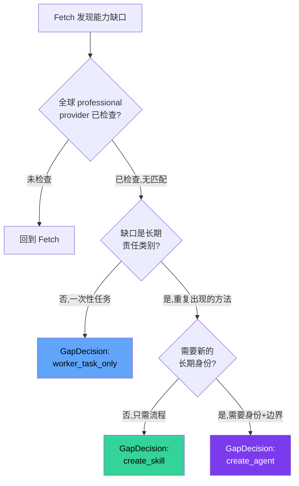
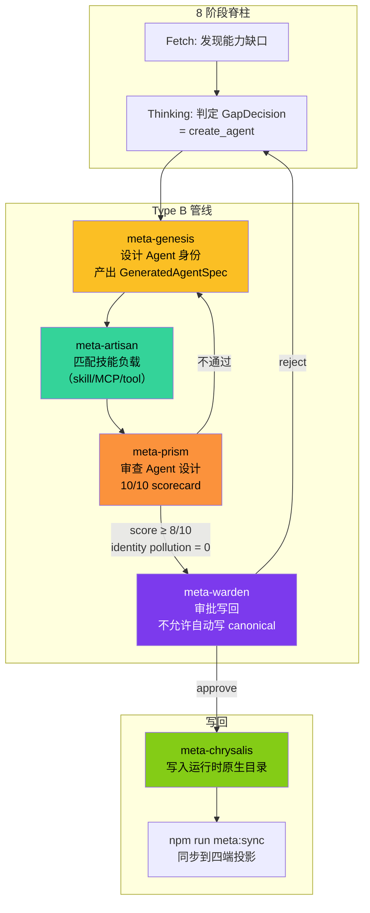
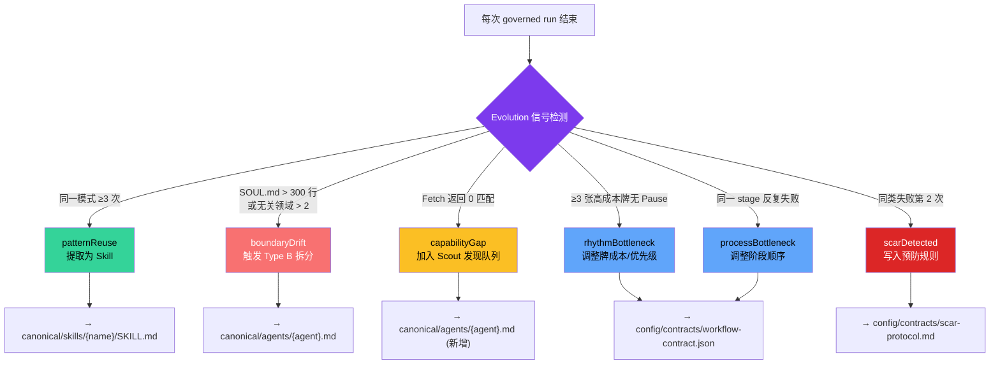
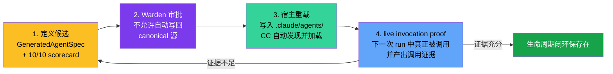

# 用户上下文 Agent 的创建、位置与持续演进

## 📖 概念

> 在 Meta_Kim 体系中，Agent 分两类。第一类是 **9 个元角色（meta-warden、meta-genesis 等）**——它们是治理框架自身的固定组成部分，定义在 `canonical/agents/` 中，不随用户项目变化。第二类是 **用户上下文 Agent**——在 governed run 中，当系统发现现有能力不足以覆盖某个反复出现的责任类别时，通过 Type B 管线动态创建的项目级专业 agent。

本文聚焦第二类：用户上下文 Agent **在哪个环节被创建**、**创建后写入哪里**、以及**如何持续演进而不是创建完就过时**。

核心问题速答：

| 问题 | 答案 |
|------|------|
| 在哪个环节创建？ | **Evolution 阶段（第 8 阶段）**，通过 Type B 管线。Fetch 发现缺口 → Thinking 判定 `create_agent` → meta-genesis 设计 → meta-prism 审查 → meta-warden 审批 → meta-chrysalis 写回 |
| 在哪里可以找到？ | 按运行时写入原生 agent 目录：`.claude/agents/{agent}.md` / `.codex/agents/{agent}.toml` / `openclaw/workspaces/{agent}/SOUL.md` / `.cursor/agents/{agent}.md` |
| 如何持续演进？ | Evolution 合约定义的 6 维度反馈循环（模式复用、边界漂移、能力缺口、节奏瓶颈、流程瓶颈、伤疤）+ Scar 伤疤机制 + durableAgentLifecyclePacket 四阶段闭环 |

---

## 🔧 Type B 管线：Agent 创建的完整链路

Type B 是 Meta_Kim 中专门处理 **"Agent / Skill / Owner 创建或升级"** 的工作管线。它不是 8 阶段脊柱的替代物，而是在脊柱的 Execution 和 Evolution 阶段之间插入的一条**专用设计-审查-写回链路**。

### Type B 触发条件

Agent 创建不是随便触发的。来自 `config/contracts/capability-gap-decision-contract.json`，系统必须先排除以下情况才能走到 `create_agent`：



### 6 种缺口决策路由

| GapDecision | 执行 owner | 触发信号 | 典型场景 |
|-------------|-----------|---------|---------|
| **create_agent** | meta-genesis | 缺稳定长期 owner，需要专业身份 + 拒绝边界 + 记忆策略 | 项目需要一个专门的"数据库迁移审查员" |
| **create_skill** | meta-artisan | 重复出现的流程/方法，不需要新责任身份 | "每次发布前都要做的 5 项检查" |
| **create_script** | script-provider | 动作稳定、机械、可测试 | "自动生成 API 文档" |
| **create_mcp_provider** | MCP capability | 稳定外部系统需要权限/凭证/审计 | 接入新的第三方服务 |
| **worker_task_only** | 现有 owner | 一次性任务，无需长期复用 | 本次 run 的临时子任务 |
| **blocked_or_needs_approval** | meta-sentinel | 缺权限/凭证/证据或高风险 | 涉及付费操作的自动化 |

### create_agent 的硬性禁止行为

来自合约原文——以下行为明确禁止：

> - `worker_task_only` — 不能把一次性 worker 任务写成 agent
> - `temporary_subagent_as_agent_definition` — 不能把临时 subagent 冒充为持久 agent 定义
> - `temporary_small_agent_for_one_run_task` — 禁止为单次 run 的任务创建临时小 agent
> - `skip_global_professional_provider_search` — 必须先搜全球已有的 professional provider

**一句话**：创建 agent 是严肃的架构决策，不是"这次任务缺个人，随便建一个"。

### Type B 完整链路



**各环节职责**：

| 环节 | 负责 agent | 做什么 | 验收标准 |
|------|-----------|--------|---------|
| 1. 身份设计 | meta-genesis | 设计 SOUL.md（8 模块）、Core Truths、Decision Rules、Thinking Framework | 替换 agent 名字后 SOUL.md 失效（证明不是泛泛模板） |
| 2. 技能匹配 | meta-artisan | 匹配 skill/MCP/command/tool 负载 | 不绑定一次性文件路径或 ticket |
| 3. 质量审查 | meta-prism | 10/10 scorecard 评分 + identity pollution 检查 | score ≥ 8/10, pollution = 0 |
| 4. Warden 审批 | meta-warden | 审批写回 canonical 源 | 不能自动写回——必须人工/Warden gate |
| 5. 写回 | meta-chrysalis | 写入运行时原生 agent 目录 | 文件存在 + 格式正确 + 不覆盖用户已有文件 |

---

## 📂 创建后写入哪里：文件位置速查

来自 `core-loop-contract.json` 中的"持久 Agent 策略"段：

| 运行时 | Agent 定义文件路径 | 文件格式 | 说明 |
|--------|-------------------|---------|------|
| **Claude Code** | `.claude/agents/{agent}.md` | YAML frontmatter + Markdown | CC 原生 agent 格式 |
| **Codex** | `.codex/agents/{agent}.toml` | TOML | Codex 原生 agent 格式 |
| **OpenClaw** | `openclaw/workspaces/{agent}/SOUL.md` | Markdown | OpenClaw workspace agent |
| **Cursor** | `.cursor/agents/{agent}.md` | YAML frontmatter + Markdown | Cursor 原生 agent 格式 |

同时写入 **canonical 源**（仅在 Warden 审批后）：
- `canonical/agents/{agent}.md` — Meta_Kim 仓库中的持久定义源

### 与 9 个元角色的区别

| 特性 | 9 个元角色 | 用户上下文 Agent |
|------|-----------|-----------------|
| 定义位置 | `canonical/agents/meta-*.md`（仓库源码） | `.claude/agents/` 等项目本地目录 |
| 创建时机 | Meta_Kim 安装时（`node setup.mjs`） | governed run 中 Evolution 阶段 |
| 创建方式 | 随仓库发布，通过 `npm run meta:sync` 同步到四端 | Type B 管线按需生成 |
| 职责范围 | 治理（协调、审查、匹配、沉淀） | 项目特定的执行能力 |
| 生命周期 | 随 Meta_Kim 版本升级 | 通过 Evolution 6 维度持续演进 |
| 是否可替换 | 可以，但需要通过 canonical 源修改 | 可以，项目级直接修改或 Type B 迭代 |

> ⚠️ **关键区分**：不要混淆 `canonical/agents/` 下已有的 9 个文件和 governed run 中动态创建的用户 agent。前者是"治理框架的操作系统"，后者是"为你的项目定制的应用软件"。

---

## 🔄 Agent 如何持续演进：6 维度反馈循环

Agent 创建完不是就结束了。Meta_Kim 的 Evolution 合约（`config/contracts/evolution-contract.json`）定义了 **6 个演进维度 + 1 个伤疤机制**，让 agent 在每个 governed run 中持续自我改进。

### 演进全景



### 6 维度详解

#### 1. patternReuse — 模式复用

| 属性 | 内容 |
|------|------|
| **触发条件** | 同一模式在不同任务中出现 ≥ 3 次 |
| **演化动作** | `extract-and-persist` — 提取为 skill 候选 |
| **写入目标** | `canonical/skills/{skill-name}/SKILL.md` |
| **示例** | 三次 governed run 都执行了"部署前检查清单"→ 提取为 `deploy-checklist` skill |

#### 2. boundaryDrift — 边界漂移

| 属性 | 内容 |
|------|------|
| **触发条件** | SOUL.md > 300 行（Stew-All 大杂烩风险）或无关领域 > 2 个（Shattered 碎片化风险） |
| **演化动作** | `trigger-type-b-split` — 触发 Type B 管线拆分或合并 |
| **写入目标** | `canonical/agents/{agent}.md` |
| **示例** | 一个 agent 的 SOUL.md 膨胀到 400 行，同时管数据库、认证、日志 → Type B 拆成 3 个独立 agent |

**Stew-All 死亡模式**：一个 agent 什么都管，结果什么都管不好。
**Shattered 死亡模式**：过度拆分导致 agent 之间边界模糊、协作成本远超单体。

#### 3. capabilityGap — 能力缺口

| 属性 | 内容 |
|------|------|
| **触发条件** | Fetch 对某个必需能力返回 0 匹配 |
| **演化动作** | `queue-for-scout` — 加入 meta-scout 的外部发现队列 |
| **写入目标** | `canonical/agents/{agent}.md`（新增 agent 定义） |
| **示例** | 需要一个"GraphQL schema 兼容性检查"能力，但全球和本地都没有 → scout 搜索社区 → 发现后通过 Type B 创建 |

#### 4. rhythmBottleneck — 节奏瓶颈

| 属性 | 内容 |
|------|------|
| **触发条件** | 连续 ≥ 3 张高成本牌（Execute/Verify/Fix/Risk/Rollback）没有 Pause |
| **演化动作** | `update-card-costs` — 调整牌的成本权重和优先级 |
| **写入目标** | `config/contracts/workflow-contract.json` |
| **示例** | 连续执行-验证-修复循环 5 次不暂停 → 系统调整 Fix 牌成本，让 Pause 更容易插入 |

#### 5. processBottleneck — 流程瓶颈

| 属性 | 内容 |
|------|------|
| **触发条件** | Review gate 在同一阶段反复失败 |
| **演化动作** | `reorder-stages` — 调整阶段顺序或门控条件 |
| **写入目标** | `config/contracts/workflow-contract.json` |
| **示例** | Critical 阶段反复被退回 3 次 → 系统建议在 Critical 之前增加一个轻量 Pre-Clarify 步骤 |

#### 6. scarDetected — 伤疤机制

| 属性 | 内容 |
|------|------|
| **触发条件** | **同一类失败出现第 2 次**（第 1 次是经验，第 2 次是系统缺陷） |
| **演化动作** | `append-to-protocol` — 追加预防规则 + 回归测试 |
| **写入目标** | `config/contracts/scar-protocol.md` |
| **示例** | 两次因为 hook 正则缺少锚定导致误拦截 → 写入 Scar：所有 hook 正则必须用 `^...$` |

**Scar 的数据结构**：
```json
{
  "failurePattern": "hook 配置中的正则缺少锚定导致误匹配",
  "preventionRule": "所有 hook 正则必须用 ^...$ 锚定",
  "test": "新增 hook 配置校验脚本 check-hook-regex-anchors.mjs",
  "nextRunReuseKey": "scar-hook-regex-anchor-check"
}
```

> **Same-Type Failure Design Gate**：同一类失败出现第 2 次时，不是再打一个补丁——而是判定为 **bottom_design_failure（底层设计缺陷）**，必须回到 Critical/Fetch/Thinking 改底层设计，然后写入 Scar。第三次还出现同样的失败，直接停止 Execution 并升级到 Warden 裁定。

---

## 🔄 durableAgentLifecyclePacket：Agent 生命周期的四阶段闭环

创建一个 agent 不是"写完文件就完了"。Meta_Kim 要求每个 agent 完成 **四阶段生命周期验证**：



**四个阶段不能跳过任何一个**。特别是第 4 阶段——如果 agent 被创建了但从未被真正调用过（`selected_not_invoked`），它的生命周期不算完成。下一次 run 中必须出现 `capabilityInvocationTruthPacket` 中该 agent 的状态为 `invoked`（而非 `selected_not_invoked`），才算通过。

---

## 🎯 完整闭环示例

以一个具体场景串联全部概念：

### 场景

你的项目反复需要"数据库迁移安全性审查"——每次改 migration 文件，都要有人检查：
- 是否有回滚路径
- 是否锁表时间过长
- 是否有数据丢失风险
- 是否兼容旧版本代码

### 第 1 次 run：发现缺口

```
你："审查这次数据库迁移"
Meta_Kim Fetch → 全球搜索"数据库迁移审查"能力 → 0 匹配
Meta_Kim Thinking → GapDecision: worker_task_only（先用已有 agent 临时审查）
Meta_Kim Evolution → 记录 capabilityGap 信号
```

### 第 2 次 run：再次触发

```
你（两周后）："审查新的数据库迁移"
Meta_Kim Fetch → 仍然 0 匹配 → capabilityGap 信号累计
Meta_Kim Evolution → 信号强度达标 → 加入 Scout 发现队列
Scout 搜索社区 → 未找到现成方案
```

### 第 3 次 run：触发 Type B 管线

```
你（一个月后）："审查又一次迁移"
Meta_Kim Evolution → patternReuse 触发（≥3 次同类需求）
→ Thinking 判定 GapDecision = create_agent
→ Type B 管线启动：
  1. meta-genesis 设计 "db-migration-reviewer" agent
     - SOUL.md: 8 模块完整
     - Core Truth: "迁移审查的第一原则是可回滚，不是零风险"
     - Decision Rules: IF 无回滚路径 → CRITICAL finding
  2. meta-artisan 匹配负载: 需要 PostgreSQL knowledge + 项目 schema 访问
  3. meta-prism 审查: 9/10 scorecard, identity pollution = 0
  4. meta-warden 审批: approve
  5. meta-chrysalis 写回:
     - .claude/agents/db-migration-reviewer.md（CC 用）
     - .codex/agents/db-migration-reviewer.toml（Codex 用）
```

### 第 4 次 run：Agent 被真正调用

```
你："审查迁移"
Meta_Kim Fetch → 发现 db-migration-reviewer agent
→ capabilityInvocationTruthPacket: db-migration-reviewer = invoked ✅
→ 生命周期闭环保存在 ✅
```

### 第 N 次 run 后：持续演进

```
Evolution 检测到:
- SOUL.md 从 80 行增长到 350 行（Stew-All 风险）
  → boundaryDrift 触发 → Type B 拆分建议
- 审查通过率从 60% 提升到 95%
  → patternReuse 触发 → 提取审查模式为 skill
- 一次因为忽略了 PostgreSQL 的 CONCURRENTLY 特性导致误判
  → scarDetected → 写入 Scar: "检查是否使用了 CONCURRENTLY"
```

---

## 🔗 关联概念

- [[Meta_Kim/02-元角色体系与能力优先分发|元角色体系]] — 9 个元角色 vs 用户上下文 Agent 的区分
- [[Meta_Kim/04-三层记忆与进化闭环|进化闭环]] — Evolution 阶段的完整机制
- [[Meta_Kim/03-协议、门与动态发牌|协议与发牌]] — capabilityGapDecision 的协议定义
- [[Meta_Kim/01-8 阶段脊柱与路径分类|8 阶段脊柱]] — Fetch/Thinking/Evolution 在本流程中的角色
- [[Meta_Kim/06-实战案例：一次完整的 8 阶段运行|实战案例]] — demo run 中的 durableAgentLifecyclePacket
- [[Claude Code/04-Agents 代理系统|CC Agents]] — agent 文件的运行时加载机制
- [[Claude Code/01-Skills 技能系统|CC Skills]] — skill 与 agent 的区别和协作

## 📚 扩展阅读

- `config/contracts/capability-gap-decision-contract.json` — 6 种缺口决策路由的完整定义
- `config/contracts/capability-gap-executable-graph-contract.json` — Type B 管线的节点-边-状态-事件控制图
- `config/contracts/evolution-contract.json` — 6 维度反馈循环的触发条件和阈值
- `config/contracts/agent-design-quality-contract.json` — Agent 设计质量评分标准（10/10 scorecard）
- `canonical/agents/meta-genesis.md` — meta-genesis 的完整 agent 定义和工作流
- `config/contracts/scar-protocol.md` — Scar 伤疤机制的完整规范
