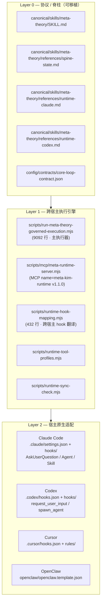
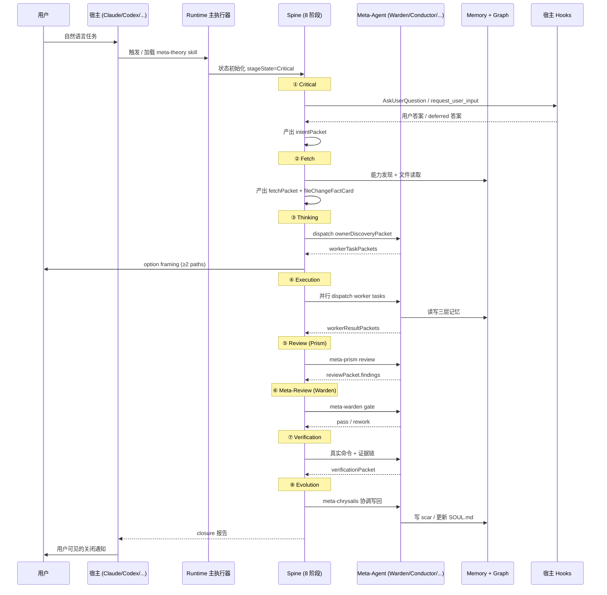

# Runtime 运行时：跨宿主的执行引擎与适配层

## 📖 概念

> Meta_Kim 的 **Runtime（运行时）** 是让 8 阶段脊柱真正"跑起来"的执行引擎 + 跨宿主适配层。它不是文档，也不是契约，而是 9092 行主执行器 + MCP runtime server + 跨宿主 hook 映射表的真实代码组合——把可移植的脊柱定义（SKILL.md / spine-state.md）翻译成 Claude Code / Codex / Cursor / OpenClaw 各自能理解的原生 API 调用。

简单说：**Spine 告诉你"做什么"，Runtime 告诉你"在当前宿主里怎么做"**。没有 runtime，spine 只是 SKILL.md；有了 runtime，spine 才能在 4 个宿主里驱动真实的 worker、三层记忆和原生发问。

| 概念 | 角色 | 类比 |
|------|------|------|
| **8 阶段脊柱（Spine）** | 状态机路径定义：Critical→Fetch→Thinking→Execution→Review→Meta-Review→Verification→Evolution | 业务流程图 / 工作流模板 |
| **Runtime** | 真正驱动脊柱流转的引擎 + 各宿主的 I/O 适配层 | 调度器 + 设备驱动 |

本文聚焦 runtime：它由哪些代码组成、单次任务的生命周期、如何和脊柱配合、以及它在 4 个宿主里如何贴合各自原生能力。

## 🔧 工作原理

### 三层架构



**Layer 0（协议）**：完全可移植的"做什么"。SKILL.md 定义 Meta-Theory Dispatcher、spine-state.md 定义隐藏状态机、runtime-claude.md 与 runtime-codex.md 给出两份宿主适配说明、`config/contracts/core-loop-contract.json` 是 8 阶段的压缩契约。

**Layer 1（执行引擎）**：真正驱动脊柱的代码。本节重点。

**Layer 2（适配）**：把引擎信号翻译成宿主原生 API。

### 核心组件清单

| # | 组件 | 角色 | 源码位置 |
|---|------|------|----------|
| 1 | **主执行器** | 跑完整 8 阶段循环、能力发现、worker 分派、closure 报告 | `scripts/run-meta-theory-governed-execution.mjs:1-9092` |
| 2 | **Runtime MCP Server** | 通过 MCP 暴露 9 个 meta-agent、运行能力矩阵、Meta-theory 文档 | `scripts/mcp/meta-runtime-server.mjs:166-318` |
| 3 | **Hook 映射器** | 把同一套 hook 逻辑翻译成各宿主的 hooks.json / settings.json | `scripts/runtime-hook-mapping.mjs:9-432` |
| 4 | **工具画像加载器** | 从 `config/sync.json` + `runtime-compatibility-catalog.json` 加载 4 宿主产品画像 | `scripts/runtime-tool-profiles.mjs:1-62` |
| 5 | **同步检查器** | 比对全局/项目运行时投影一致性 | `scripts/runtime-sync-check.mjs` |
| 6 | **运行时状态机** | `stageState / controlState / gateState / surfaceState` 四个隐藏状态字段 | `canonical/skills/meta-theory/references/spine-state.md:42-49` |
| 7 | **宿主选择面板** | 声明每个宿主对 HookPrompt 的支持度（native / adapter-required / degraded） | `scripts/runtime-hook-mapping.mjs:67-88` |
| 8 | **契约加载器** | `core-loop-contract.json` 把脊柱和执行器绑定 | `SKILL.md` 引用 + `config/contracts/core-loop-contract.json` |
| 9 | **能力注册表** | 9 个 meta-agent + 11 个共享 hook 文件 + 各宿主 projection 路径 | `scripts/mcp/meta-runtime-server.mjs:1-71` |
| 10 | **degraded mode / hook repair** | 二次失败时进入降级模式，避免 hook loop | `SKILL.md Degraded Mode` + `runtime-hook-mapping.mjs:150-200` |

### Runtime MCP Server 暴露的资源与工具

`scripts/mcp/meta-runtime-server.mjs` 以 `name=meta-kim-runtime, version=1.1.0` 注册到 MCP 总线：

| 类型 | 名称 | 用途 |
|------|------|------|
| Resource | `meta://theory` | Meta_Kim 完整 theory 转录 |
| Resource | `meta://runtime-matrix` | Claude Code / OpenClaw / Codex 能力矩阵 |
| Resource | `meta://skill/meta-theory` | 可移植的 Meta_Kim skill 定义 |
| Tool | `list_meta_agents` | 列出 9 个 meta-agent 及其角色与源文件 |
| Tool | `get_meta_agent` | 返回单个 meta-agent 完整定义 |
| Tool | `get_meta_runtime_capabilities` | 返回运行时能力矩阵 |

任何宿主只要接入 MCP，都能询问"Meta_Kim 你现在有哪些能力、谁负责什么"。这就是 runtime 把脊柱"接口化"的关键手段。

### 跨宿主 Hook 翻译表

`scripts/runtime-hook-mapping.mjs` 用 `RUNTIME_HOOK_CAPABILITIES` 统一管理 4 个宿主的事件与配置路径：

```javascript
// scripts/runtime-hook-mapping.mjs:9-65
export const RUNTIME_HOOK_CAPABILITIES = {
  claude:   { configPath: ".claude/settings.json", hookDir: ".claude/hooks", ... },
  codex:    { configPath: ".codex/hooks.json",     hookDir: ".codex/hooks",   ... },
  cursor:   { configPath: ".cursor/hooks.json",    hookDir: ".cursor/hooks",  ... },
  openclaw: { configPath: "openclaw/openclaw.template.json", hookDir: "openclaw/hooks", ... },
};

export const HOOKPROMPT_PLATFORM_SUPPORT = {
  claude:   { status: "native",           adapter: "claude-settings-hook" },
  codex:    { status: "adapter-required", adapter: "codex-hookprompt-adapter" },
  cursor:   { status: "adapter-required", adapter: "cursor-hookprompt-adapter" },
  openclaw: { status: "degraded",         adapter: "openclaw-workspace-instruction" },
};
```

注意 OpenClaw 是 `degraded`——它通过 workspace 指令而非真实 hook 来模拟 HookPrompt 行为。这是 runtime 的诚实标注：**不假装每个宿主都有同样的能力**。

### 单次任务的运行生命周期



**生命周期上的 5 个钩子点**：

1. **入口**：`scripts/run-meta-theory-governed-execution.mjs` 通过 `npm run meta:theory:run` 被显式触发，或宿主在自然语言里检测到 SKILL.md 中定义的触发词（"元理论|执行元理论|跑元理论|debug|fix|验证"等）自动加载 skill。
2. **Critical 阶段**：通过宿主原生 question surface 锁定 intent；hook 缺失时记录 `nativeChoiceSurfaceBlocked` 阻断 Execution。
3. **Thinking → Execution**：dispatch plan 把 `ownerAgent / weapon / capabilityBindings / verificationOwner` 写到 `dispatchEnvelopePacket`，再调宿主的 Agent / Task / Skill / Command / MCP tool。
4. **Memory IO**：通过 canonical/runtime-assets/claude/mcp.json 配置的 MCP memory server（HTTP 长连接模式），三层记忆在 SessionStart / UserPromptSubmit / Stop 三处自动落盘。
5. **Evolution 闭环**：写回时必须经 Warden gate；metachrysalis 协调，目标 owner 自行更新自己 owned 的 canonical 文件；否则记 `none-with-reason` + scar。

### Runtime 与 Spine 的关系

| 维度 | Spine | Runtime |
|------|-------|---------|
| 回答什么问题 | 任务应经过哪些阶段 | 在当前宿主里，阶段如何真正运行 |
| 形态 | 文档 + 契约（SKILL.md、core-loop-contract.json、spine-state.md） | 代码（run-meta-theory-governed-execution.mjs）+ MCP server + hook 映射 |
| 可移植性 | 完全可移植（不依赖宿主） | 受宿主能力约束（native / adapter-required / degraded） |
| 修改者 | 治理层（meta-warden 批准 + meta-genesis 起草） | 受 Runtime hook mapping + 宿主能力矩阵约束 |
| 失败模式 | 概念性失效（pass criteria 不满足） | 工程性失效（hook 缺失、subagent 不可用、native 问询被剥） |

**协议 vs 实现**：

- `canonical/skills/meta-theory/SKILL.md` 描述"理想怎么做"
- `scripts/run-meta-theory-governed-execution.mjs` 是"在 Node 22 里怎么落地"
- `scripts/runtime-hook-mapping.mjs` 是"在 Claude Code / Codex / Cursor / OpenClaw 里怎么贴合原生接口"
- `scripts/mcp/meta-runtime-server.mjs` 是"让任何宿主都可以问 Meta_Kim 你有什么能力"

### 4 宿主能力矩阵（浓缩）

`config/runtime-capability-matrix.json` 把 31 种能力 × 4 宿主列出支持度。Runtime 据此在 `runtime-hook-mapping.mjs` 中标注 HookPrompt 的支持：

| 宿主 | HookPrompt | Agent / Subagent | MCP | 原生发问 | 备注 |
|------|------------|------------------|-----|----------|------|
| Claude Code | native | native | native | AskUserQuestion | 最强宿主 |
| Codex | adapter-required | native | native | request_user_input | 主要宿主 |
| Cursor | adapter-required | partial | partial | beforeSubmitPrompt | 兼容宿主 |
| OpenClaw | degraded | command-only | n/a | workspace-instruction | 降级宿主 |

## 💡 为什么重要

- **解决的问题**：8 阶段脊柱是抽象的——它不能告诉 Claude Code 怎么调 Agent，也不能告诉 Codex 怎么发问。Runtime 把抽象协议转成具体执行，没有它脊柱只是文档。
- **带来的价值**：
  - **同一份治理逻辑可在 4 个宿主跑**——MCP runtime server 是核心抽象层
  - **失败模式诚实标注**——`degraded` 不被包装成 `native`，避免假装
  - **能力可被外宿发现**——任何宿主接入 MCP 都能问 Meta_Kim 你会什么
- **不引入 Runtime 时的影响**：
  - 脊柱只能在文档里读，无法驱动实际 worker
  - 宿主切换时整套治理逻辑要重写
  - 能力发现必须靠人工同步，无法机器查询

## 🎯 实战示例

### 示例 1：查看 Runtime 注册了哪些 meta-agent

**场景**：在 Claude Code 里想知道 Meta_Kim 暴露了哪些治理角色。

**操作步骤**：

```bash
cd /Users/delphi/work/Meta_Kim
node scripts/mcp/meta-runtime-server.mjs --self-test
```

**结果**：

```json
{
  "ok": true,
  "agentCount": 9,
  "agentIds": [
    "meta-warden", "meta-genesis", "meta-artisan",
    "meta-sentinel", "meta-librarian", "meta-conductor",
    "meta-prism", "meta-scout", "meta-chrysalis"
  ],
  "resources": ["meta://theory", "meta://runtime-matrix", "meta://skill/meta-theory"],
  "tools": ["list_meta_agents", "get_meta_agent", "get_meta_runtime_capabilities"]
}
```

**原理分析**：Runtime MCP Server 在 `scripts/mcp/meta-runtime-server.mjs:141-164` 用 `--self-test` 标志快速输出能力清单，无需启动完整 stdio server。

### 示例 2：检查 4 宿主 hook 配置是否一致

**场景**：刚升级 Meta_Kim，要确认 4 个宿主的 hooks.json 投影都没漏。

**操作步骤**：

```bash
cd /Users/delphi/work/Meta_Kim
npm run meta:check:runtimes
```

**结果**（截取）：

```text
[check] claude:    .claude/settings.json   → ✅ 11 hooks present
[check] codex:     .codex/hooks.json       → ✅ 11 hooks present
[check] cursor:    .cursor/hooks.json      → ✅ 11 hooks present
[check] openclaw:  openclaw/openclaw.template.json → ⚠️ degraded mode, 5 hooks
```

**原理分析**：`scripts/sync-runtimes.mjs` 用 `RUNTIME_HOOK_CAPABILITIES` 表遍历 4 宿主，比对预期 hook 数量与实际配置。

### 示例 3：在 Codex 里跑完整 8 阶段 governed run

**场景**：用户在 Codex App 输入"重构认证模块，跑元理论治理"。

**操作步骤**：

```bash
cd /Users/delphi/work/<project>
npm run meta:theory:run -- --user-prompt "重构认证模块"
```

**结果**：

```text
[Critical]  intent locked → refactor auth module (regulated_path)
[Fetch]     capability discovery → 3 providers, 0 gap
[Thinking]  chosen route → meta-conductor fan-out (3 lanes)
[Execution] dispatched:
            - meta-librarian:  检索现有 auth 相关代码 + scar
            - meta-artisan:    列出可复用 skill / command
            - meta-sentinel:   评估安全风险
[Review]    meta-prism: 0 critical, 2 fixable warnings
[Meta-Review] meta-warden: PASS (degradedFlag=false)
[Verification] npm test → 47 pass, 2 skipped
[Evolution]  meta-chrysalis: 写回 1 scar (auth 模块鉴权旁路检测)
```

**原理分析**：Runtime 在 4 宿主里跑同一套逻辑。Codex 走 `request_user_input` 替代 Claude Code 的 `AskUserQuestion`；Agent dispatch 走 `spawn_agent` 而非 Claude 的 Task tool。MCP memory server 用 HTTP 长连接模式在 SessionStart/Stop 自动落盘。

### 示例 4：从 MCP 查询单个 meta-agent 完整定义

**场景**：开发者想看 meta-warden 的完整 SOUL 定义。

**操作步骤**（在 Claude Code 中）：

```javascript
// 通过 mcp__meta-kim-runtime__get_meta_agent 工具
{
  "agentId": "meta-warden",
  "includePrompt": true
}
```

**结果**：

```json
{
  "id": "meta-warden",
  "title": "Meta-Warden: Governance Owner",
  "description": "Coordinate the Meta_Kim agent team, quality gates, and final synthesis across the other meta agents.",
  "sourceFile": "canonical/agents/meta-warden.md",
  "prompt": "# Meta-Warden: Governance Owner\n\n..."
}
```

**原理分析**：Runtime MCP Server 在 `scripts/mcp/meta-runtime-server.mjs:250-297` 解析 frontmatter + body，返回可机读结构。其他宿主也能通过同一 MCP 接口询问。

## ✅ 最佳实践

1. **DO**：升级 Meta_Kim 时先跑 `npm run meta:check` 确认 4 宿主演练配置同步；不要只盯 Claude Code。
2. **DO**：自定义 meta-agent 时通过 Type B 管线（meta-genesis → meta-prism → meta-warden），不要绕过 Runtime 注册直接写文件。
3. **DO**：发现 hook 反复 block 时，记录 `nativeChoiceSurfaceBlocked` 并返回 Thinking 改设计，不要无限 retry 同一 hook。
4. **DON'T**：不要把 Runtime 当成可改的"业务代码"——它属于治理层，改动需 meta-warden gate。
5. **DON'T**：不要在 OpenClaw 宿主期待 `AskUserQuestion` 等价行为——它走 `workspace-instruction` 降级路径。
6. **TIP**：调试 Runtime 行为时优先看 `meta-runtime-server.mjs --self-test` 和 `meta:run-status --latest`，它们暴露内部状态而不污染主流程。

## ⚠️ 常见陷阱

| 陷阱 | 表现 | 解决方案 |
|------|------|----------|
| Runtime 与 Spine 混为一谈 | 改 SKILL.md 时以为改了"执行逻辑" | SKILL.md 只改协议；改执行逻辑改 `run-meta-theory-governed-execution.mjs` |
| MCP memory server 用错 transport | 长连接场景下用 stdio，导致 stop 时记忆丢失 | 改用 HTTP transport `--http --http-port 8000`（memory hook 需要长连接） |
| 跨宿主 hook 配置漂移 | 升级后只测了 Claude Code，Codex/Cursor 出问题 | 跑 `npm run meta:check:runtimes` 一次性覆盖 4 宿主 |
| Hook loop 反复触发 | 同一条 hook 失败 3 次还在 retry | 第二次同因失败进入 `hookRepairMode`，第三次创建 `hookFailurePacket`，返回 Thinking |
| 把 `degraded` 当 `native` | OpenClaw 宿主假装有完整 hook 能力 | 严格按 `HOOKPROMPT_PLATFORM_SUPPORT.openclaw = degraded` 处理，不假装 |
| 写回时跳过 Warden gate | 直接 edit canonical 文件 | Evolution 阶段必须 `meta-warden` 批准 + `meta-chrysalis` 协调；否则记 `none-with-reason` + scar |

## 🔗 关联概念

- [[Meta_Kim/00-Meta_Kim 入门概览|Meta_Kim 入门概览]] — 治理层总览
- [[Meta_Kim/01-8 阶段脊柱与路径分类|8 阶段脊柱与路径分类]] — Runtime 驱动的状态机路径
- [[Meta_Kim/02-元角色体系与能力优先分发|元角色体系]] — Runtime 注册表里的 9 个 agent
- [[Meta_Kim/03-协议、门与动态发牌|协议、门与发牌]] — Runtime 校验的协议层
- [[Meta_Kim/04-三层记忆与进化闭环|三层记忆与进化]] — Runtime 通过 MCP memory 落盘
- [[Meta_Kim/05-场景判断：何时用 meta-theory|场景判断]] — Runtime 何时被激活
- [[Meta_Kim/06-实战案例：一次完整的 8 阶段运行|实战案例]] — Runtime 在真实 run 里的行为
- [[Meta_Kim/07-用户上下文Agent的创建与演进|用户上下文 Agent 的创建与演进]] — Runtime 的 Type B 管线

## 📚 扩展阅读

- 源码：`/Users/delphi/work/Meta_Kim/scripts/run-meta-theory-governed-execution.mjs`（9092 行主执行器）
- 源码：`/Users/delphi/work/Meta_Kim/scripts/mcp/meta-runtime-server.mjs`（runtime MCP server）
- 源码：`/Users/delphi/work/Meta_Kim/scripts/runtime-hook-mapping.mjs`（跨宿主 hook 翻译）
- 配置：`/Users/delphi/work/Meta_Kim/config/runtime-capability-matrix.json`（31 能力 × 4 宿主矩阵）
- 协议：`/Users/delphi/work/Meta_Kim/canonical/skills/meta-theory/SKILL.md`（Meta-Theory Dispatcher v3.0.0）
- 协议：`/Users/delphi/work/Meta_Kim/canonical/skills/meta-theory/references/spine-state.md`（隐藏状态机）
- 适配：`/Users/delphi/work/Meta_Kim/canonical/skills/meta-theory/references/runtime-claude.md`（Claude Code 适配器）
- 适配：`/Users/delphi/work/Meta_Kim/canonical/skills/meta-theory/references/runtime-codex.md`（Codex 适配器）

---

> **下一步**：阅读 [[Meta_Kim/00-Meta_Kim 入门概览|Meta_Kim 入门概览]] 回到治理层总览，或 [[Meta_Kim/06-实战案例：一次完整的 8 阶段运行|实战案例]] 看 Runtime 在真实 run 里的表现。